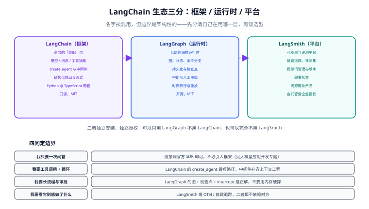

# LangChain

<p style="text-align:center;"></p>

LangChain 是**大模型应用的装配框架**：它把「模型调用、消息、工具、结构化输出、检索」这些零件统一成一套抽象，让 Agent 这类需要「模型调工具、拿结果再调模型」的循环不必每次从零手写。2025 年 10 月发布的 1.0 是一次减法——核心包只留下 Agent 相关构件，历史能力整体迁出。

本专题以 **Python 侧 LangChain v1** 为主线，讲清生态边界、Agent 与中间件、记忆分层、LangGraph 编排与落地验收。**Java 侧的同类主题见 [大模型应用开发](../LLMApp/index.md)**，两者解决同一个问题，抽象与生态不同，本页第 3 节给出分工判据。



## 专题导航

- [生态概览与 v1 变更](Overview/index.md)：框架 / 运行时 / 平台三层边界、v1 的三项改动、与 AgentExecutor 时代的关系
- [环境与模型接入](Environment/index.md)：Python 与依赖管理、`init_chat_model` 统一初始化、密钥与网关、可复现的版本锁定
- [从 Chain 到 Runnable](Chains/index.md)：LCEL 管道、组合子（batch/stream/retry/fallback）、`langchain-classic` 的位置
- [Agent 与中间件](Agent/index.md)：`create_agent`、六个钩子、预构建中间件、结构化输出策略
- [记忆与上下文](Memory/index.md)：四层记忆、检查点与 `thread_id`、摘要压缩、跨会话记忆
- [LangGraph 编排](LangGraph/index.md)：状态与 reducer、条件边、持久化、`interrupt` 与时间旅行
- [实战：带人工审批的检索增强 Agent](Practice/index.md)：六段链路 + 五条可执行验收
- [常见问题与最佳实践](FAQ/index.md)：四类高频故障的排障决策树、坑清单与术语表

::: tip 一句话理解
LangChain 解决的是**装配问题**，不是能力问题。模型能力来自模型本身，LangChain 让你少写胶水代码、并且把这些胶水标准化——但装配错了（上下文裁剪不当、工具描述不清、状态放错层），调试成本比手写更高。
:::

## 1. 三层边界：先分清自己在用哪一层

LangChain 这个名字被用来指三种不同的东西，混着说会导致选型结论完全跑偏：

| 层 | 是什么 | 装什么 | 关键能力 | 授权 |
| --- | --- | --- | --- | --- |
| **LangChain** | 高层框架：模型/消息/工具/结构化输出的统一抽象，以及 Agent 装配 | `langchain` | `create_agent`、中间件、内容块 | 开源（MIT） |
| **LangGraph** | 低层编排运行时：图、状态、条件分支、持久化 | `langgraph` | 检查点、`interrupt`、时间旅行、重放 | 开源（MIT） |
| **LangSmith** | 可观测、评测与部署平台 | 托管服务 / SDK | 链路追踪、评测集、提示词版本 | 闭源商业产品，自托管需企业授权 |

三者的**独立性**是架构性的，不是品牌区分：

- 可以只用 LangGraph 不用 LangChain——需要显式图与持久化、不需要 Agent 装配时。
- 用 LangChain 的 `create_agent` 会得到一张图，但**不会**因此开启 LangSmith、也不会替你建数据库或部署端点。
- LangSmith 能接收用其它框架（甚至直接调 SDK）写的应用上报的 trace。

## 2. 版本速览（2026-09 核对）

Python 与 TypeScript 两套实现**独立发版**，主次版本号相同不代表兼容：

| 语言 | 包 | 当前线 | 角色 |
| --- | --- | --- | --- |
| Python | `langchain` | 1.4.x（1.4.0 / 2026-09-03） | 框架层：`create_agent`、中间件、集成 |
| Python | `langchain-core` | 1.6.x（1.6.3 / 2026-09-11） | 消息、工具、Runnable 等基础抽象 |
| Python | `langgraph` | 1.2.x（1.2.11 / 2026-08-11） | 编排运行时 |
| Python | `deepagents` | 0.7.x（0.7.14 / 2026-09-14） | 预装中间件栈的「深度 Agent」封装 |
| TypeScript | `langchain` | 1.5.x（1.5.11 / 2026-09-09） | 同上的 TS 实现 |
| TypeScript | `@langchain/core` | 1.2.x（1.2.11 / 2026-09-12） | 基础抽象 |
| TypeScript | `@langchain/langgraph` | 1.4.x（1.4.15 / 2026-09-12） | 编排运行时 |

::: warning 版本以注册表为准
上表是写作时的核对结果，**不要照抄**。判断当前版本用 `pip index versions langchain`（或 `npm view langchain version`），并注意两套语言各自独立——「Python 是 1.4、TS 是 1.5」不是谁落后，而是两条发布线。
:::

::: danger 已停维护的包
`langgraph-supervisor` 已标注为 unmaintained（最后发布 2025-11）、`langgraph-swarm` 实际冻结。多智能体场景请按 [LangGraph 编排](LangGraph/index.md) 的说法用子图与路由自行组织，不要引入这两个包。
:::

## 3. 与 Java 侧的 Langchain4j 怎么分工

同一个需求，Python 侧和 Java 侧各有一套主流选择。选哪套**不取决于哪套更先进**，取决于三件事：

| 判据 | 倾向 Python（LangChain） | 倾向 Java（Langchain4j / Spring AI） |
| --- | --- | --- |
| 团队主语言 | 数据/算法团队，或已有 Python 服务 | Java 后端团队，服务已在 JVM 上 |
| 生态新鲜度 | 新模型、新能力（推理轨迹、内容块）通常先到 Python 侧 | 更看重与企业既有技术栈、鉴权、监控一致 |
| 部署形态 | 独立推理服务，通过 HTTP 被后端调用 | 直接作为后端的一个模块，共享事务与配置 |
| 长流程编排 | LangGraph 的图与检查点是成熟方案 | 倾向于用工作流引擎或自研状态机 |

**混合架构是常见落点**：Java 后端负责业务与权限，把「模型相关的那一段」抽成独立 Python 服务，用 HTTP 协议约定输入输出。代价是**多一次网络边界与一套部署**，收益是模型侧迭代不被后端发版节奏拖住——这需要权衡，不是默认正确。

```text
[浏览器] → [Java 后端：鉴权/事务/审计] → HTTP → [Python Agent 服务：LangChain + LangGraph]
                                              ↓
                                     [向量库 / 模型网关 / LangSmith]
```

## 4. 大版本处理约定

本库对存在代际差异的主题采用「**主线 + 存量存档**」的方式组织，LangChain 这一代的分界点是 **v1**（`langchain 1.0.0` 发布于 **2025-10-17**）：

- 主线内容全部面向 **v1**（`create_agent` + 中间件 + `langchain-core` 抽象）。
- v0.x 时代的写法（`LLMChain`、`ConversationChain`、`AgentExecutor`、`create_react_agent`）**不删除**，但统一标注为存量写法，并在 [Agent 与中间件](Agent/index.md) 的迁移小节给出替代路径。
- 旧代码不升级也能跑：把包锁在 v0.x 即可——v0.3 线到 **2026-05** 仍在收补丁（`0.3.29` / 2026-05-05），说明这条存档线短期内不会消失。**判断依据不是「新版更好」，而是「是否要跟进新模型能力」**——v1 的标准内容块只在新版抽象里可用。

## 5. 学习路径建议

1. **先确认需不需要框架**：只做一次问答、或流程完全固定，直接调官方 SDK（见 [大模型应用开发](../LLMApp/index.md)）往往更省事。
2. **需要工具调用循环** → 读 [Agent 与中间件](Agent/index.md)，把 `create_agent` 与六个钩子弄明白，这是 v1 的核心。
3. **流程有分支、要审批、要恢复** → 读 [LangGraph 编排](LangGraph/index.md)，不要用内存状态硬撑。
4. **效果不稳定、成本失控** → 读 [常见问题与最佳实践](FAQ/index.md) 的排障树，先定位到具体一步。

## 相关专题

- [大模型应用开发](../LLMApp/index.md)：不引入框架时怎么直接调 SDK，成本与限流的工程做法
- [RAG 检索增强](../RAG/index.md)：检索链路本身（切分、向量库、召回优化、评估）
- [Agent 应用](../Agent/index.md)：Agent 的通用原理、多智能体与安全边界
- [提示词工程](../PromptEngineering/index.md)：上下文工程里「写给模型的那部分」
- [本地模型部署](../LocalModel/index.md)：把模型换成本地推理服务时的接口与显存问题
- [多模态应用](../Multimodal/index.md)：图片、音频这类内容块怎么进消息——多模态输入的框架侧接法
- [大模型微调](../FineTuning/index.md)：框架解决**装配**，微调解决**行为**——输出格式与判断口径不稳定时的另一条路

## 参考资料

- LangChain v1 新特性（官方）：https://docs.langchain.com/oss/python/releases/langchain-v1
- v1 迁移指南（官方）：https://docs.langchain.com/oss/python/migrate/langchain-v1
- LangGraph 官方文档：https://docs.langchain.com/oss/python/langgraph/overview
- LangSmith 文档：https://docs.langchain.com/langsmith/home
- 版本查询：`pip index versions langchain`、`npm view langchain version`
