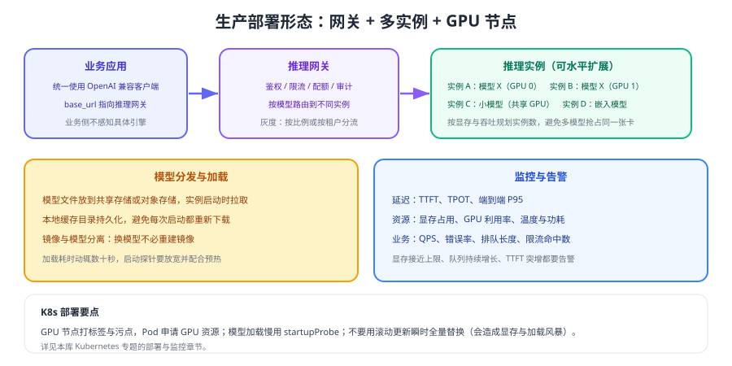

# 生产部署与运维

把本地模型从"能跑"做到"能长期稳定服务"，需要补齐四件事：**网关、多实例、可观测、可升级**。本页给出生产部署的参考形态与运维清单，容器化细节可结合本库 Kubernetes 专题。



## 参考架构

| 组件 | 职责 | 关键约束 |
| --- | --- | --- |
| 推理网关 | 鉴权、限流、配额、路由、缓存、审计 | 必须有超时与熔断，不能被后端拖死 |
| 推理实例 | 加载模型并提供兼容接口 | 一卡一大模型，避免多模型抢占 |
| 模型存储 | 集中存放权重，实例启动时拉取 | 本地缓存目录持久化，避免重复下载 |
| 监控告警 | 延迟、显存、GPU 利用率、错误率 | 显存接近上限与队列增长必须告警 |
| 配置中心 | 模型别名、上下文字长、并发参数 | 支持热更新与灰度，避免重启全量实例 |

```text
业务 → 网关（鉴权/限流/路由）→ 实例 A|B|C（同模型不同卡）→ 监控与日志
                                ↘ 云端 API（敏感度低的任务）
```

## 容器化与 GPU 调度

```yaml [deployment.yaml（关键片段）]
spec:
  replicas: 2
  template:
    spec:
      nodeSelector:
        gpu: "true"                     # GPU 节点打标签
      tolerations:
        - key: nvidia.com/gpu
          operator: Exists
      containers:
        - name: vllm
          image: <vllm-image>           # 镜像与 CUDA 版本绑定，需与驱动匹配
          resources:
            limits:
              nvidia.com/gpu: 1         # 一实例一张卡，避免超卖
          startupProbe:                 # 模型加载慢，必须放宽启动探测
            failureThreshold: 60
            periodSeconds: 10
          readinessProbe:
            httpGet:
              path: /v1/models
              port: 8000
          volumeMounts:
            - name: model-cache
              mountPath: /models        # 持久化模型缓存，避免反复下载
```

::: danger K8s 部署的五个坑
1. **用滚动更新瞬时替换全部实例**：会出现显存与下载风暴，应设置 `maxSurge: 0` 或分批灰度。
2. **启动探针太严**：模型加载动辄数十秒到几分钟，探针失败会导致无限重启。
3. **不申请 GPU 资源**：多个 Pod 抢同一张卡，必然 OOM。
4. **模型走镜像层**：镜像体积巨大、发布缓慢，应将权重与镜像分离。
5. **不做预热**：第一个请求承担全部加载耗时，用户直接超时。
:::

## 升级与灰度

| 步骤 | 动作 | 验证 |
| --- | --- | --- |
| 1 | 新版本实例以新模型别名上线 | 用离线评测集对比质量与延迟 |
| 2 | 网关按 5% 流量切到新别名 | 观察错误率、TTFT、显存 |
| 3 | 逐步放量到 100% | P95 与业务指标不劣化 |
| 4 | 保留旧实例一个观察周期 | 出现异常可一键切回 |
| 5 | 下线旧实例，清理旧模型 | 释放显存与磁盘 |

::: tip 升级最容易忽略的两件事
一是**环境快照**（驱动、CUDA、引擎版本、模型、量化等级），二是**回滚演练**。没有演练过的回滚，在故障时往往不可用。
:::

## 监控指标与告警

| 指标 | 说明 | 告警建议 |
| --- | --- | --- |
| TTFT / 端到端 P95 | 用户体验 | 超过 SLA 阈值持续 5 分钟 |
| 显存占用峰值 | OOM 前兆 | 超过 90% 告警，超过 95% 紧急 |
| GPU 利用率 | 是否有效利用算力 | 长期低于 20% 说明配置不合理 |
| 队列长度 / 等待时间 | 是否开始排队 | 持续增长立即告警 |
| 错误率（5xx / 超时） | 服务可用性 | 超过 1% 告警 |
| 模型重载次数 | 是否频繁换入换出 | 异常增长说明显存不足 |

```shell
# 快速自检
nvidia-smi                      # 显存、利用率、温度、进程
curl -s http://gateway/v1/models   # 网关与实例可用性
# 指标导出到 Prometheus 后，按上面表格配置告警规则
```

## 安全与合规

1. **鉴权**：网关按应用发放 Key，禁止内网裸奔。
2. **审计**：记录调用方、模型别名、令牌数、耗时；敏感输入按合规要求脱敏或不落盘。
3. **隔离**：不同部门使用不同 Key 与配额；高敏场景单独实例。
4. **模型来源**：只使用可信来源的权重，记录哈希与版本，避免供应链风险。

## 验证方式

1. 部署两个实例，杀掉一个，确认网关自动摘除并保持服务可用。
2. 用新标号灰度 5% 流量，观察 15 分钟后指标无异常再放量。
3. 模拟显存打满，确认告警触发且服务有明确降级行为（排队或 503）。
4. 完成一次完整升级与回滚演练，记录耗时与操作步骤。

## 参考资料

- vLLM 官方文档：https://docs.vllm.ai/
- Ollama 官方文档：https://docs.ollama.com/
- Kubernetes 官方文档（GPU 调度）：https://kubernetes.io/docs/tasks/manage-gpus/scheduling-gpus/
- 本库 Kubernetes 专题：[部署](../../../Ops/Kubernetes/Deployment/index.md)、[监控](../../../Ops/Kubernetes/Monitoring/index.md)
