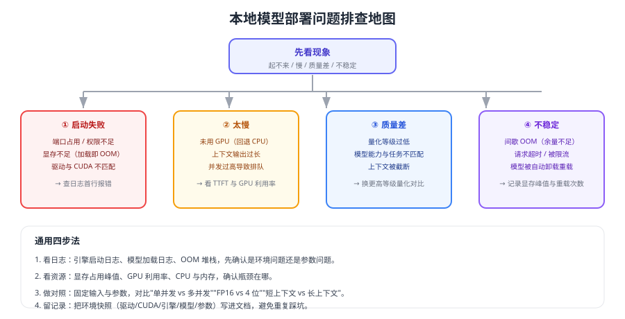

# 常见问题与最佳实践

本地模型部署的问题高度集中在四类：**起不来、太慢、质量差、不稳定**。本页按现象给出排查路径，并汇总长期可执行的最佳实践。



## 通用排查四步

```shell
# 1. 环境：驱动、CUDA、引擎版本是否匹配
nvidia-smi
ollama --version 2>/dev/null || echo "非 Ollama 环境"

# 2. 资源：显存、GPU 利用率、进程占用
nvidia-smi --query-gpu=memory.used,memory.total,utilization.gpu --format=csv

# 3. 服务：端口、模型是否加载、接口是否可用
curl -s http://localhost:11434/api/ps        # Ollama 场景
curl -s http://localhost:8000/v1/models      # vLLM 场景

# 4. 单请求复现：固定输入与参数，观察 TTFT 与显存变化
```

## 1. 启动失败

| 现象 | 可能原因 | 处理 |
| --- | --- | --- |
| 端口被占用 | 已有实例在跑 | 换端口或停掉旧实例 |
| 加载即 OOM | 模型/量化等级过大 | 换 4 位量化或更小模型 |
| 报 CUDA 相关错误 | 驱动与 CUDA/镜像不匹配 | 先升驱动，再选匹配镜像 |
| 找不到模型 | 模型名错误或未拉取 | `ollama list` / 检查权重路径 |
| 权限错误 | 数据盘无写权限 | 修正目录权限与 SELinux/AppArmor 策略 |

## 2. 太慢

按影响从大到小排查：

1. **是否真的在用 GPU**：`nvidia-smi` 看显存占用与利用率，利用率长期为 0 说明回退到 CPU。
2. **上下文与输出是否过长**：端到端 ≈ TTFT + 输出 token × TPOT，长输出必然慢。
3. **是否在排队**：并发超过拐点后延迟飙升，回调并发到压测推荐值。
4. **是否发生模型换入换出**：多模型共享一张卡时，会反复加载卸载。
5. **量化是否合适**：CPU 场景量化提速明显，GPU 场景需实测比较。

## 3. 质量差

| 原因 | 验证方式 | 处理 |
| --- | --- | --- |
| 量化等级过低 | 同一问题对比 8 位与 4 位输出 | 升级到 5~8 位 |
| 模型能力不足 | 换更大参数模型对比 | 换模型或拆分任务 |
| 上下文被截断 | 打印实际输入长度 | 提高上下文或压缩输入 |
| 提示词不适合本地模型 | 用官方推荐模板重试 | 调整提示词结构 |
| 检索没给对材料 | 检查 RAG 召回片段 | 先修检索（见 RAG 专题） |

## 4. 不稳定（间歇失败）

::: danger 间歇性问题的四个常见根因
1. **显存余量不足**：峰值时 OOM，平时正常——余量应留 15%~25%。
2. **并发超过硬件上限**：队列增长后批量变慢，最终超时。
3. **多模型共享显卡**：互相驱逐，表现为"偶发首令牌很慢"。
4. **内存不足**：模型加载、向量库、系统缓存一起挤爆内存，触发 OOM Killer。
:::

处理顺序：先把并发降到安全值 → 再限制上下文 → 再考虑升级硬件或改用更高显存方案。

## 5. 输出乱码 / 格式异常

1. 检查模型的对话模板与引擎是否匹配（模板错了会出现奇怪标记）。
2. 检查是否混用了不同模型的 tokenizer 或权重。
3. 结构化输出场景改用引擎支持的约束能力，而不是靠提示词"求 JSON"。
4. 中文乱码多与编码/模板相关，确认请求编码为 UTF-8 且模板声明正确。

## 6. 如何估算"到底要买多大显存"

按四步算：权重（参数量 × 量化字节）→ KV Cache（上下文 × 并发）→ 运行时开销 → 15%~25% 余量。详细公式与参考组合见 [GPU 与显存规划](../Hardware/index.md)。

## 7. 本地与云端怎么混合

| 场景 | 建议路由 |
| --- | --- |
| 敏感数据（合同、客户信息） | 本地模型 |
| 通用任务（摘要、翻译、改写） | 云端 API（质量更高、按量付费） |
| 高并发批量任务 | 本地（成本可预测）或云端批处理 |
| 需要最强推理能力的任务 | 云端模型 |

实现方式：统一用 OpenAI 兼容接口 + 网关按"敏感度/复杂度"路由，业务代码只认模型别名。

## 8. 怎么评估"自建是否划算"

```text
月成本 ≈ GPU 折旧（或租用费） + 电费 + 运维人力分摊
对比  = 同等流量的云端 API 账单（含重试与失败放大的量）
```

别忘了隐形成本：显存规划、版本升级、故障处理、监控告警建设。**只有当"数据不能出内网"或"长期稳定高负载"时，自建才通常更划算**。

## 9. 面试高频问题速答

| 问题 | 回答要点 |
| --- | --- |
| Ollama 与 vLLM 区别 | Ollama 重易用与模型管理；vLLM 重吞吐与生产特性（连续批处理） |
| 为什么量化 | 降低显存占用、提升可部署性，代价是精度可能下降 |
| 显存都花在哪 | 权重 + KV Cache + 运行时开销 + 余量，KV Cache 常被低估 |
| 如何提升吞吐 | 连续批处理、限制上下文与输出、量化、多实例/多卡 |
| TTFT 大怎么优化 | 缩短输入、减少排队、启用前缀缓存、预热模型 |
| 怎么保证数据不出内网 | 模型、嵌入、向量库全部本地部署 + 抓包验证 |

## 最佳实践清单

::: tip 部署前
1. 先用一页纸算清显存预算，再买卡选模型。
2. 业务代码只依赖 OpenAI 兼容接口与模型别名。
3. 记录环境快照（驱动/CUDA/引擎/模型/量化/参数）。
:::

::: tip 运行中
1. 并发按压测拐点的 70% 设置，显存留 15%~25% 余量。
2. 监控 TTFT、显存峰值、队列长度、错误率并配置告警。
3. 网关做鉴权、限流、配额与审计，内网也不能裸奔。
4. 模型与索引都在本地，敏感数据不落第三方。
:::

::: tip 变更时
1. 换模型、换量化、换引擎都要重新压测并重新评测质量。
2. 用模型别名灰度切换，保留一个可回滚版本。
3. 升级前查兼容矩阵，升级后留观察周期。
:::

## 验证方式

1. 按"通用排查四步"复现一次线上问题，输出根因与改动结论。
2. 把并发从安全值加到 OOM，观察错误表现并确认有可读提示。
3. 对比 4 位与 8 位量化在同一评测集上的关键字段一致率。
4. 断网运行一次完整问答，证明数据不出内网。

## 参考资料

- Ollama 官方文档：https://docs.ollama.com/
- vLLM 官方文档：https://docs.vllm.ai/
- llama.cpp 官方仓库：https://github.com/ggml-org/llama.cpp
- 本库相关专题：[显存规划](../Hardware/index.md)、[性能调优](../Performance/index.md)、[生产部署](../Deployment/index.md)
