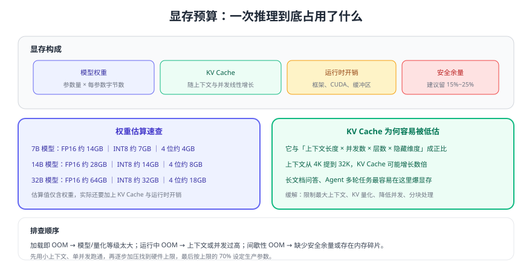

# GPU 与显存规划

本地部署最常见的翻车方式不是"模型不会用"，而是**显存不够**：装不下权重、长上下文爆显存、并发一上来就 OOM。本页给出一套可复用的估算方法，让你在买卡或选模型之前就能算清账。



## 显存由四部分构成

```text
总显存 = 权重 + KV Cache + 运行时开销 + 安全余量
```

| 部分 | 影响因素 | 估算方式 |
| --- | --- | --- |
| 权重 | 参数量 × 量化字节数 | 7B FP16 ≈ 14GB；INT8 ≈ 7GB；4 位 ≈ 4~5GB |
| KV Cache | 层数 × 隐藏维度 × 上下文长度 × 并发 × 精度 | 长上下文场景可达数 GB 到数十 GB |
| 运行时开销 | 框架、CUDA 上下文、缓冲区 | 通常 1~3GB，随引擎不同 |
| 安全余量 | 峰值波动、碎片 | 建议留总显存的 15%~25% |

::: tip 一条实用经验
**先按"权重 × 1.5"粗略判断能不能装下**（含 KV Cache 与开销），再用真实压测修正。若余量不足 20%，生产环境几乎一定会遇到间歇性 OOM。
:::

## 常见硬件与模型组合参考

| 显存 | 典型可行组合（量化 4 位，上下文 8K） | 并发参考 |
| --- | --- | --- |
| 8GB | 3B~4B 小模型，或 7B 4 位 + 短上下文 | 1~2 |
| 12GB | 7B 4 位 + 8K 上下文 | 2~4 |
| 16GB | 7B~8B 4 位，或 13B 4 位 + 短上下文 | 4~8 |
| 24GB | 13B~14B 4 位 + 8K 上下文，或 32B 4 位 + 短上下文 | 4~10 |
| 48GB×2 | 32B~70B 4 位（多卡），或 32B FP16 | 8~20 |

表中数值是**量级参考**，实际取决于模型结构、引擎实现与上下文策略，务必以自己环境的压测结果为准。

## KV Cache 为什么容易被低估

KV Cache 是"为了生成下一个 token，缓存的历史注意力状态"。它与**上下文长度、并发数**近似线性相关：

1. 上下文从 4K 提到 32K，KV Cache 可能增长数倍。
2. 并发从 1 提到 8，KV Cache 同样近似 ×8。
3. 长文档问答、Agent 多轮任务最容易触发（历史越滚越长）。

缓解手段（按代价从低到高）：

| 手段 | 效果 | 代价 |
| --- | --- | --- |
| 限制最大上下文 | 直接降低 KV Cache | 长文可能被截断 |
| 限制输出长度 | 降低生成时间与部分开销 | 回答可能不完整 |
| 复用前缀缓存 | 相同前缀不重复计算 | 需要引擎支持 |
| KV Cache 量化 | 显存明显下降 | 精度小幅影响 |
| 降低并发 | 线性降低 KV Cache | 吞吐下降 |
| 多卡/更大显存 | 根治 | 成本最高 |

## 从零开始的一次预算计算

以"14B 模型、4 位量化、8K 上下文、并发 4、24GB 显卡"为例：

```text
权重：14B × 0.55 字节 ≈ 7.7GB
KV Cache：按经验约占权重的一半到同等量级（随上下文与并发增长）≈ 4~7GB
运行时开销 ≈ 2GB
合计 ≈ 14~17GB  →  24GB 显卡余量充足（约 30%+），可行
```

若把上下文提到 32K、并发提到 8，KV Cache 可能翻数倍，24GB 就不再安全——这时应优先限制上下文与并发，而不是继续压榨显存。

::: danger 显存规划的五条红线
1. **不要按"权重刚好装下"配置**：没有余量必然间歇 OOM。
2. **不要忽略上下文与并发**：它们对 KV Cache 是乘数关系。
3. **不要在同卡上运行多个大模型**：多模型抢占会导致互相驱逐与反复加载。
4. **不要只看 GPU 显存不看内存**：CPU 推理、模型加载、向量库都吃内存。
5. **不要在容量规划上省事**：上线后 OOM 排查成本远高于提前算一算。
:::

## 其他容易忽略的资源

| 资源 | 影响 | 建议 |
| --- | --- | --- |
| 磁盘 | 模型文件数 GB 起，多个版本迅速累积 | 独立数据盘 + 定期清理旧版本 |
| 内存 | 模型加载、CPU 推理、向量库、服务进程 | 一般不低于显存的 1.5~2 倍 |
| 网络 | 多卡通信、模型分发 | 多卡用 NVLink/高速互联；分发走内网 |
| 电源与散热 | 长时间满负载推理 | 按 GPU 功耗留足电源与风道 |

## 验证方式

1. 用 `nvidia-smi` 观察加载前、加载后、推理中的显存占用，与预算表对照。
2. 上下文从 2K 逐步提到 8K、16K，记录显存增长曲线，验证 KV Cache 的影响。
3. 并发从 1 加到 8，找出首次出现 OOM 或明显排队的位置，即为当前上限。
4. 按上限的 70% 设定生产参数，并连续压测 1 小时确认无内存泄漏式增长。

## 参考资料

- NVIDIA CUDA Toolkit 发行说明（驱动与 CUDA 对应关系）：https://docs.nvidia.com/cuda/cuda-toolkit-release-notes/index.html
- vLLM 官方文档（显存与并发参数）：https://docs.vllm.ai/
- llama.cpp 官方仓库（CPU/GPU 卸载与量化）：https://github.com/ggml-org/llama.cpp
- 部署与监控：[生产部署与运维](../Deployment/index.md)
