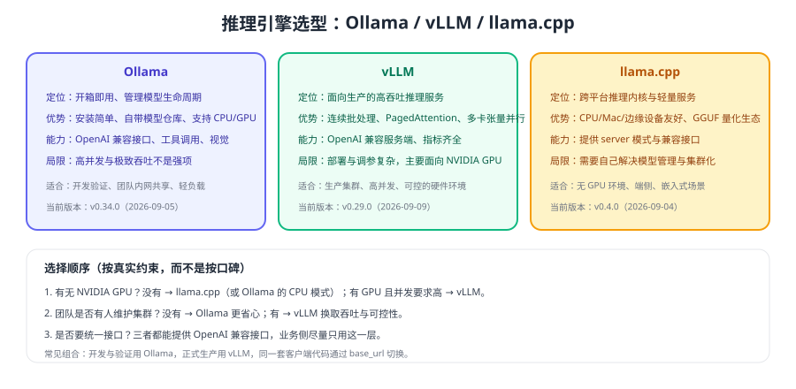

# 推理服务与 API 接入

跑通一个模型很容易，把它变成**稳定、可扩展、可观测的服务**才是工程问题。本页讲清 vLLM 与 llama.cpp server 的定位差异，以及生产环境统一的接入层该怎么设计。



## 三种引擎怎么选

| 维度 | Ollama | vLLM | llama.cpp |
| --- | --- | --- | --- |
| 主要目标 | 易用 | 高吞吐 | 跨平台 |
| 硬件 | CPU / GPU | NVIDIA GPU 为主 | CPU / Mac / 边缘 |
| 并发能力 | 轻中度 | 高（连续批处理） | 低到中 |
| 部署复杂度 | 低 | 中到高 | 中 |
| 兼容接口 | `/v1` 兼容 + 原生 `/api` | `/v1` 兼容服务端 | server 模式提供兼容接口 |
| 典型用法 | 开发、内网小规模 | 生产集群 | 无 GPU、端侧、离线设备 |

选择建议：**开发与验证用 Ollama，生产高并发用 vLLM，无 GPU 场景用 llama.cpp**。三者都提供兼容接口，业务代码不必改。

## vLLM 最小部署

```shell
# 单卡启动（参数以官方文档为准，这里只体现关键项）
python -m vllm.entrypoints.openai.api_server \
  --model <model-path-or-name> \
  --served-model-name qwen-local \
  --max-model-len 8192 \
  --gpu-memory-utilization 0.90 \
  --port 8000

# 验证
curl http://localhost:8000/v1/models
curl -X POST http://localhost:8000/v1/chat/completions \
  -H "Content-Type: application/json" \
  -d '{"model":"qwen-local","messages":[{"role":"user","content":"你好"}]}'
```

关键参数说明：

| 参数 | 作用 | 建议 |
| --- | --- | --- |
| 最大上下文长度 | 单请求最大 token 数 | 与显存预算联动，不要默认拉满 |
| 显存利用率 | 允许 vLLM 使用的显存比例 | 0.85~0.92，留出安全余量 |
| 服务模型名 | 对外暴露的模型名 | 用业务语义命名，便于灰度替换真实权重 |
| 张量并行度 | 多卡切分 | 单卡放不下才用，注意通信开销 |
| 最大并发序列数 | 同时处理的序列上限 | 决定吞吐与延迟的平衡点 |

::: danger vLLM 部署的三个坑
1. **显存利用率拉满到 0.98**：看似省显存，实际容易在长上下文时 OOM 崩溃。
2. **最大上下文按模型上限设置**：KV Cache 预留过大，吞吐明显下降。
3. **模型名与业务硬编码绑定**：换模型必须改业务代码，应该用别名路由。
:::

## llama.cpp server（无 GPU 场景）

```shell
# CPU 推理：加载 GGUF 量化模型并开启兼容接口
./llama-server -m <model>.gguf \
  --host 0.0.0.0 --port 8080 \
  -c 4096 \
  -t 8 \
  -ngl 0
# -c 上下文长度；-t CPU 线程数；-ngl 卸载到 GPU 的层数（无 GPU 时为 0）
```

经验值：

1. 线程数不要超过物理核数，超了反而变慢。
2. 上下文越长，内存占用与首令牌时间越高。
3. 有 GPU 时用 `-ngl` 把部分层卸载到显存，能显著提速（受显存限制）。

## 统一接入层设计

无论后端是哪种引擎，业务侧只应看到**一个地址 + 一个模型别名**：

```text
业务应用 → [推理网关] → 实例 A（模型 X，GPU0）
                      → 实例 B（模型 X，GPU1）
                      → 实例 C（小模型，共享卡）
                      → 云端 API（敏感度低的任务）
```

| 网关职责 | 说明 |
| --- | --- |
| 鉴权与配额 | 按应用/租户发 Key，限制每日调用量与并发 |
| 限流与排队 | 保护后端不被打爆，超限时给出明确错误 |
| 路由与灰度 | 按模型别名、租户或比例分流，支持一键切回 |
| 观测 | 统一记录延迟、令牌、错误码与调用方 |
| 缓存 | 相同请求（含参数）可命中结果缓存 |

::: tip 模型别名是生产必备
业务里写 `model="chat-default"`，由网关切到具体权重。这样换模型、做 A/B、回滚都不用改业务代码——**这是本地部署里性价比最高的一条设计**。
:::

## 客户端接入与错误处理

```python [client_with_fallback.py]
from openai import OpenAI, APIStatusError, APITimeoutError

client = OpenAI(base_url="http://gateway.internal/v1", api_key="app-key")

def chat(prompt: str, model: str = "chat-default") -> str:
    try:
        resp = client.chat.completions.create(
            model=model,
            messages=[{"role": "user", "content": prompt}],
            timeout=60,
            max_tokens=512,
        )
        return resp.choices[0].message.content
    except APITimeoutError:
        return "服务繁忙，请稍后重试"          # 超时不要盲目重试长请求
    except APIStatusError as e:
        if e.status_code == 429:
            return "当前请求过多，请稍后再试"  # 限流：给出可理解提示
        raise
```

::: warning 本地服务同样需要超时与限流
本地部署不等于"不会挂"：模型加载、显存不足、并发过载都会让请求变慢或失败。客户端必须有超时、有上限、有可读错误，否则会拖垮上游线程池。
:::

## 验证方式

1. 用 `curl /v1/models` 确认服务可用与模型别名正确。
2. 用同一客户端代码分别指向 Ollama 与 vLLM，确认业务代码无需修改。
3. 压测 10 并发，记录 TTFT 与错误率，确认网关限流生效。
4. 关掉一个实例，确认网关自动把流量切到其余实例（验证健康检查）。

## 参考资料

- vLLM 官方文档：https://docs.vllm.ai/
- llama.cpp 官方仓库：https://github.com/ggml-org/llama.cpp
- Ollama OpenAI 兼容接口：https://docs.ollama.com/openai
- 性能与压测：[性能调优与压测](../Performance/index.md)
