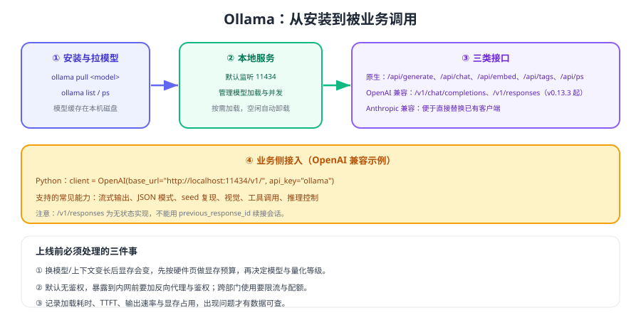

# Ollama 快速落地

Ollama 是目前上手成本最低的本地模型运行方式：一条命令拉模型、一条命令启动服务，还自带 OpenAI 兼容接口。它适合做开发验证、团队内网共享与轻负载场景；高并发生产环境建议换成 vLLM（见 [推理服务与 API 接入](../InferenceServer/index.md)）。



## 安装与基本命令

```shell
# 安装（各平台安装包见官方文档）
curl -fsSL https://ollama.com/install.sh | sh      # Linux 示例

# 服务与模型管理
ollama serve                       # 启动服务（默认 127.0.0.1:11434）
ollama pull <model-name>           # 拉取模型
ollama list                        # 查看本地已有模型
ollama ps                          # 查看正在运行/已加载的模型
ollama run <model-name> "你好"      # 交互式或单次问答
ollama rm <model-name>             # 删除模型，释放磁盘
```

::: danger 三类高频坑
1. **默认只监听 127.0.0.1**：其他机器访问不到，需要显式配置监听地址并配合鉴权与防火墙。
2. **服务默认无鉴权**：直接暴露到内网等于把模型接口开放给所有人，务必加反向代理与认证。
3. **模型占满磁盘**：模型文件通常数 GB 起，磁盘清理与配额要有计划。
:::

## 常用环境变量

| 变量 | 作用 | 建议 |
| --- | --- | --- |
| 监听地址类变量 | 控制服务绑定地址 | 需要内网访问时显式配置，并加网关鉴权 |
| 模型存储目录类变量 | 指定模型文件存放位置 | 指向大盘或独立数据盘，避免占满系统盘 |
| 并发类变量 | 控制同时处理的请求数 | 先按显存测算上限，再设置为上限的 70% |
| 常驻/卸载类变量 | 控制模型在显存中的保持时间 | 交互场景保持常驻，批处理场景允许自动卸载 |
| 上下文长度类变量 | 控制默认上下文窗口 | 与显存预算联动，不要盲目调大 |

具体变量名以官方文档当前版本为准（本文不逐一枚举，避免版本差异带来的误导）。

## OpenAI 兼容接口

Ollama 提供 `/v1/chat/completions` 等兼容端点，业务侧可以直接用 OpenAI 客户端：

```python [ollama_openai_client.py]
from openai import OpenAI

# 关键：base_url 指向本地服务；api_key 是占位值（本地服务要求但会忽略）
client = OpenAI(base_url="http://localhost:11434/v1/", api_key="ollama")

resp = client.chat.completions.create(
    model="<model-name>",
    messages=[
        {"role": "system", "content": "你是严谨的技术助手，回答不超过 3 句。"},
        {"role": "user", "content": "什么是 KV Cache？"},
    ],
    stream=True,                 # 流式输出，改善体感延迟
    max_tokens=300,
)

for chunk in resp:
    delta = chunk.choices[0].delta.content
    if delta:
        print(delta, end="", flush=True)
```

官方文档列出的兼容能力包括：流式输出、JSON 模式、可复现输出（seed）、视觉输入、工具调用与推理控制；此外还提供 `/v1/responses`（自 v0.13.3 起，**仅无状态**，不支持 `previous_response_id` 续接会话）以及原生 `/api/*` 接口。

```shell
# 原生接口示例（排查时很有用，能拿到更细的统计字段）
curl http://localhost:11434/api/tags            # 列出本地模型
curl http://localhost:11434/api/ps              # 查看已加载模型
curl -X POST http://localhost:11434/api/chat \
  -H "Content-Type: application/json" \
  -d '{"model":"<model-name>","messages":[{"role":"user","content":"你好"}],"stream":false}'
```

::: tip 用原生接口做压测与排障
兼容接口适合业务接入，原生接口在排查（查看加载状态、拿到精确耗时字段）时更方便。生产建议：**业务走兼容接口，运维脚本走原生接口**。
:::

## 模型定制（Modelfile）

需要固定系统提示词、参数与模板时，用 Modelfile 打一个自定义模型，业务侧只认模型名：

```text [Modelfile]
FROM <base-model>
PARAMETER temperature 0.2
PARAMETER num_ctx 8192
SYSTEM """你是企业内部知识助手，只依据资料回答，无依据时明确说明找不到依据。"""
```

```shell
ollama create kb-assistant -f Modelfile
ollama run kb-assistant "退款多久到账？"
```

好处：参数与提示词从代码里挪到模型定义里，业务调用更简洁，也便于版本化管理。

## 上线前的四件事

1. **算显存**：按 [GPU 与显存规划](../Hardware/index.md) 估算权重 + KV Cache，确定模型与量化等级。
2. **定并发**：先压测找到单实例上限，再按上限的 70% 配置并发。
3. **加鉴权与限流**：前置反向代理（鉴权、配额、日志），不要裸奔在内网。
4. **接监控**：记录加载耗时、TTFT、输出速率、显存占用与错误率。

::: warning 并发与显存的直觉
Ollama 适合轻中度并发。并发调得越高，KV Cache 占用越大，越容易 OOM 或触发排队；**并发上限不是「越大越好」，而是「显存允许的最优值」**。
:::

## 验证方式

1. `ollama ps` 确认模型已加载；连续发两次请求，确认第二次明显更快（模型已在显存）。
2. 用 `curl` 调用 `/v1/chat/completions`，确认返回结构与云端一致，业务客户端无需改动。
3. 把请求上下文从 1K 提到 8K，观察显存占用与延迟变化，建立硬件直觉。
4. 并发发起 5 个请求，观察是否排队、是否 OOM，记录当前并发上限。

## 参考资料

- Ollama 官方文档：https://docs.ollama.com/
- OpenAI 兼容接口（官方文档）：https://docs.ollama.com/openai
- 推理服务选型：[推理服务与 API 接入](../InferenceServer/index.md)
- 显存规划：[GPU 与显存规划](../Hardware/index.md)
