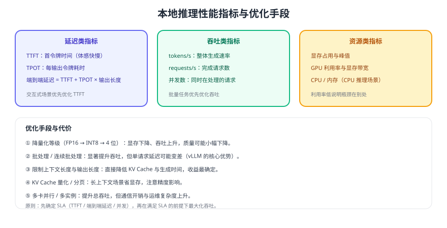

# 性能调优与压测

本地推理的性能不是"越快越好"，而是**在延迟 SLA 约束下把吞吐做到最大**。要达成这一点，先要分清 TTFT（首令牌时间）与 TPOT（每令牌时间）这两个决定体感的指标，再用压测找到硬件与并发的最优组合。



## 四个核心指标

| 指标 | 含义 | 谁关心 | 优化方向 |
| --- | --- | --- | --- |
| TTFT | 发出请求到收到第一个 token | 交互式问答 | 缩短输入、减少排队、启用前缀缓存 |
| TPOT | 相邻 token 的平均间隔 | 长回答体感 | 提高算力利用率、降低并发争抢 |
| 吞吐（tokens/s） | 单位时间生成的 token 数 | 批量任务、成本 | 提高批处理度、优化量化与并行 |
| 并发数 | 同时在处理的请求数 | 容量规划 | 由显存与算力共同决定 |

```text
端到端延迟 ≈ TTFT + 输出 token 数 × TPOT
```

这条公式解释了为什么"输出很长"时吞吐优化收益明显、而"短问答"时 TTFT 更关键。

## 压测怎么做

```shell
# 示例：用并发压测工具对兼容接口施压（也可用 k6/JMeter/locust）
# 关键是把「并发」与「上下文长度」作为变量，逐项找出拐点
for concurrency in 1 2 4 8 16; do
  echo "=== concurrency=$concurrency ==="
  # 工具以 OpenAI 兼容协议请求 /v1/chat/completions，记录 TTFT/TPOT/P95
done
```

压测时必须固定：模型、量化等级、上下文长度、输出长度、提示词。否则不同轮次的数据不可比。

| 记录项 | 说明 |
| --- | --- |
| TTFT P50 / P95 | 体感延迟 |
| TPOT / 输出速率 | 生成速度 |
| 吞吐 tokens/s | 总产出效率 |
| 显存峰值 | 判断是否接近 OOM |
| 错误率与超时数 | 是否有排队或崩溃 |

::: tip 找"拐点"而不是找"最大值"
并发从 1 加到 8 时吞吐通常快速上升、延迟缓慢上升；继续加到 16 后吞吐不再增长而延迟飙升——**这个拐点就是合理的并发上限**，生产按它的 70% 配置。
:::

## 优化手段与代价

| 手段 | 收益 | 代价 | 适用 |
| --- | --- | --- | --- |
| 降低量化等级 | 显存、速度 | 质量可能下降 | 显存受限 |
| 连续批处理（vLLM） | 吞吐大幅提升 | 单请求延迟可能变差 | 高并发生产 |
| 限制上下文长度 | 直接省显存与时间 | 长文场景受限 | 通用 |
| 限制输出长度 | 降低端到端延迟 | 回答可能被截断 | 通用 |
| 前缀缓存复用 | 相同系统提示词更快 | 需要引擎支持 | 固定提示词场景 |
| KV Cache 量化 | 长上下文省显存 | 精度小幅下降 | 长文档问答 |
| 多实例/多卡 | 线性扩展吞吐 | 成本与运维复杂度 | 规模化 |

::: danger 调优中的四个误区
1. **只看平均延迟**：P95 才决定用户体验，均值会掩盖排队尖峰。
2. **并发拉满**：吞吐不再增长，延迟却成倍恶化。
3. **用短上下文压测长上下文场景**：上线后必然 OOM。
4. **改多个参数一起测**：无法归因到底是哪一项起了作用。
:::

## 端到端优化的顺序

1. **先修客户端**：流式输出、超时设置、失败重试（不要对长请求盲目重试）。
2. **再修输入**：压缩上下文（RAG 只带 Top-N 片段，见 [RAG 检索增强](../../RAG/Retrieval/index.md)）。
3. **再修服务端**：并发上限、批处理、KV Cache 策略。
4. **最后才换硬件或换模型**：成本最高，收益却常常不如前三步。

## 验证方式

1. 固定输入，测量并发 1/2/4/8 下的 TTFT、吞吐与显存峰值，画出曲线并标出拐点。
2. 把上下文从 2K 提到 8K，重复压测，确认拐点位置是否变化。
3. 对比 4 位与 8 位量化在同一并发下的吞吐与显存，评估是否需要为了质量牺牲吞吐。
4. 按拐点的 70% 设置生产并发，持续压测 30 分钟确认 P95 稳定。

## 参考资料

- vLLM 官方文档（连续批处理与性能参数）：https://docs.vllm.ai/
- llama.cpp 官方仓库（线程与卸载参数）：https://github.com/ggml-org/llama.cpp
- Ollama 官方文档：https://docs.ollama.com/
- 显存规划：[GPU 与显存规划](../Hardware/index.md)
