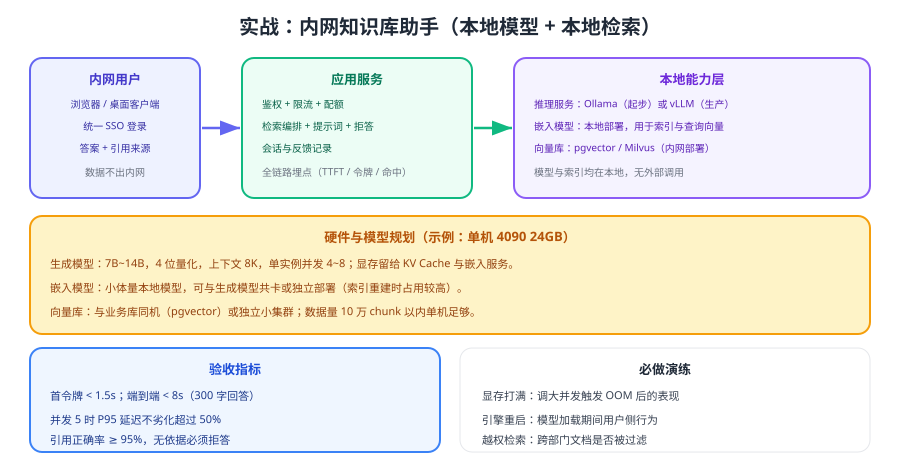

# 实战：内网知识库助手

把本地模型与本地检索组合起来，做一套**数据完全不出内网**的知识库问答：单机 GPU + Ollama/vLLM + 本地嵌入模型 + pgvector，从索引到问答全在机房内完成。本页给出落地骨架、验收指标与演练清单。



## 目标与约束

| 项 | 设定 |
| --- | --- |
| 用户 | 内网员工（客服、运维、销售） |
| 硬件 | 单机 1 张 24GB 显卡 + 64GB 内存 + 1TB 数据盘 |
| 模型 | 生成：7B~14B 4 位量化；嵌入：小体量本地嵌入模型 |
| 检索 | 本地向量库（如 pgvector）+ 关键词混合召回 |
| 约束 | 数据不出内网；无依据必须拒答；并发 5 时 P95 延迟可控 |

::: tip 为什么先用 Ollama 再用 vLLM
先用 Ollama 把链路跑通（半天内可完成），验证业务价值后再换 vLLM 提升吞吐。**同一套 OpenAI 兼容客户端代码无需改动**，这是本地部署最重要的工程红利。
:::

## 部署骨架

```shell
# 1. 本地生成模型服务（先 Ollama，后按需换 vLLM）
ollama serve
ollama pull <chat-model>

# 2. 本地嵌入模型（用于索引与查询）
#    可为独立服务，也可用同一引擎的 embedding 接口

# 3. 本地向量库（pgvector 示例：与业务库同机最省运维）
#    CREATE EXTENSION vector; 并建立带权限字段的表结构

# 4. 应用服务：检索 + 提示词 + 调用本地模型
python -m app.main            # 监听内网端口，前置鉴权网关
```

## 核心代码骨架

```python [private_ask.py]
from openai import OpenAI

# 业务侧只认这一个地址；本地与云端通过配置切换
llm = OpenAI(base_url="http://localhost:11434/v1/", api_key="ollama")

INSTRUCTIONS = """你是企业内部知识助手。只依据【材料】回答：
1) 材料中没有的内容，回答"未在资料中找到依据"；
2) 每个结论后用 [编号] 标注依据；
3) 涉及时限、金额、责任条款必须原文引用。"""

def ask(question: str, user: dict) -> dict:
    # 1. 本地嵌入 + 本地检索（权限过滤下推到检索层）
    hits = vector_store.search(
        embed(question), top_k=6,
        filter={"tenant": user["tenant"], "acl_group": {"any_of": user["groups"]}},
    )
    if not hits:
        return {"text": "未在资料中找到依据", "refs": [], "handoff": True}

    # 2. 拼装上下文并调用本地生成模型
    material = "\n\n".join(f"[{i+1}] {h['title_path']}\n{h['text']}" for i, h in enumerate(hits))
    resp = llm.chat.completions.create(
        model="<chat-model>",
        messages=[
            {"role": "system", "content": INSTRUCTIONS},
            {"role": "user", "content": f"【材料】\n{material}\n\n【问题】{question}"},
        ],
        max_tokens=600,
    )
    return {
        "text": resp.choices[0].message.content,
        "refs": [h["chunk_id"] for h in hits],
        "handoff": "未在资料中找到依据" in resp.choices[0].message.content,
    }
```

## 容量与参数设定

| 项 | 取值 | 依据 |
| --- | --- | --- |
| 模型与量化 | 14B 4 位 | 24GB 显存装得下且留有余量 |
| 上下文长度 | 8K | 覆盖常规问答，避免 KV Cache 过大 |
| 最大输出 | 600 token | 控制端到端延迟 |
| 并发 | 4~6 | 按压测拐点的 70% 设定 |
| 检索 Top-K | 6（重排后 3~5 入上下文） | 兼顾召回与令牌成本 |

::: warning 三个最消耗资源的时刻
1. **模型首次加载**：数十秒不可用，需要预热或让流量避开。
2. **索引重建**：嵌入计算吃满 GPU/CPU，建议放低峰并限速。
3. **长文档问答**：上下文暴涨导致 KV Cache 激增，最容易 OOM。
:::

## 验收指标

| 指标 | 目标 | 测量方式 |
| --- | --- | --- |
| TTFT | < 1.5s | 压测工具采集 P95 |
| 端到端（300 字回答） | < 8s | 同上 |
| 并发 5 时的 P95 | 劣化不超过 50% | 并发压测 |
| 引用正确率 | ≥ 95% | 20 条人工抽样 |
| 拒答准确率 | ≥ 95% | 10 条知识库外问题 |
| 显存峰值 | < 90% 总显存 | `nvidia-smi` 长期观察 |

## 故障演练

| 演练 | 操作 | 期望结果 |
| --- | --- | --- |
| 显存打满 | 并发逐步加到 OOM | 服务返回可读错误，不崩溃重启循环 |
| 引擎重启 | 重启生成服务 | 应用侧快速失败并提示，不挂起线程 |
| 模型被卸载 | 空闲超时后首个请求 | 接受较慢首令牌，有提示或预热机制 |
| 越权检索 | A 部门账号查 B 部门文档 | 返回为空并留下审计日志 |
| 索引未更新 | 修改文档后立即提问 | 按增量任务周期生效，且缓存已失效 |

## 上线检查清单

1. 显存预算表与实际压测数据一致，峰值不超过 90%。
2. 网关鉴权、限流、配额、审计全部生效。
3. 模型与索引均在本地，无任何外部调用（可用抓包/日志验证）。
4. 监控覆盖 TTFT、显存、错误率、队列长度，并配置告警。
5. 版本快照（驱动/CUDA/引擎/模型/量化等级）记录在运维文档中。
6. 回滚方案（模型别名切回 + 旧实例保留）已演练。

## 验证方式

1. 按骨架代码跑通"提问 → 检索 → 生成 → 引用"，用 20 条真实问题人工核对。
2. 断网后重跑，确认服务完全可用（证明数据不出内网）。
3. 并发压测 1/2/4/8，记录 TTFT、吞吐与显存，确定生产并发参数。
4. 执行故障演练表中至少三项，记录表现与改进项。

## 参考资料

- Ollama 官方文档：https://docs.ollama.com/
- vLLM 官方文档：https://docs.vllm.ai/
- 本库 RAG 专题：[RAG 检索增强](../../RAG/index.md)、[生产工程化](../../RAG/Pipeline/index.md)
- 本库应用侧：[大模型应用开发](../../LLMApp/index.md)
