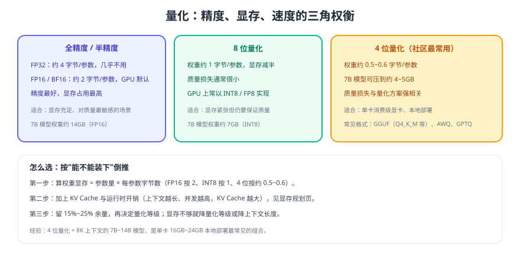

# 量化与模型格式

量化（Quantization）用更少的比特表示模型权重，是**让本地部署跑得起来**的关键手段：同一张显卡，换一个量化等级可能就从"装不下"变成"跑得很顺"。代价是精度可能下降，需要按业务容错度做选择。



## 精度与体积对照

| 精度 | 每参数约占用 | 7B 权重约 | 质量 | 适用 |
| --- | --- | --- | --- | --- |
| FP32 | 4 字节 | 28GB | 最高 | 几乎不用（推理无必要） |
| FP16 / BF16 | 2 字节 | 14GB | 高 | GPU 显存充足 |
| INT8 / FP8 | 1 字节 | 7GB | 接近 FP16 | 显存紧张但要求质量 |
| 4 位（Q4/AWQ/GPTQ） | 约 0.5~0.6 字节 | 4~5GB | 与方案相关 | 消费级显卡、本地部署 |
| 更低比特（3 位及以下） | 更少 | 更小 | 明显下降 | 极端受限的端侧场景 |

::: tip 一句话理解
量化的收益是**线性的显存下降**，代价是**非线性的质量风险**：从 FP16 到 INT8 通常几乎无损，从 INT8 到 4 位则要看具体方法与模型。**先用 4 位跑通、再用 8 位对比质量**，是成本最低的决策路径。
:::

## 常见格式与适用引擎

| 格式 | 主要使用者 | 特点 | 注意 |
| --- | --- | --- | --- |
| GGUF | llama.cpp、Ollama | 单文件、量化等级丰富、CPU/GPU 通用 | 等级命名（如 Q4_K_M）直接影响质量 |
| safetensors | vLLM 等 GPU 引擎 | 权重原始精度（FP16/BF16），加载快 | 体积大，需要足够显存 |
| AWQ / GPTQ | GPU 低比特推理 | 4 位量化，GPU 上性能好 | 与引擎/内核支持情况强相关 |
| 更早的 GGML/GGJT | 旧版 llama.cpp | 已被 GGUF 取代 | **仅存量**，新项目不要使用 |

```shell
# 以 llama.cpp 生态为例：同一模型的不同量化等级
# Q4_K_M：体积与质量平衡，社区默认选择
# Q5_K_M：体积稍大，质量更接近 FP16
# Q8_0：接近无损，体积约为 4 位的两倍
# 具体文件名与可用等级以模型仓库为准
```

## 怎么选：三步决策

1. **算显存**：按 [GPU 与显存规划](../Hardware/index.md) 算出"权重 + KV Cache + 余量"是否装得下。
2. **定等级**：优先选 4 位（如 Q4_K_M）跑通；显存有富余时升到 5~8 位以换取质量。
3. **做验证**：用固定评测样本对比不同等级的输出质量，确认业务可接受后再定稿。

::: danger 量化选型的五个坑
1. **只看体积不看质量**：3 位量化在数学推理、代码生成上掉点可能非常明显。
2. **不同格式混用**：GGUF 不能喂给 vLLM，safetensors 不能喂给 llama.cpp。
3. **以为"量化后一定更快"**：CPU 场景通常更快，GPU 场景有时因反量化开销提升有限。
4. **换了量化等级却复用旧基准**：质量对比必须用同一批样本与同一套参数。
5. **忽略上下文对显存的影响**：权重只占一半，KV Cache 往往才是长上下文下的瓶颈。
:::

## 质量验证怎么做

| 步骤 | 做法 | 判据 |
| --- | --- | --- |
| 建样本集 | 20~50 条真实任务（含边界与拒答） | 覆盖你的实际场景 |
| 固定参数 | 温度、最大输出、系统提示词全部固定 | 只让量化等级变化 |
| 对拍 | FP16（或 8 位）作为基线，4 位作为待测 | 输出差异是否影响业务结论 |
| 人工复核 | 抽样 10~20 条人工判断 | 关键字段错误率 |
| 记录结论 | 写明"某等级 + 某模型 + 某场景可用" | 形成团队的选型经验 |

```python [compare_quant.py]
# 对拍不同量化等级的输出：同一批问题，比较关键字段是否一致
prompts = ["退款多久到账？", "如何修改绑定手机？", "订单号 ORD-2026-001 的状态？"]

for level in ["q8", "q4"]:
    model = f"kb-assistant-{level}"
    outputs = [chat(p, model=model) for p in prompts]
    print(level, [o[:60].replace("\n", " ") for o in outputs])
```

预期输出：两个等级的输出格式与关键结论应基本一致；若 4 位在关键字段（金额、时限、编号）上出错，应升到 5~8 位或换量化方案。

## 验证方式

1. 同一模型分别以 4 位与 8 位加载，记录显存占用与首个令牌时间。
2. 用 20 条评测样本对比两者输出，统计关键字段一致率。
3. 把上下文从 2K 提到 8K，观察显存增量，确认原定量化等级仍然可行。
4. 把结论写入项目文档：模型 + 量化等级 + 上下文长度 + 并发上限的组合。

## 参考资料

- llama.cpp 官方仓库（GGUF 与量化说明）：https://github.com/ggml-org/llama.cpp
- Ollama 官方文档：https://docs.ollama.com/
- vLLM 官方文档（支持的量化方案）：https://docs.vllm.ai/
- 显存规划：[GPU 与显存规划](../Hardware/index.md)
