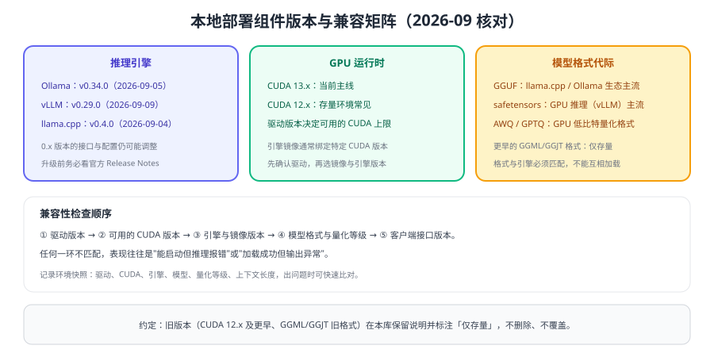

# 版本与兼容矩阵

本地部署的"版本"不止一个维度：**引擎版本、CUDA 与驱动、模型格式、量化等级、客户端接口**，任一环不匹配都会出现"能启动但推理报错"或"输出异常"。本页给出当前状态与升级路径；旧版本内容保留并标注状态，不删除、不覆盖。



## 推理引擎版本

| 引擎 | 当前版本 | 上一代 | 状态说明 |
| --- | --- | --- | --- |
| Ollama | **v0.34.0**（2026-09-05） | 0.13.x 及更早 | 主线；兼容接口能力随小版本增加（如 `/v1/responses` 自 v0.13.3 起） |
| vLLM | **v0.29.0**（2026-09-09） | 0.2x 更早版本 | 主线；0.x 期间参数与接口仍可能调整，升级前看 Release Notes |
| llama.cpp | **v0.4.0**（2026-09-04） | 早期构建号版本（b####) | 主线；旧构建仍可用但缺少新格式与新优化 |

::: info 版本标注约定
「当前」指新项目应采用；「上一代」仍在维护或仍被大量使用，本库保留说明；「仅存量」指历史版本，仅用于维护既有系统。所有版本以官方发布页为准。
:::

::: tip 用一条命令固化环境快照
把驱动、CUDA、引擎版本与模型信息写进部署清单，出问题时能第一时间判断"是不是环境不一致"，比事后逐个排查省几个小时。
:::

## GPU 运行时

| 组件 | 当前 | 存量常见 | 注意 |
| --- | --- | --- | --- |
| CUDA | 13.x | 12.x | 驱动版本决定可用的 CUDA 上限，先查驱动再选镜像 |
| 驱动 | 随 GPU 厂商发布 | 旧版驱动 | 升级驱动可能影响其他 GPU 负载，需评估 |
| 容器运行时 | 支持 GPU 的运行时 | 旧版 | 需与 CUDA、驱动、编排平台三者兼容 |

引擎镜像通常**绑定特定 CUDA 版本**。升级路径建议：先升级驱动 → 再选匹配的引擎镜像 → 最后在预发环境验证精度与性能。

## 模型格式代际

| 格式 | 状态 | 使用方 | 说明 |
| --- | --- | --- | --- |
| GGUF | 当前 | llama.cpp、Ollama | 单文件、量化等级丰富，CPU/GPU 通用 |
| safetensors | 当前 | vLLM 等 GPU 引擎 | 原始精度权重，加载快、体积大 |
| AWQ / GPTQ | 当前 | GPU 低比特推理 | 4 位量化方案，依赖引擎内核支持 |
| GGML / GGJT | **仅存量** | 旧版 llama.cpp | 已被 GGUF 取代，新项目不要使用 |

::: danger 换格式或换引擎前必须做的事
1. **重建推理服务**：格式与引擎强绑定，不能直接把 GGUF 喂给 vLLM。
2. **重新压测**：不同引擎的显存占用与吞吐差异可达数倍。
3. **重新评测质量**：量化方案变化可能影响输出。
4. **保留旧部署**：至少保留一个可回滚版本，直到新版本稳定运行一个观察周期。
:::

## 客户端接口版本

| 接口 | 说明 | 建议 |
| --- | --- | --- |
| OpenAI 兼容 `/v1/chat/completions` | 事实标准，本地引擎普遍支持 | 业务统一使用这一层 |
| OpenAI 兼容 `/v1/responses` | 部分引擎支持（Ollama 自 v0.13.3 起，仅无状态） | 需要该能力时先确认引擎支持范围 |
| 原生接口（`/api/*` 等） | 字段更细、能力更全 | 运维脚本与排障使用 |
| Anthropic 兼容接口 | 便于替换已有客户端 | 按需使用 |

## 升级标准流程

1. **记录当前快照**：驱动、CUDA、引擎、模型、量化等级、上下文与并发参数。
2. **查兼容矩阵**：确认新版本对硬件与格式的要求。
3. **预发验证**：新实例用同一评测集跑质量，用压测跑性能。
4. **灰度切换**：按模型别名切换流量，5% → 100%。
5. **保留回滚**：旧实例与旧权重保留一个观察周期。

## 验证方式

```shell
# 环境快照：把输出保存到运维文档或配置库
nvidia-smi --query-gpu=name,driver_version,memory.total --format=csv
ollama --version 2>/dev/null || true
python -c "import vllm; print('vllm', vllm.__version__)" 2>/dev/null || true
```

1. 执行 `nvidia-smi`、引擎版本命令（如 `ollama --version`、`vllm --version`），记录环境快照。
2. 在预发环境用同一批问题对比新旧版本输出，确认关键字段一致。
3. 用同一并发压测新旧版本，记录吞吐、TTFT 与显存差异。
4. 完成一次别名切换与回滚演练，记录操作步骤与耗时。

## 参考资料

- Ollama 官方文档：https://docs.ollama.com/
- vLLM 官方文档与发布说明：https://docs.vllm.ai/
- llama.cpp 官方仓库（Release Notes）：https://github.com/ggml-org/llama.cpp
- NVIDIA CUDA Toolkit 发行说明：https://docs.nvidia.com/cuda/cuda-toolkit-release-notes/index.html
