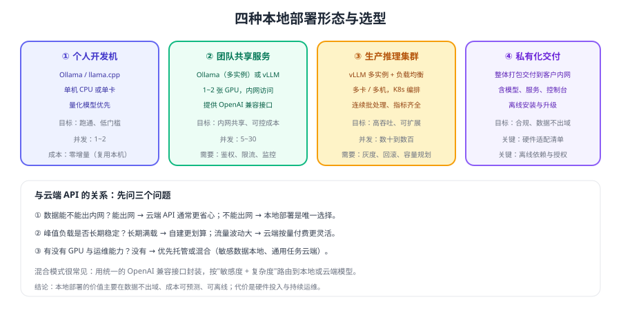

# 本地模型部署

<p style="text-align:center;"></p>

本地模型部署（Local Model Deployment）指在**自己的机器或内网**运行开源大模型，用 OpenAI 兼容接口对外提供服务。它的核心价值是三条：**数据不出域、成本可预测、可以离线运行**；代价是硬件投入与持续的运维。



## 专题导航

- [Ollama 快速落地](Ollama/index.md)：安装、拉模型、兼容接口与常用环境变量
- [推理服务与 API 接入](InferenceServer/index.md)：vLLM / llama.cpp server 与统一接入层
- [量化与模型格式](Quantization/index.md)：FP16 / INT8 / 4 位量化、GGUF / AWQ / GPTQ
- [GPU 与显存规划](Hardware/index.md)：权重、KV Cache、并发与安全余量
- [性能调优与压测](Performance/index.md)：TTFT / TPOT / 吞吐与优化手段
- [生产部署与运维](Deployment/index.md)：网关、多实例、容器化与监控
- [版本与兼容矩阵](Version/index.md)：引擎、CUDA、模型格式的版本状态
- [实战：内网知识库助手](Practice/index.md)：本地模型 + 本地检索的端到端落地
- [常见问题与最佳实践](FAQ/index.md)：起不来、太慢、质量差、不稳定的排查

::: tip 一句话理解
本地部署的成败**不在模型好不好，而在显存够不够、量化选得对不对、并发压不压得住**。先用一页纸算清显存，再动手装环境。
:::

## 什么时候该本地部署

| 判断维度 | 倾向云端 API | 倾向本地部署 |
| --- | --- | --- |
| 数据合规 | 数据可以出内网 | 数据严禁出内网 |
| 负载特征 | 波动大、偶发高峰 | 长期稳定、持续有量 |
| 硬件 | 没有 GPU | 已有 GPU 或可采购 |
| 运维能力 | 无人维护集群 | 有运维/平台团队 |
| 模型需求 | 需要最强模型 | 开源模型够用，或需定制微调 |

::: warning 三个常见误判
1. **只看「省 API 费」**：忽略 GPU 采购、电费、运维人力，成本未必更低。
2. **低估运维成本**：引擎升级、CUDA 兼容、模型管理、监控告警都要长期投入。
3. **高估硬件能力**：以为「有张显卡就能跑」，结果显存不足、上下文受限、并发只有个位数。
:::

## 引擎与版本速览

以下版本按 2026-09 官方仓库核对，详细兼容矩阵见 [版本与兼容矩阵](Version/index.md)。

| 引擎 | 当前版本 | 定位 | 适合 |
| --- | --- | --- | --- |
| Ollama | v0.34.0 | 开箱即用，自带模型管理与兼容接口 | 开发验证、团队内网共享 |
| vLLM | v0.29.0 | 高吞吐生产推理服务 | 生产集群、高并发 |
| llama.cpp | v0.4.0 | 跨平台推理内核（CPU/Mac/边缘） | 无 GPU 环境、端侧 |

## 最小可运行验证

```shell
# 1. 启动本地引擎（以 Ollama 为例，安装方式见对应章节）
ollama serve            # 默认监听 127.0.0.1:11434

# 2. 拉取并试跑一个小模型
ollama pull <model-name>
ollama run <model-name> "用一句话解释什么是量化"

# 3. 用 OpenAI 兼容接口验证（业务侧统一走这一层）
curl -X POST http://localhost:11434/v1/chat/completions \
  -H "Content-Type: application/json" \
  -d '{"model":"<model-name>","messages":[{"role":"user","content":"你好"}]}'
```

预期输出：第三条命令返回标准 Chat Completions 结构的 JSON（含 `choices[0].message.content`）。若连不上，先确认服务端口与监听地址；若模型报错，检查模型名与实际拉取的清单是否一致。

```python [verify_local.py]
from openai import OpenAI

# 业务侧只认 base_url + api_key，本地与云端用配置切换
client = OpenAI(base_url="http://localhost:11434/v1/", api_key="ollama")

resp = client.chat.completions.create(
    model="<model-name>",
    messages=[{"role": "user", "content": "用一句话说明你是本地模型。"}],
    max_tokens=100,
)
print(resp.choices[0].message.content)
```

::: info 统一的接入姿势
业务代码只依赖 **OpenAI 兼容接口**（`base_url` + API Key），本地与云端通过配置切换。这样既能先用云端验证业务，再平滑迁移到本地，也便于「敏感数据本地、通用任务云端」的混合路由。
:::

## 上手路径

| 阶段 | 目标 | 关键动作 |
| --- | --- | --- |
| 第 1 天 | 跑通 | 装引擎、拉小模型、调通兼容接口 |
| 第 1 周 | 可用 | 按显存选模型与量化等级、接进一个真实场景 |
| 第 1 月 | 可靠 | 加鉴权限流、监控告警、压测确定并发上限 |
| 长期 | 可运营 | 版本管理、灰度升级、容量规划与成本核算 |

## 相关专题

- [大模型应用开发](../LLMApp/index.md)：应用侧的接口调用、上下文与成本控制
- [RAG 检索增强](../RAG/index.md)：本地部署下同样需要本地检索（嵌入模型与向量库）
- [OpenClaw](../OpenClaw/index.md)：可搭配 Ollama 本地模型运行的智能体工具
- [Java · LangChain4j 模型集成](../../Backend/Java/Frame/Langchain4j/LlmIntegration/index.md)：Java 生态接入本地模型的写法
- [Kubernetes 部署](../../Ops/Kubernetes/Deployment/index.md)：容器化与 GPU 工作负载编排

## 验证方式

1. 用最小验证脚本跑通一次问答，确认本地引擎与兼容接口都正常工作。
2. `nvidia-smi`（或 CPU 场景的系统监控）记录推理前后的资源占用，与显存预算表对照。
3. 连续发两次相同请求，确认第二次更快（说明模型已常驻，未被反复加载）。
4. 断开外网后重跑一次，确认服务不依赖任何外部调用。

## 参考资料

- Ollama 官方文档：https://docs.ollama.com/
- Ollama OpenAI 兼容接口：https://docs.ollama.com/openai
- vLLM 官方文档：https://docs.vllm.ai/
- llama.cpp 官方仓库：https://github.com/ggml-org/llama.cpp
- NVIDIA CUDA Toolkit 发行说明：https://docs.nvidia.com/cuda/cuda-toolkit-release-notes/index.html
