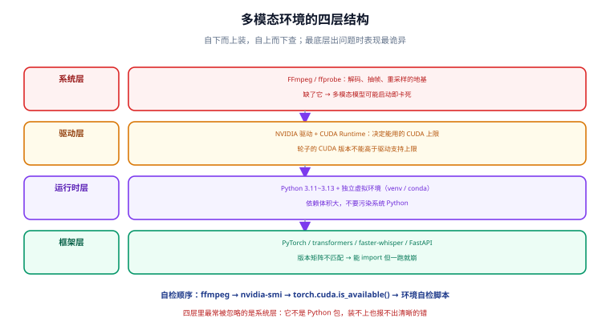

# 多模态应用环境搭建

本页把后面所有页面依赖的工具链**一次性装好并验证**：Python 运行时、PyTorch 与 CUDA、FFmpeg、模型权重缓存，以及「本地跑得动多大模型」的显存速算。目标不是装得全，而是**每一步都有可执行的验证命令**，装完就知道有没有装对。

::: tip 一句话理解
多模态环境的坑 90% 不在 Python 包，而在**系统级依赖**：FFmpeg 缺了、CUDA 版本对不上、CUDA Toolkit 与驱动版本错位。先把这三样验证过，再谈模型。
:::



## 一、需要装什么：四层结构

| 层 | 组件 | 谁依赖它 | 装错了会怎样 |
| --- | --- | --- | --- |
| **系统层** | FFmpeg / ffprobe | 音频解码、视频抽帧、Whisper 读音频、部分推理框架的视频后端 | 报「找不到 ffmpeg」；更糟的是推理框架**启动即卡死**（见下方注意） |
| **驱动层** | NVIDIA 驱动 + CUDA Runtime | PyTorch、vLLM、faster-whisper | 显存识别不到，或 `CUDA error: no kernel image is available` |
| **运行时层** | Python 3.11~3.13、venv/conda | 一切 Python 库 | 包冲突，`pip install` 互相覆盖 |
| **框架层** | PyTorch、transformers、ffmpeg-python、FastAPI | 业务代码 | 版本矩阵不匹配，能 import 但一跑就崩 |

## 二、Python 与虚拟环境

多模态项目的依赖体积很大（PyTorch 单独就几 GB），**必须隔离环境**，不要污染系统 Python。

```shell
# 1. 确认版本（建议 3.11~3.12；3.13 生态已基本跟上，但个别推理库仍滞后）
python --version

# 2. 建虚拟环境（在当前项目目录下）
python -m venv .venv

# 3. 激活（Windows Git Bash / Linux / macOS）
source .venv/Scripts/activate     # Windows
# source .venv/bin/activate       # Linux / macOS

# 4. 升级基础工具
python -m pip install -U pip setuptools wheel
```

::: warning 为什么推荐 3.11 / 3.12
多模态依赖链里有不少包（尤其推理加速与音视频解码相关）会编译原生扩展，**对新版 Python 的支持存在滞后**。选 3.11 或 3.12 能避开绝大多数「装不上」的问题；只有当你要用的模型官方示例明确要求 3.13+ 时才升上去。
:::

## 三、PyTorch 与 CUDA

**不要靠记忆写版本号**。正确做法是先看驱动支持的最高 CUDA 版本，再去 PyTorch 官网拿对应的安装命令。

```shell
# 1. 查看驱动与驱动支持的最高 CUDA 版本
nvidia-smi
# 输出右上角形如：CUDA Version: 12.9  → 表示驱动最高支持 12.9
```

然后到 PyTorch 官网的选择器里选好系统与 CUDA 版本，复制生成的命令，例如：

```shell
# 2. 安装（示例：CUDA 12.8 轮子源；请以官网选择器生成的命令为准）
pip install torch torchvision torchaudio --index-url https://download.pytorch.org/whl/cu128

# 3. 验证：必须同时打印 True 与显卡名
python -c "import torch; print(torch.__version__, torch.cuda.is_available(), torch.cuda.get_device_name(0) if torch.cuda.is_available() else 'CPU-only')"
```

预期输出形如 `2.x.x True NVIDIA GeForce RTX 4070`。**如果 `cuda.is_available()` 是 False**，按顺序检查：驱动版本是否够 → 装的轮子是不是 CPU 版（`cu` 前缀） → 有没有被另一个环境的 torch 抢先加载。

::: danger CUDA、驱动、轮子三者不要混着推理
- 驱动版本决定了**能用的上限**；轮子里带的 CUDA 版本**不能高于驱动支持的上限**，否则报 `CUDA driver version is insufficient`。
- 反向不成立：驱动比轮子新是正常的，向后兼容。
- **不要单独装一套系统 CUDA Toolkit 试图「修好」PyTorch**。轮子自带运行库，系统 Toolkit 只在编译扩展时才需要。装错版本反而更容易把环境搞乱。
- 用容器时（`nvidia/cuda` 或 `vllm/vllm-openai` 镜像），**镜像里的 CUDA 版本才是决定因素**，宿主机只需要驱动够新。
:::

## 四、FFmpeg（最容易漏的一环）

FFmpeg 是音视频链路的地基：Whisper 读任意格式音频靠它，抽帧靠它，推理框架解码视频也靠它。

```shell
# Windows
winget install --id Gyan.FFmpeg -e

# macOS
brew install ffmpeg

# Ubuntu / Debian
sudo apt update && sudo apt install -y ffmpeg
```

装完必须验证（**ffprobe 也要能跑**，很多库只调用 ffprobe）：

```shell
ffmpeg -version        # 预期首行形如 ffmpeg version 9.0 ...
ffprobe -version       # 预期首行形如 ffprobe version 9.0 ...
ffmpeg -hide_banner -filters | grep -i "whisper\|scale"
```

::: danger 缺 FFmpeg 会让多模态服务「启动就卡死」
这不是夸张。部分推理框架（如 vLLM 的多模态路径）会通过 `torchcodec` 在**导入阶段**检查系统 FFmpeg，缺失时抛异常；更早的版本里这个异常发生在不适合报错的时机，表现是**进程直接挂住、日志停在启动阶段**。

排查口径：
1. 启动多模态模型时卡住不动，先跑一次 `ffmpeg -version`，别先怀疑显存。
2. 确认用到的推理框架版本是否包含「延迟检查 FFmpeg」的修复（vLLM 在 0.25.1 附近修过该问题）。
3. Windows 上用 winget 装完后，**新开一个终端**再验证，否则 PATH 没刷新，仍会找不到。
:::

::: warning 版本选择
当前主线是 FFmpeg **9.0 "Lei"**（2026-08-04 发布，后续有 9.0.x 补丁）。长期支持线仍是 7.1 LTS。生产环境若已有稳定流水线，**不必为追新而升级**——9.0 升级了多个核心库的主版本号（`libavcodec` / `libavformat` 进入 63 系列），依赖原生扩展的项目需要重新编译与回归测试。
:::

## 五、Python 侧依赖与模型缓存

```shell
# 1. 图像/文档/语音常用依赖
pip install transformers accelerate pillow numpy soundfile librosa
pip install faster-whisper            # ASR 推理（CTranslate2 后端）
pip install fastapi uvicorn python-multipart   # 实战用的服务框架
pip install openai                    # 调用云端多模态 API

# 2. 可选：自托管推理（有 NVIDIA GPU 时）
pip install vllm
```

模型权重会下载到 Hugging Face 缓存目录，**默认在用户主目录**。多模态权重动辄几 GB 到几十 GB，建议显式指定到一个空间充足的盘：

```shell
# 指向大容量磁盘（示例）
export HF_HOME="/d/models/hf"
export HF_HUB_ENABLE_HF_TRANSFER=1     # 启用 hf_transfer 加速大文件下载
```

```python
# verify_env.py —— 把环境自检写成一个脚本，换机器时先跑它
import importlib, os, shutil, subprocess, sys

def check(name, fn):
    try:
        print(f"[OK]   {name}: {fn()}")
    except Exception as e:
        print(f"[FAIL] {name}: {e}")

check("python", lambda: sys.version.split()[0])
check("ffmpeg", lambda: subprocess.run(["ffmpeg", "-version"], capture_output=True, text=True)
      .stdout.splitlines()[0])
check("torch", lambda: __import__("torch").__version__)
check("cuda", lambda: __import__("torch").cuda.is_available())
check("transformers", lambda: __import__("transformers").__version__)
check("HF_HOME", lambda: os.environ.get("HF_HOME", "(default)"))
check("磁盘可用", lambda: f"{shutil.disk_usage(os.environ.get('HF_HOME', '.')).free / 1024**3:.1f} GB")
```

运行 `python verify_env.py`，**每一项都必须是 `[OK]`**，出现 `[FAIL]` 就按对应章节修。

## 六、显存速算：先算再装

在下载权重之前先算清楚装不装得下。粗略口径（BF16，含 KV Cache 与中间激活的余量）：

| 模型规模 | 权重占用（BF16） | 建议显存 | 实际可选设备 |
| --- | --- | --- | --- |
| 2B 级 VLM | ~5 GB | 8 GB | 消费级显卡、部分核显 |
| 4B 级 VLM | ~9 GB | 12 GB | RTX 3060 12G / 4060 Ti 16G |
| 8B 级 VLM | ~17 GB | 24 GB | RTX 3090 / 4090 |
| 30B 级 MoE（3B 激活） | 约 12 GB（激活态） | 24 GB | RTX 3090 / 4090 |
| 32B 级 VLM | ~65 GB | 80 GB | A100 / H100 或多卡 |
| 235B 级 MoE | 数百 GB | 多卡集群 | 需 FP8 量化 + 多卡 |

::: tip 显存不够的三条路
1. **换小模型**：多模态任务里，8B 级 VLM 在「看图说一句」「抽取固定字段」这类任务上，常常不输大模型，只是复杂推理弱。
2. **量化**：INT8/INT4 量化能把 8B 模型压到 6~10 GB，代价是精度损失——**必须在你的业务数据上实测**，不能只看论文指标。
3. **拆任务**：小模型负责看与定位，大模型只负责难样本，整体显存与成本都能降一半以上。详见 [模型接入与选型](../ModelAccess/index.md)。
:::

## 七、常见坑速查

| 现象 | 原因 | 解法 |
| --- | --- | --- |
| `No module named 'ffmpeg'` | 装的是 `ffmpeg-python` 用于调用，但**系统里没有 ffmpeg 可执行文件** | 先装系统级 FFmpeg（见第四节），`ffmpeg-python` 只是包装器 |
| `torch.cuda.is_available()` 为 False | 装了 CPU 版轮子，或驱动过旧 | 按官网选择器重装 `cuXXX` 版；更新驱动 |
| 多模态模型启动卡死、日志停在加载 | 缺系统 FFmpeg，或框架版本有已知问题 | 验证 `ffprobe -version`；升级到含修复的框架版本 |
| 模型下载中断、反复重下 | 网络波动 + 未启用断点续传 | 设置镜像 `HF_ENDPOINT` 或启用 `HF_HUB_ENABLE_HF_TRANSFER` |
| C 盘被权重撑爆 | 未改 `HF_HOME` | 迁到数据盘，并把 `HF_HOME` 写进启动脚本 |
| `OOM` 但 `nvidia-smi` 显示显存没用满 | 显存被其他进程占用，或 KV Cache 预留不足 | 关掉占显存的进程；调低并发或 `max-model-len` |
| Windows 上路径含空格导致 FFmpeg 调用失败 | 命令拼接未加引号 | 用 `subprocess` 的列表形式传参，不要拼字符串 |

## 八、验证方式

按顺序跑完下面四条，全部通过才算环境就绪：

```shell
# ① 系统依赖
ffmpeg -version && ffprobe -version

# ② Python 与 GPU
python -c "import torch; print(torch.cuda.is_available(), torch.cuda.get_device_name(0) if torch.cuda.is_available() else '')"

# ③ 环境自检脚本
python verify_env.py

# ④ 端到端冒烟：生成一段静音音频再让 FFmpeg 读出来（不依赖模型权重）
ffmpeg -f lavfi -i anullsrc=r=16000:cl=mono -t 1 -y smoke.wav && ffprobe -v error -show_entries stream=sample_rate,channels -of default=nw=1 smoke.wav
```

第 ④ 步预期输出 `sample_rate=16000` 与 `channels=1`——这正是后面语音链路要求的输入格式，**能在这一步验证通过，说明整条音视频地基是通的**。

## 参考资料

- PyTorch 官方安装选择器（按系统与 CUDA 版本生成命令）：<https://pytorch.org/get-started/locally/>
- FFmpeg 官方下载与文档：<https://ffmpeg.org/download.html>
- Hugging Face 缓存与 `HF_HOME` 配置：<https://huggingface.co/docs/huggingface_hub/guides/manage-cache>
- faster-whisper 项目（CTranslate2 后端与量化说明）：<https://github.com/SYSTRAN/faster-whisper>
- vLLM 官方安装与多模态支持：<https://docs.vllm.ai/>
- NVIDIA 驱动与 CUDA 兼容性表：<https://docs.nvidia.com/cuda/cuda-toolkit-release-notes/index.html>
