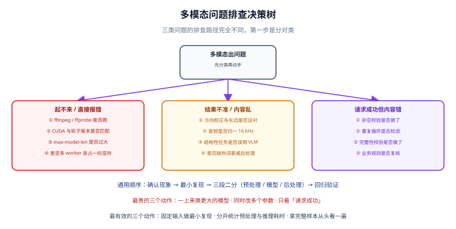

# 多模态应用常见问题与最佳实践

本页是专题的收口：把前面各页散落的坑集中成**一张按症状查找的排查表**，再给出一份可以直接抄进项目的**上线验收清单**。

::: tip 一句话理解
多模态故障分成两类：**响的**（报错、OOM、超时）和**不响的**（内容错了但请求成功）。第二类才是真正烧钱的，所以排查表里专门有一节叫「静默失败」。
:::



## 一、排查总原则

| 步骤 | 做什么 | 不要做什么 |
| --- | --- | --- |
| ① 分类 | 先判断是**基础设施问题**（起不来 / OOM）还是**质量问题**（结果不对） | 不要一上来就换模型 |
| ② 最小复现 | 用一张图/一段音频固定输入，逐项开关预处理 | 不要用「整批数据跑一遍」来定位 |
| ③ 二分定位 | 预处理 / 模型 / 后处理，三段各截一次输入输出 | 不要同时改多个参数 |
| ④ 回归验证 | 改完用固定的冒烟用例 + 抽样集验证 | 不要只看「这次好像对了」 |

::: danger 三个最昂贵的错误动作
1. **一上来换更大的模型**——多数问题出在预处理（方向没校正、长边设太小、音频没归一），换模型是花钱买不到解决。
2. **同时改多个参数**——即使结果变好了，你也不知道是哪个参数起的作用，下次还会踩。
3. **只看「请求成功」**——多模态最危险的失败是「成功返回了错的内容」。
:::

## 二、基础设施类问题

| 症状 | 最可能原因 | 处置 |
| --- | --- | --- |
| 多模态模型启动卡死、日志停在加载阶段 | 缺系统 FFmpeg（推理框架在导入期检查 `torchcodec`） | `ffmpeg -version` 与 `ffprobe -version` 都要能跑；升级到含「延迟检查」修复的框架版本 |
| 文本请求正常、图像请求全失败 | 多模态路径缺依赖或显存不足 | 单独跑一条图像冒烟用例；检查框架日志里的多模态分支报错 |
| `CUDA driver version is insufficient` | 轮子内的 CUDA 版本高于驱动支持上限 | 装匹配的轮子，或升级驱动 |
| `torch.cuda.is_available()` 为 False | 装了 CPU 版轮子 | 从官方选择器重装 `cuXXX` 版本 |
| 加载后立刻 OOM | `gpu-memory-utilization` 过高、`max-model-len` 过大 | 降到 0.85、下调 `max-model-len`（视觉 token 也占上下文） |
| 服务偶发 OOM 但 `nvidia-smi` 没满 | 多 worker 各加载一份模型 | Web 层单 worker，把模型服务独立 |
| 磁盘写满导致构建/推理中断 | 帧图片与中间 WAV 未清理 | 中间产物落临时目录并自动回收，产物落对象存储 |
| 无错误但输出乱码、连续重复符号 | 混合精度量化核的 dtype 不匹配（已知问题类型） | 升级到含修复的版本；或改用 dtype 一致的配置 |

## 三、质量问题：识别不准

| 症状 | 最可能原因 | 处置 |
| --- | --- | --- |
| 手机拍的照片识别率骤降 | 未做 EXIF 方向校正 / 未矫正畸变 | 预处理加方向校正与透视矫正 |
| 小字号文字识别不出 | 缩得太多，长边上限设得太小 | 文字类保 1600~2048；或先切块再放大识别 |
| 多栏文档输出顺序错 | 缺阅读顺序还原 | 用带版面分析的流水线；或按栏切开分别识别 |
| 表格塌成一列 | 端到端 VLM 对表格结构弱 | 表格单独走表格识别；或换流水线式方案 |
| 整块内容凭空消失 | 版面检测漏块（静默遗漏） | 调低检测阈值；对输出做「块数校验」 |
| 模型读出了图上没有的文字 | 视觉信号弱时模型用语言模型「补全」 | 提示词限定「只描述可见事实」；关键字段独立校验 |
| 语种识别错了导致整段乱码 | 多语种混说却只猜一次语言 | 按 VAD 切片后逐片判语言 |
| 静音段出现不存在的句子 | ASR 在静音上幻觉 | 开 VAD / `vad_filter=True` |
| 特定口音/领域词始终错 | 训练数据偏置、术语不在词表 | 热词表、后处理映射，或微调 |

## 四、质量问题：静默失败（最危险）

这一类**请求返回 200，内容却是错的**，必须在代码里主动检测。

| 静默失败形态 | 特征 | 检测手段 |
| --- | --- | --- |
| **空结果** | `content` 为空字符串或只有标点 | 长度校验，最小长度阈值 |
| **重复循环** | 同一片段反复出现直到 `max_tokens` | 统计最短重复周期出现次数，超阈值判失败 |
| **硬截断** | 输出看着像「文档本来就这么短」 | 完整性校验：页数/字段数/结尾标记 |
| **内容编造** | 字段格式合法但值错（金额少一位） | 业务规则校验：合计是否等于明细之和、编号校验位 |
| **格式漂移** | 有时 JSON 有时 Markdown | 强制 schema 输出；解析失败即重试或降级 |

```python
# validators.py —— 三类静默失败的通用检测
import json

def not_empty(text: str | None, min_len: int = 2) -> bool:
    return bool(text and len(text.strip()) >= min_len)

def no_repetition(text: str, window: int = 40, max_repeat: int = 8) -> bool:
    """重复循环检测：取开头 window 个字符，统计其在全文出现次数。"""
    if len(text) <= window:
        return True
    return text.count(text[:window]) < max_repeat

def json_ok(text: str) -> bool:
    try:
        json.loads(text)
        return True
    except Exception:
        return False

def complete(text: str, must_have: list[str]) -> bool:
    """完整性：必须出现的字段/标记一个都不能少。"""
    return all(k in text for k in must_have)
```

::: danger 校验失败必须走降级，不能当成成功
**只对异常做降级是不够的**。上面这类「返回了但内容是坏的」情况不会抛异常，如果代码只在 `except` 里做降级，坏结果就会被当成好结果返回给用户——而且监控上看全是成功。正确写法是：**校验不通过也走降级链**（见 [模型接入与选型](../ModelAccess/index.md) 的网关实现）。
:::

## 五、延迟与成本类问题

| 症状 | 最可能原因 | 处置 |
| --- | --- | --- |
| 单请求延迟远超预期，但 GPU 利用率不高 | 瓶颈在预处理（FFmpeg 抽帧/重采样）而非推理 | 分开计时：预处理耗时与推理耗时分别上报 |
| 并发上不去，加并发反而更慢 | 转写/推理是 GPU 密集，并发过高导致排队与显存争抢 | 加信号量限制并发；横向扩 Web 层而非模型层 |
| 成本突然翻倍 | 输入 token 涨了（图变大、帧变多、上下文变长） | 按「输入大小」维度做成本归因，定位是哪类请求变贵 |
| 提示词改了以后成本上升 | 固定前缀被破坏，缓存命中率下降 | 把固定提示词放在最前面，保持前缀稳定 |
| 长视频请求超时 | 单次请求塞了太多帧 | 场景切分 + 分批 + 汇总（两阶段） |
| 云端费用居高不下 | 全文重试、无缓存 | 只重试失败分片；同文本同音色做结果缓存 |
| 首包延迟高（实时对话） | 等整句/整段才开始下游 | 全链路流式：ASR 流式 → LLM 流式 → TTS 流式 |

::: tip 成本归因的最小做法
每次请求记三个数：**输入大小（像素/秒数/帧数）、输入 token、输出 token**。这三个数能回答 90% 的「为什么这个月变贵了」。
:::

## 六、合规与安全类问题

| 问题 | 规则 | 落地做法 |
| --- | --- | --- |
| 数据能否出网 | **先判这一条，再谈选型** | 涉案/涉病历/涉身份证一律走本地或内网自托管 |
| 权重许可 | 代码许可 ≠ 权重许可 | 打开权重仓库模型卡，逐项核对；禁用 NC 条款做商用 |
| 开源项目门槛条款 | 部分项目按 MAU 或营收设阈值 | 记为上线前检查项；跨阈值前联系授权 |
| 标注义务 | 部分许可要求显著标注来源 | 写进产品界面或公开文档，**不标注会导致许可自动终止** |
| 地域限制 | 个别模型有地域授权限制 | 跨境业务上线前核对授权地域 |
| 声音克隆 | 涉及他人声音权 | 取得授权；产物加水印或可追溯标记 |
| 生成内容标识 | 部分司法辖区要求 AI 生成内容加标识 | 出口处统一加标识字段 |
| 提示注入 | 图片/文档里的文字可能包含指令 | 把模型输出的指令当**数据**不当指令执行；关键动作走人工确认 |

::: danger 提示注入在多模态里更隐蔽
纯文本场景里，用户输入的指令至少是「用户写的」。多模态场景里，**指令可能藏在图片里的文字、音频的语音、文档的批注中**，而且用户自己都未必知道。任何「模型输出会触发真实动作」的功能（发邮件、下单、删数据），都必须把模型输出当作**不可信输入**重新校验。
:::

## 七、最佳实践清单

按重要性排序，前五条是必做项。

1. **链路入口归一化**：图片统一做方向校正与限长边，音频统一到 16 kHz 单声道。这一步的收益大于换任何模型。
2. **结构性任务与语义性任务分家**：保真（OCR/转写）用专用模型，归纳（摘要/问答）用 VLM。不要混在一次请求里。
3. **输出必校验**：非空、无重复、完整性、业务规则，四类校验至少做前两类。
4. **固定前缀以命中缓存**：系统提示词与工具定义放最前且不要频繁改动。
5. **按后端抽象**：只依赖 `messages` + `image_url` 最小公共子集；换后端只改配置。
6. **显式降级链**：写进配置，带日志与计数；合规场景的链条里不许出现云端。
7. **成本归因到位**：每次请求记录输入大小 / 输入 token / 输出 token。
8. **版本全部固定**：推理框架镜像、模型权重、FFmpeg，都固定到具体版本号，不用 `latest`。
9. **异步化重活**：视频处理与视频生成一律异步（提交任务 → 轮询/回调）。
10. **保留抽样人工校验**：任何自动指标都不能替代「拿完整样本从头看到尾看一次」。

## 八、上线验收清单

逐项打勾，缺一项就不要上线。

| # | 检查项 | 判定口径 |
| --- | --- | --- |
| 1 | 环境自检脚本全绿 | 每一项 `[OK]`，无 `[FAIL]` |
| 2 | 四类冒烟用例全过 | 纯文本 / 单图 / 多图 / 大图（或文本 / 单音频 / 长音频 / 异常格式） |
| 3 | 自有数据抽样准确率达标 | 见 [图像与文档理解](../ImageUnderstanding/index.md) 与 [语音处理](../SpeechProcessing/index.md) 的指标口径 |
| 4 | 静默失败率可统计 | 有明确的「校验失败次数 / 总请求数」指标 |
| 5 | 错误路径规范 | 返回业务码，响应体无堆栈，日志有 traceId |
| 6 | 降级演练通过 | 手动停主后端，服务仍可用且产生降级日志 |
| 7 | 成本有预算与监控 | 每请求的成本可归因，日/月预算有告警 |
| 8 | 合规核对完成 | 数据流向、权重许可、标注义务、生成内容标识四项均有结论 |
| 9 | 版本全部固定 | 无 `latest`，回滚路径演练过一次 |
| 10 | 运维文档齐备 | 启动、扩容、回滚、常见故障处置各一节 |
| 11 | 中间产物不落地 | 帧图片/临时 WAV 用临时目录，产物落对象存储并设过期 |
| 12 | 抽样人工复核 | 上线前完整看过一份端到端样本 |

::: warning 最容易「看着完成其实没做」的三项
**第 3、4、6 项**。准确率容易用 Demo 图糊弄过去；静默失败率需要额外埋点，常被跳过；降级演练要动手停服务，常被推迟到「上线后再说」。这三项恰好是线上事故的主要来源。
:::

## 九、参考资料

- OpenAI 视觉输入文档（图像参数与限制）：<https://platform.openai.com/docs/guides/vision>
- vLLM 官方文档（多模态服务与版本说明）：<https://docs.vllm.ai/>
- Whisper 官方仓库（静音幻觉等已知行为）：<https://github.com/openai/whisper>
- faster-whisper（`vad_filter` 与参数说明）：<https://github.com/SYSTRAN/faster-whisper>
- MinerU 许可条款（标注义务与阈值）：<https://github.com/opendatalab/MinerU>
- FFmpeg 官方文档（音视频预处理）：<https://ffmpeg.org/documentation.html>
- 项目内相关：[多模态应用概述](../Overview/index.md) ｜ [实战：图片问答 + 语音转写服务](../Practice/index.md)
