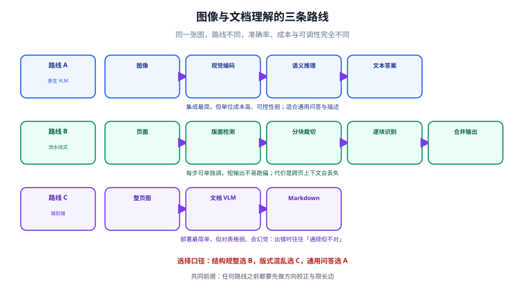

# 图像与文档理解

本页解决「**让模型看懂一张图**」这一类需求：图像问答与描述、文字识别（OCR）、文档版面还原与结构化抽取。这三件事经常被混为一谈，但它们的预处理、模型选型和失败模式完全不同——**分开处理，准确率立刻上一个台阶**。

::: tip 一句话理解
图像任务里，**「看清楚」和「看懂了」是两个独立的问题**。OCR/版面分析负责「看清楚」（保真、可校验），VLM 负责「看懂了」（归纳、推理）。把两件事交给同一个模型的同一个请求，是准确率上不去的头号原因。
:::



## 一、先分清三类任务

| 任务 | 要什么 | 典型输入 | 首选方案 | 失败模式 |
| --- | --- | --- | --- | --- |
| **图像理解** | 语义：这是什么、图里有什么、界面元素在哪 | 照片、截图、图表 | 原生 VLM | 编造看不见的细节 |
| **文字识别** | 保真：把图上的字一字不差取出来 | 票据、车牌、票据、扫描件 | 专用 OCR | 漏字、错字、串行 |
| **文档结构化** | 结构：标题/段落/表格/公式，以及它们的关系 | PDF、多栏论文、报表 | 版面检测 + 识别（或文档 VLM） | 阅读顺序错、表格塌成一团 |

::: danger 最常见的错误做法
拿一个 VLM，把整页扫描件丢进去，让它「输出 JSON」。结果是：看起来很像，但**关键字段会静默出错**——数字 `8` 变 `3`、金额少一位、编号前后颠倒，而且模型用很自然的语气把错的内容写出来，肉眼扫一遍根本发现不了。

正确做法：**结构性的东西靠版面分析，字段级的保真靠专用识别，语义归纳才交给 VLM**。
:::

## 二、预处理：决定成败的一半

图像进模型之前，至少要过这四道工序：

| 工序 | 做什么 | 为什么必须做 |
| --- | --- | --- |
| **方向校正** | 检测并旋转到正向 | 手机拍的文档经常旋转 90°/180°，不校正直接大幅掉点 |
| **畸变矫正** | 估计文档四角并做透视变换 | 斜着拍的照片，文字行倾斜，检测框会错位 |
| **分辨率约束** | 限制长边（常见 1024~2048） | 视觉 token 随分辨率增长；过大不仅贵，还可能被内部降采样而白花成本 |
| **分块裁切** | 按版面切成标题/段落/表格/图 | 每块单独识别，短输出没有「跑偏」的空间（详见第五节） |

```python
# preprocess.py —— 一个最小可用的预处理链（依赖 pillow）
from PIL import Image, ImageOps

def normalize(path: str, max_side: int = 1600) -> Image.Image:
    img = Image.open(path)
    img = ImageOps.exif_transpose(img)      # ① 按 EXIF 方向校正（手机照片必需）
    img = img.convert("RGB")                # ② 统一色彩通道，避免 RGBA 报错
    w, h = img.size
    if max(w, h) > max_side:                # ③ 等比缩放到长边上限
        scale = max_side / max(w, h)
        img = img.resize((int(w * scale), int(h * scale)), Image.LANCZOS)
    return img

if __name__ == "__main__":
    out = normalize("sample.jpg")
    print("输出尺寸:", out.size)   # 预期：长边 <= 1600
```

::: tip 为什么是「限制长边」而不是「固定尺寸」
文档类图片被压到固定小尺寸会**直接丢失小字号文字**；而照片类图片过大又浪费 token。实用口径是：**文字类保长边 1600~2048，语义类 1024 左右就够**。同一批数据用哪个值，靠实测——拿 20 张典型图，两档各跑一次对比识别正确率即可。
:::

## 三、图像理解：原生 VLM 怎么调

开源 VLM 用 `transformers` 就能跑通，关键是**用对类和处理器**：

```python
# vlm_local.py —— 本地 VLM 图像问答（示例为 Qwen 系列 Instruct 权重）
from transformers import AutoModelForImageTextToText, AutoProcessor

MODEL_ID = "Qwen/Qwen3-VL-8B-Instruct"     # 以官方模型卡发布的最新 ID 为准

model = AutoModelForImageTextToText.from_pretrained(MODEL_ID, dtype="auto", device_map="auto")
processor = AutoProcessor.from_pretrained(MODEL_ID)

messages = [{
    "role": "user",
    "content": [
        {"type": "image", "image": "./sample.jpg"},
        {"type": "text", "text": "只描述图中可见的事实，不要推测。"},
    ],
}]

inputs = processor.apply_chat_template(
    messages, tokenize=True, add_generation_prompt=True, return_dict=True, return_tensors="pt"
).to(model.device)

generated = model.generate(**inputs, max_new_tokens=256)
trimmed = [o[len(i):] for i, o in zip(inputs.input_ids, generated)]
print(processor.batch_decode(trimmed, skip_special_tokens=True)[0])
```

三个必须记住的约束：

1. **`AutoModelForImageTextToText`、`AutoProcessor`** 是当前多模态的标准入口类名，别沿用旧的 `AutoModelForVision2Seq` 记忆。
2. **`dtype="auto"`**（旧写法是 `torch_dtype`）让权重按模型自身精度加载，能省一半显存。
3. **`trimmed = output[len(input_ids):]`** 这一步不能省。很多模型会把输入 prompt 原样复述一遍，不裁掉就会看到「问题 + 答案」全冒出来，误判成模型不听话。

用云端 OpenAI 兼容接口时，图像走 `image_url` 这一种内容块，**URL 和 base64 都支持**：

```python
from openai import OpenAI
import base64

client = OpenAI()   # 读 OPENAI_API_KEY；自托管时传 base_url

def describe(path: str) -> str:
    b64 = base64.b64encode(open(path, "rb").read()).decode()
    resp = client.chat.completions.create(
        model="gpt-5.4",          # 以官方当前模型列表为准
        messages=[{
            "role": "user",
            "content": [
                {"type": "text", "text": "用一句话说明这张图是什么。"},
                {"type": "image_url", "image_url": {"url": f"data:image/jpeg;base64,{b64}"}},
            ],
        }],
        max_tokens=128,
    )
    return resp.choices[0].message.content
```

::: warning OpenAI 兼容协议是「事实标准」
不管是自托管（vLLM / llama.cpp server）还是各家云服务，**图像内容块的形状基本都统一为 `{"type": "image_url", "image_url": {"url": ...}}`**。把这一层封装成函数，换后端时只改 `base_url` 和 `model`，业务代码零改动——这是多模态应用最重要的一条解耦。
:::

## 四、OCR 与文档解析：两条架构路线

2026 年的开源文档解析已经收敛成两条路线，**选错比选差更致命**。

| 对比项 | 流水线式（Layout-first） | 端到端 VLM |
| --- | --- | --- |
| 工作方式 | 版面检测 → 分块 → 逐块识别 → 阅读顺序还原 | 整页图 → 一次生成 Markdown |
| 代表 | PaddleOCR 系、MinerU、Docling、Marker | dots.ocr、olmOCR、DeepSeek-OCR |
| 优点 | 每一步可单独调试；短输出不易跑偏；可只跑部分阶段 | 部署简单；对怪异版式的适应性强 |
| 缺点 | 阶段多、链路长；**跨页上下文丢失**（续表会变成两张无关的表） | 本地难调；**会幻觉** |
| 可调点 | 检测阈值、裁切比例、NMS、形状模式 | 基本没有，只能调采样参数 |
| 适合 | 结构规整的业务单据、批量入库 | 版式混乱的扫描件、一次性转换 |

::: danger 端到端 VLM 的两种「静默失败」
识别器（OCR）出错会退化成噪声——人能一眼看出不对。VLM 出错会退化成**通顺**：

1. **重复循环**：token 概率塌陷，模型不断重复一个片段，并把自己的输出当上下文继续强化，直到撞上 `max_new_tokens`。自托管模型上常见。
2. **硬截断**：云端模型在合法抽取任务上触发安全过滤，直接结束，返回的是一份「看起来很短的文档」——`finish_reason` 是 `content_filter` 之类，但没有报错。

**应对**：输出必须做长度与完整性校验（页数、字段数、结尾标记），不能只看「请求成功」。
:::

### 选型表（核对时间 2026-09）

| 方案 | 类型 | 代码许可 | 权重许可 | 显存门槛 | 备注 |
| --- | --- | --- | --- | --- | --- |
| PaddleOCR（PP-OCRv6） | 流水线 | Apache-2.0 | Apache-2.0 | CPU 可跑 | 轻量检测+识别，单模型覆盖中英日与 46 种拉丁语系；PaddleOCR-VL 另有 0.9B 端到端版本 |
| MinerU | 流水线（含 VLM 后端） | Apache-2.0 + 附加条款 | 自定义 | 4 GB（流水线）/ 8 GB（VLM） | 商用免费，但**超过 MAU 1 亿或月营收 2000 万美元需单独授权**，且在线服务必须显著标注来源 |
| Docling | 流水线（可挂 VLM） | **MIT** | Apache-2.0 | 4~8 GB（可选） | 许可最干净；2026 年初捐给 Linux Foundation AI & Data；提供 258M 的 Granite-Docling |
| Marker | 流水线（内嵌 VLM） | Apache-2.0 | 改版 OpenRAIL-M | 视后端 | 权重在融资/营收超过阈值后需付费；速度档位差别很大 |
| dots.ocr / dots.mocr | 端到端 VLM | **MIT** | MIT | 8~16 GB（1.7B / 3B） | 端到端路线里许可最宽松的一档 |
| olmOCR 2 | 端到端 VLM | Apache-2.0 | **Apache-2.0** | 12 GB | 代码与权重双 Apache-2.0，并公开训练数据；官方给出「每百万页 < 200 美元」的成本口径 |
| DeepSeek-OCR 2 | 端到端 VLM | Apache-2.0 | Apache-2.0 | 16~24 GB | ~3B；注意其**旧版本 checkpoint 曾是 MIT**，换版本要重新核对许可 |
| Chandra 2 | 端到端 VLM | Apache-2.0 | 改版 OpenRAIL-M | 24 GB+ | 有「不得与官方 API 竞争」之类限制 |
| Tesseract 5.5.x | 传统 OCR | Apache-2.0 | Apache-2.0 | CPU | 已进入维护模式；「让档案可被 grep」这类需求由 OCRmyPDF 包一层就够 |
| HunyuanOCR | 端到端 VLM | 社区许可 | 社区许可 | — | **未在欧盟 / 英国 / 韩国授权**，跨境业务必须先核对地域条款 |

::: danger 许可核对的三条硬规则
1. **代码许可 ≠ 权重许可**。GitHub 首页的 License 徽章只代表代码。权重仓库里往往写着另一套条款，务必打开模型卡确认。
2. **同一项目的不同 checkpoint 可能换了许可**。MinerU 的 2025 版某 checkpoint 是 AGPL-3.0，2026 版才是 Apache-2.0——用旧镜像固定版本提供服务，AGPL 的网络条款会追到你身上。
3. **标注义务是自动失效条款**。MinerU 一类协议要求在线服务显著标注来源，**不标注则该许可自动终止**（且不另行通知）。上线前把它写进产品界面或文档。
:::

## 五、版面阶段的调参：力气花在哪里

选流水线式方案后，**时间应该花在检测阶段而不是采样参数上**。检测漏了一个块，后面的 VLM 根本看不到它——**这是一个静默遗漏，输出里没有任何迹象**。

| 参数类别 | 调它的时机 | 方向 |
| --- | --- | --- |
| 检测阈值 | 有块整块丢失 | 调低阈值（漏检比误检更贵） |
| 裁切外扩比例 | 文字被框边缘切掉 | 适度外扩 |
| 框合并模式 | 相邻框重叠、内容被拆散 | 选大框 / 小框 / 并集，按版式试 |
| 去重（NMS） | 同一区域被检出多次 | 开启去重 |
| 框形状 | 矩形框装不下倾斜文本 | 改用四边形 / 多边形 / 自动 |
| 像素上下限 | 小字块裁出来太糊 | 抬高最小像素 |

::: tip 三个「比换模型更有效」的预处理
扫描件质量差时，**先在检测前做三个可选阶段**，收益通常大于换更大的模型：

1. **方向分类**（把转正的页面挑出来）
2. **去畸变/展平**（手机拍的书页卷曲）
3. **多页重组**（把跨页表格接回去——这是流水线式方案唯一真正的短板，必须自己做）
:::

## 六、结构化输出：别让模型自由发挥

要 JSON 就**用 schema 约束**，不要只在提示词里写「请输出 JSON」。

```python
# 用 JSON Schema 约束抽取结果（OpenAI 兼容接口的 structured outputs 写法）
from openai import OpenAI
from pydantic import BaseModel

class Invoice(BaseModel):
    invoice_no: str
    amount: float
    currency: str
    items: list[str]

client = OpenAI()
resp = client.chat.completions.parse(          # parse 会按 Pydantic 模型校验
    model="gpt-5.4",
    messages=[{"role": "user", "content": [
        {"type": "text", "text": "抽取这张发票的关键字段，找不到的字段不要编造。"},
        {"type": "image_url", "image_url": {"url": "https://example.com/inv.jpg"}},
    ]}],
    response_format=Invoice,
)
print(resp.choices[0].message.parsed)
```

::: danger 约束了格式，不代表约束了内容
Schema 能保证「字段都在、类型都对」，**但保证不了「值是真的」**。金额被读错一位，返回的仍然是合法的 `float`。

因此凡是**金额、编号、日期、数量**这类字段，必须配一条独立校验：金额合计是否等于明细之和、编号是否符合校验位规则、日期是否在合理区间。**校验不通过就拒收并转人工**，这是把准确率从 90% 抬到 99% 的唯一办法。
:::

## 七、验证方式

不要用「Demo 图看着不错」当结论。按下面三步验证：

```shell
# ① 造一份带已知答案的测试集（20~50 张，覆盖：正向扫描件、手机斜拍、多栏、含表格）
mkdir -p cases && echo "请把 cases/ 下每张图的人工转写文本填入 cases/expected/*.txt"

# ② 跑批量识别，逐条与人工答案比对（字符级相似度即可）
python eval_ocr.py --dir cases --expected cases/expected
# 预期：输出每张图的字符准确率，并给出总体准确率与最差的 3 张
```

判定口径：

| 指标 | 及格线（业务单据） | 说明 |
| --- | --- | --- |
| 字符准确率 | ≥ 98% | 全文比对，含标点 |
| 关键字段准确率 | ≥ 99.5% | 金额、编号、日期等，逐字段核 |
| 表格结构（TEDS 类指标） | ≥ 85% | 表格还原质量，用公开基准口径可比 |
| 端到端失败率 | ≤ 1% | 含超时、截断、循环等异常 |

::: warning 用公开基准起步，用自有数据定稿
公开榜单（各类文档解析基准）能帮你**筛掉明显不合格的方案**，但榜单与你的单据版式往往差得很远。**最终选型必须用自有数据**，并且要统计「静默错误率」——也就是模型自信地给出了错误答案的比例，这一项比总体准确率更能预测线上事故。
:::

## 八、常见坑速查

| 现象 | 原因 | 解法 |
| --- | --- | --- |
| 手机拍的照片识别率骤降 | 未做 EXIF 方向校正 / 未做畸变矫正 | 预处理补上 `exif_transpose`，卷曲页加展平 |
| 多栏 PDF 输出顺序错乱 | 未做阅读顺序还原 | 用带版面分析的流水线；或按栏裁开分别识别再拼接 |
| 表格全塌成一列 | 端到端 VLM 对表格结构弱 | 表格单独走表格识别模型，或改用流水线式方案 |
| 输出里混进整段 prompt | 没裁掉输入 token | `output[len(input_ids):]` 后再解码 |
| 模型读出图上没有的文字 | 视觉信号弱时模型用语言模型「补全」 | 提示词加「只描述可见事实」；关键字段加独立校验 |
| 换后端后图像参数不生效 | 各后端对兼容字段支持程度不同 | 只依赖 `image_url` 这一最小公共子集 |
| 昨天能跑今天报错 | 用了 `latest` 镜像 / 未固定权重版本 | 权重与推理镜像都固定到具体版本号 |
| 长文档处理到一半中断 | 命中 `max_tokens` 或安全过滤 | 按页分段处理，逐段校验完整性后再合并 |

## 参考资料

- PaddleOCR 项目与 PP-OCR 系列模型：<https://github.com/PaddlePaddle/PaddleOCR>
- MinerU 项目与许可条款说明：<https://github.com/opendatalab/MinerU>
- Docling（MIT）项目与 VLM 流水线：<https://github.com/docling-project/docling>
- olmOCR 项目（Apache-2.0 代码与权重）：<https://github.com/allenai/olmocr>
- dots.ocr 项目：<https://github.com/studio-dots-ai/dots.ocr>
- OpenAI 结构化输出（Structured Outputs）文档：<https://platform.openai.com/docs/guides/structured-outputs>
- Transformers 多模态模型与处理器文档：<https://huggingface.co/docs/transformers/main/en/tasks/image_text_to_text>
- 项目内相关：[多模态应用概述](../Overview/index.md) ｜ [模型接入与选型](../ModelAccess/index.md) ｜ [环境搭建](../Environment/index.md)
- 跨专题相关：[RAG 检索增强 · 嵌入与向量基础](../../RAG/Embedding/index.md)（多模态检索复用同一套向量工程）
