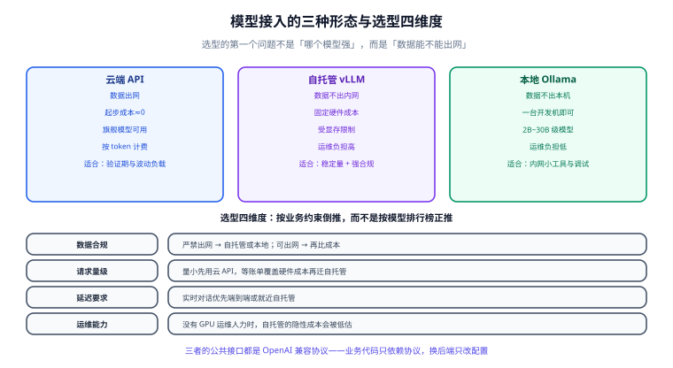

# 模型接入与选型

多模态模型有**三种接入方式**：调云端 API、自己托管（vLLM 之类）、本地跑（Ollama 之类）。它们不是「新旧关系」，而是**同一套业务代码的三种后端**。本页的核心主张是：**用 OpenAI 兼容协议把三者统一起来，业务代码只依赖协议，不依赖厂商**。

::: tip 一句话理解
选型的第一个问题不是「哪个模型强」，而是「**数据能不能出网**」。这一条决定排除掉一半选项，剩下的再按量级、预算与延迟挑。
:::



## 一、三种接入方式对比

| 维度 | 云端 API | 自托管（vLLM） | 本地（Ollama / llama.cpp） |
| --- | --- | --- | --- |
| **数据合规** | 数据出网 | 内网 | 本机，最严 |
| **起步成本** | 几乎为零 | 需要 GPU 与运维 | 一台开发机即可 |
| **单位成本** | 按 token 计费，量大后很贵 | 固定硬件成本，量大后极便宜 | 只有电费 |
| **模型上限** | 旗舰模型随便用 | 受显存限制 | 2B~30B 级 |
| **多模态支持** | 图像/音频/视频齐全 | 支持主流开源 VLM（需框架支持） | 以图像为主，视频支持较弱 |
| **延迟** | 受网络与队列影响 | 可控，受并发影响 | 单并发最快 |
| **运维负担** | 无 | 高（版本、显存、监控） | 低 |
| **适合** | 快速验证、负载波动大 | 有稳定量、数据不能出网 | 内网小工具、开发调试 |

::: danger 选型时最容易算错的一笔账
**只算 token 单价，不算工程成本**。自托管看起来「每 token 便宜 10 倍」，但真实成本 = 显卡折旧 + 运维人力 + 版本升级 + 容灾冗余。当每天请求量低于某个量级时，自托管的总成本**高于**云 API。

判断口径：先算「云 API 月支出」，如果它**明显低于**「一台可用 GPU 的月折旧 + 0.3 个运维人力」，就先用云 API——**等账单涨到能覆盖硬件时再迁**。反过来，如果数据不能出网，那这笔账不用算，直接自托管。
:::

## 二、统一抽象：OpenAI 兼容协议

不管是 vLLM、llama.cpp server、Ollama 还是各家云服务，**图像内容块的形状已经基本统一**。把这一层封成函数，换后端只改两个变量。

```python
# llm_gateway.py —— 一个后端无关的多模态调用封装
import base64
import os
from openai import OpenAI

BACKENDS = {
    # 名字 -> (base_url, api_key, 默认模型)
    "cloud":  (None,                                   os.getenv("OPENAI_API_KEY"), "gpt-5.4"),
    "vllm":   ("http://10.0.0.5:8000/v1",              "not-needed",                "Qwen/Qwen3-VL-8B-Instruct"),
    "ollama": ("http://localhost:11434/v1",            "not-needed",                "qwen3-vl:8b"),
}

def build_client(name: str) -> tuple[OpenAI, str]:
    base_url, key, model = BACKENDS[name]
    return OpenAI(base_url=base_url, api_key=key), model

def ask_image(client: OpenAI, model: str, image_path: str, question: str) -> str:
    b64 = base64.b64encode(open(image_path, "rb").read()).decode()
    resp = client.chat.completions.create(
        model=model,
        messages=[{
            "role": "user",
            "content": [
                {"type": "text", "text": question},
                {"type": "image_url", "image_url": {"url": f"data:image/jpeg;base64,{b64}"}},
            ],
        }],
        max_tokens=512,
    )
    return resp.choices[0].message.content
```

::: tip 只依赖「最小公共子集」
各家对兼容协议的实现程度不同：有的支持 `response_format` 结构化输出，有的不支持；有的支持多图，有的只吃一张。**业务代码只依赖 `messages` + `image_url` 这个最小子集**，把扩展能力用「能力开关」显式管理，而不是假设它一定存在。
:::

## 三、自托管：vLLM 起一个多模态服务

vLLM 是目前自托管多模态最主流的方案，对外直接提供 OpenAI 兼容接口。

```shell
# 方式 A：Docker（推荐，环境自带 FFmpeg 等系统依赖）
docker run --runtime nvidia --gpus all \
  -p 8000:8000 \
  -v ~/.cache/huggingface:/root/.cache/huggingface \
  --ipc=host \
  vllm/vllm-openai:latest \
  --model Qwen/Qwen3-VL-8B-Instruct \
  --served-model-name qwen3-vl-8b \
  --gpu-memory-utilization 0.9 \
  --max-model-len 32768

# 方式 B：pip 安装后宿主机启动
pip install vllm
vllm serve Qwen/Qwen3-VL-8B-Instruct \
  --host 0.0.0.0 --port 8000 \
  --served-model-name qwen3-vl-8b \
  --dtype bfloat16 \
  --gpu-memory-utilization 0.9 \
  --max-model-len 32768
```

启动后的自检（**看到 `Uvicorn running on ...` 再验证**）：

```shell
# ① 服务在不在
curl -s http://localhost:8000/v1/models

# ② 文本能不能通
curl -s http://localhost:8000/v1/chat/completions -H "Content-Type: application/json" \
  -d '{"model":"qwen3-vl-8b","messages":[{"role":"user","content":"回复：ok"}],"max_tokens":16}'

# ③ 图像能不能通（关键：确认多模态路径真的可用）
curl -s http://localhost:8000/v1/chat/completions -H "Content-Type: application/json" \
  -d '{"model":"qwen3-vl-8b","messages":[{"role":"user","content":[
        {"type":"image_url","image_url":{"url":"https://example.com/cat.jpg"}},
        {"type":"text","text":"一句话描述这张图"}]}],"max_tokens":64}'
```

::: danger 自托管的四个必配项
1. **`--served-model-name` 一定要设**。不设时模型名会是完整仓库路径，客户端硬编码后换权重就崩。
2. **`--max-model-len` 要留余量**。图像/视频编码出的视觉 token **也吃这个上下文**，设满等于多图请求直接失败。
3. **`--gpu-memory-utilization` 别拉满**。0.9 已经偏激进，加载期 OOM 就先降到 0.85。
4. **版本固定，不要用 `latest`**。多模态路径对推理框架版本敏感，升级前必须看 changelog（见下一节）。
   :::

### 版本敏感性：两个真实教训

多模态推理框架的坑和纯文本不同，往往出在**系统依赖**与**混合精度**上：

| 问题 | 表现 | 根因 | 应对 |
| --- | --- | --- | --- |
| 缺 FFmpeg 导致启动卡死 | 进程挂住，日志停在启动阶段，报与 `torchcodec` 相关的异常 | 导入期就检查系统 FFmpeg，而多模态路径必然导入它 | 装系统 FFmpeg；升级到「延迟检查 FFmpeg」的版本 |
| 量化模型输出乱码 | 生成连续的重复符号（如 `!!!!`）或完全无意义字符 | 混合精度融合核未校验 dtype 兼容性（激活 BF16 而归一化权重 FP32） | 打补丁版本；或改用 dtype 一致的安全路径 |

::: warning 升级前后的固定动作
1. 升级前：读 changelog，重点看 `bug fix` 与 `model support` 两类条目。
2. 升级中：**冻结镜像/权重版本**，用同一个 patch 版本号回滚。
3. 升级后：跑一遍固定的多模态冒烟用例（文本 + 单图 + 多图），**不能只看服务起来了**。
:::

## 四、本地：Ollama 快速验证

开发阶段不想碰 GPU 运维，用 Ollama 起一个多模态模型是最快的路径。

```shell
# 拉一个带视觉能力的模型（以官方模型库中的实际 tag 为准）
ollama pull qwen3-vl:8b

# 命令行直接问图
ollama run qwen3-vl:8b "描述这张图：./sample.jpg"

# 确认 OpenAI 兼容端点可用
curl -s http://localhost:11434/v1/models
```

Ollama 的 `/v1` 端点同样兼容上文封装的客户端，把 `base_url` 指过来即可。**开发用 Ollama、上线切 vLLM** 是常见组合，前提就是第二节那层抽象。

## 五、选型矩阵（按业务约束倒推）

| 业务约束 | 首选 | 次选 | 说明 |
| --- | --- | --- | --- |
| 数据严禁出网 + 量大 | 自托管 vLLM | 本地 Ollama（量小） | 显存规划见 [环境搭建](../Environment/index.md) 与 [本地模型部署](../../LocalModel/index.md) |
| 数据严禁出网 + 量小 | 本地 Ollama | — | 别为每天几百次请求搭集群 |
| 数据可出网 + 要最强效果 | 云端旗舰 | — | 复杂推理类任务优先云 |
| 数据可出网 + 量极大、任务简单 | 云端小模型 | 自托管小模型 | 先比价，再决定 |
| 延迟敏感（实时对话） | 端到端 realtime 或就近自托管 | — | 见 [语音处理](../SpeechProcessing/index.md) 的延迟预算 |
| 只想先验证可行性 | 云端 API | — | 一周内出结论，再谈架构 |

## 六、成本结构：钱花在哪里

多模态的成本结构与纯文本不同，**输入侧（尤其视觉 token）常常是大头**。

| 成本项 | 触发条件 | 降低手段 |
| --- | --- | --- |
| 视觉输入 token | 分辨率高、图多、帧多 | 限制长边、只送必要区域、抽帧降率 |
| 音频输入 token | 时长长，含大量静音 | VAD 剪静音、降采样 |
| 文本输入 token | 上下文长 | 上下文裁剪、摘要压缩、缓存命中 |
| 输出 token | 生成内容长 | 限制 `max_tokens`，要求结构化短输出 |
| 缓存命中率 | 前缀重复（提示词模板固定） | 把固定提示词放在最前，**提高缓存命中即直接省钱** |

::: tip 最有效的三个省钱动作（按性价比排序）
1. **裁图**：把长边从 2048 降到 1280，视觉 token 通常减半，多数任务精度几乎不变。
2. **切音频**：VAD 剪掉静音，长会议录音常能省 30%~60%。
3. **开缓存**：把系统提示词与工具定义固定在最前面，命中缓存的那部分输入单价大幅下降。
   :::

## 七、降级与路由：别把鸡蛋放一个篮子

多模态服务最怕「单一后端挂掉」。生产环境至少要有一条降级链：

```python
# fallback.py —— 简单可用的多后端降级
import logging
from llm_gateway import BACKENDS, build_client, ask_image

log = logging.getLogger(__name__)

def ask_with_fallback(image_path: str, question: str, chain=("vllm", "cloud")) -> str:
    last_err = None
    for name in chain:
        try:
            client, model = build_client(name)
            out = ask_image(client, model, image_path, question)
            log.info("backend=%s ok, len=%d", name, len(out or ""))
            return out
        except Exception as e:                      # 网络/超时/限流统一降级
            last_err = e
            log.warning("backend=%s failed: %s", name, e)
    raise RuntimeError(f"all backends failed, last={last_err}")
```

::: danger 降级链设计的三条原则
1. **必须显式声明降级顺序**，并写进配置，不要散落在代码里。
2. **降级要有可观测信号**。每次降级打日志 + 计数，否则「一直在用备用后端」这件事没人会发现。
3. **降级不等于放弃数据合规**。合规场景的降级链里**不能出现云端后端**——这是一条硬规则，不是可选项。
   :::

## 八、可观测性：多模态要记什么

多模态服务的日志比纯文本更需要「能复盘」。每请求至少记录：

| 字段 | 为什么 |
| --- | --- |
| 模态类型、输入大小（图片长宽 / 音频秒数 / 帧数） | 成本归因的唯一依据 |
| 预处理耗时 vs 推理耗时 | 判断是「模型慢」还是「FFmpeg 慢」 |
| 输入/输出 token 数 | 计费与容量规划 |
| 后端名称与降级标记 | 发现「偷偷在用备用」 |
| 失败类型（超时 / 截断 / 循环 / 内容过滤） | 不同失败类型的处置方式完全不同 |
| 结果完整性校验结论 | 静默错误只能靠校验发现 |

## 九、验证方式

换后端、升版本、调参数之后，**固定跑同一组冒烟用例**：

```shell
# 冒烟清单（四类，缺一不可）
# ① 纯文本：        问「回复 ok」，预期 2 秒内返回
# ② 单图：          一张普通照片问描述，预期返回非空且与图相关
# ③ 多图：          两张图比较，验证上下文未被挤爆（max-model-len 是否够）
# ④ 长图/大图：      一张 3000px 扫描件，验证缩放与不 OOM
curl -s http://localhost:8000/v1/chat/completions -H "Content-Type: application/json" \
  -d '{"model":"qwen3-vl-8b","messages":[{"role":"user","content":"回复 ok"}],"max_tokens":8}'
```

| 检查项 | 及格线 |
| --- | --- |
| 四类冒烟全部通过 | 100% |
| 单图请求 P95 延迟 | 在你的预算内（本地通常 < 3 s） |
| 多图请求 | 不报上下文超限 |
| 大图请求 | 不 OOM，且识别结果正常 |
| 降级链演练 | 手动停掉主后端，服务仍可用且有降级日志 |

::: warning 「服务起来了」不等于「多模态能用」
最常见的自托管事故是：文本请求一切正常，**图像请求全部失败**——因为多模态路径依赖的某个组件（系统 FFmpeg、特定扩展、额外的显存）没装好。所以冒烟用例里**第 ② 类不可省略**，它才是真正的验收项。
:::

## 参考资料

- vLLM 官方文档（服务化参数与多模态支持）：<https://docs.vllm.ai/>
- Ollama 官方文档与 OpenAI 兼容端点：<https://github.com/ollama/ollama/blob/main/docs/openai.md>
- OpenAI 兼容 Chat Completions 规范（图像内容块）：<https://platform.openai.com/docs/api-reference/chat>
- Qwen 系列模型卡（多模态权重与部署建议）：<https://github.com/QwenLM/Qwen3-VL>
- 项目内相关：[本地模型部署](../../LocalModel/index.md)（显存规划、量化、压测）
