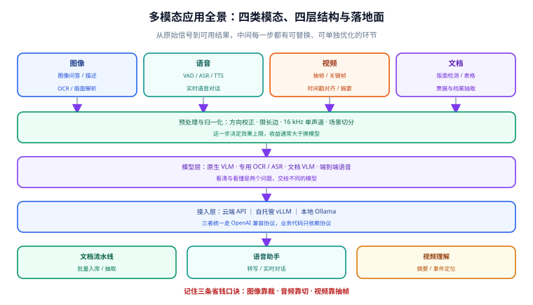

# 多模态应用概述

多模态应用（Multimodal Application）指**让模型同时处理文本之外的信息**——图片、语音、视频，并把这些信号与文本放进同一个推理流程里。它解决的核心问题只有一个：**很多业务信息天然不是文字**。发票是图、会议是音频、监控是视频，硬要先用人工转成文字再喂给大模型，等于把最贵的一环留给了人。

本专题讲「**怎么把非文本信号接进大模型，并且接得住**」：预处理怎么洗数据、模型怎么选、服务怎么搭、成本与延迟怎么控、出错怎么查。

::: tip 一句话理解
多模态不是「换一个更强的模型」，而是**多了一条数据链路**。链路里的每一步（解码、抽帧、重采样、切分、编码）都会决定最终效果，模型只是其中一环。
:::

## 本页讲什么

本页只回答三个问题：**多模态是什么、有哪几条技术路线、什么场景不该用它**。完整的页面清单，以及「按环节找页面」「按目标选读路径」两套导航，都在[多模态应用](../index.md)首页——读完本页再按需挑一条链路深入，比一上来就翻代码省时间。

## 什么是「多模态」

先分清三个容易混的说法：

| 说法 | 含义 | 典型实现 |
| --- | --- | --- |
| **多模态输入** | 模型能**读**图/音/视频，输出仍然是文本 | Qwen 系列 VLM、GPT 系列、Claude、Gemini |
| **多模态输出** | 模型能**生成**图/音/视频 | 文生图、文生视频、TTS 模型 |
| **全模态（Omni）** | 输入输出双向都覆盖多个模态，且在一段对话里混用 | 端到端 realtime 语音模型、Omni 系列 |

工程上绝大多数需求落在**第一类**：把图片或音频当成「输入的一种素材」，最终要的还是一段文字或一个 JSON。本专题以第一类为主线，第二、三类只在需要时说明边界。

::: warning 一个常见误解
「模型支持多模态」不等于「你直接把文件丢给它就行」。同一个模型，把 2000×3000 的扫描件原图丢进去，和先做版面分析再按块裁切送进去，识别准确率能差出十几个百分点——差别不在模型，在预处理。
:::

## 四类模态与任务矩阵

| 模态 | 高频任务 | 关键预处理 | 主要瓶颈 |
| --- | --- | --- | --- |
| **图像** | 图像问答、图像描述、OCR、版面解析、图表读数、UI 截图转代码 | 缩放（限制长边）、方向校正、裁切分块 | 分辨率与 token 消耗的矛盾 |
| **文档**（图像的子类） | PDF/扫描件结构化、表格还原、公式识别、票据抽取 | 是否有文本层判定、版面检测、阅读顺序还原 | 表格与多栏排版；幻觉 |
| **语音** | 语音转写（ASR）、说话人分离、语音合成（TTS）、实时对话 | 重采样到 16 kHz、单声道、VAD 切分 | 长音频切分与切片边界；实时性 |
| **视频** | 视频摘要、事件定位、字幕生成、动作识别 | 抽帧/关键帧、分辨率与帧率降采样、音轨分离 | 时间维度的 token 爆炸；时序对齐 |

这张表是后面四篇的骨架：**每一行都是一条独立链路**，不要指望一个参数配好全部。

## 三条技术路线

把非文本信号接进大模型，业界只有三条路，选择它们决定了整个工程的形态。

| 路线 | 做法 | 优点 | 代价 | 适用 |
| --- | --- | --- | --- | --- |
| **原生多模态** | 直接用支持多模态的模型，一个请求带图/音 | 集成成本最低、上下文可跨模态推理 | 模型绑定、单位成本高、可控性弱 | 通用问答、描述、抽取类任务 |
| **拼接式（级联）** | 专用小模型先转成文本（OCR/ASR），再交给纯文本 LLM | 各环节可替换、成本可控、易排障 | 链路长、误差逐级放大、丢失非文字信息 | 文档流水线、会议纪要、批量处理 |
| **两阶段（检索 + 生成）** | 先把图片/音频编码成向量入库，检索后再交给 VLM 生成 | 规模可扩展到百万级、可复用 | 需要向量库与索引运维 | 海量图片/录音的问答与检索 |

::: tip 怎么选
**先问数据量**：每天几百条 → 原生多模态最省事；每天几十万条且要反复查 → 走两阶段（向量检索部分直接复用 [RAG 检索增强](../../RAG/index.md) 的工程结论）；中间规模、要求可解释 → 拼接式。
:::

## 2026 年模型生态速览

下表按「能读什么」分类，核对时间为 **2026-09**。模型迭代极快，**以官方模型卡为准**，本表只用于建立选型直觉。

| 类别 | 代表模型 | 输入模态 | 备注 |
| --- | --- | --- | --- |
| **开源 VLM（云端规模）** | Qwen 系列（3.8 起视觉编码器并入主线）、GLM-4.6V、Llama 4 系列 | 文 + 图 + 视频 | Qwen 3.5 之后不再单独发行 `-VL` 仓库，视觉能力并入主线 checkpoint；Apache-2.0 与「旗舰层非商用」需逐个核对 |
| **开源 VLM（端侧）** | 2B~8B 级 VLM、Gemma 3 系、Pixtral | 文 + 图（部分含短视频） | 可在消费级显卡甚至 CPU 上跑，适合内网与边缘 |
| **闭源通用** | GPT 系列、Claude 系列、Gemini 系列 | 文 + 图 + 音 + 视频 | 长上下文与工具调用成熟；数据出网是硬约束 |
| **ASR** | Whisper `large-v3` / `large-v3-turbo`、Parakeet TDT、SenseVoice 系 | 音频 | `turbo` 是 2026 年性价比默认值：解码器从 32 层剪到 4 层，参数 1.55B → 809M |
| **TTS** | Kokoro-82M、CosyVoice 3、F5-TTS、Chatterbox、Piper | 文本 | 选型第一关是**权重许可**，不是音质（见下） |
| **文档解析** | PaddleOCR-VL、MinerU、Docling、dots.ocr、olmOCR | 图（页面） | 分「流水线式」与「端到端 VLM」两种架构 |
| **端到端语音对话** | 各家 realtime 语音模型；开源侧有 speech-to-speech 类管道 | 音频双向 | 延迟是主战场，500 ms 是可感知的分界 |

::: danger 选型时必须逐个核对的三件事
1. **代码许可 ≠ 权重许可**。不少项目代码 Apache-2.0、权重却是 CC-BY-NC 或自定义协议（禁商用、或超过营收/用户阈值需单独授权）。只看 GitHub 首页的 License 徽章会踩坑，必须打开权重仓库的模型卡。
2. **视觉能力的「并入主线」会造成文档失效**。某系列可能已经不再发布独立的视觉仓库，网上大量教程仍在引用已停更的旧仓库名，照抄会拉到不再维护的权重。
3. **同一模型的推理后端版本敏感**。多模态推理框架（如 vLLM）曾出现过「缺少系统 FFmpeg 导致多模态模型启动即卡死」「混合精度量化输出乱码」这类必修补丁；升级前看 changelog 比看 benchmark 重要。
:::

## 什么时候真的需要多模态

不是所有场景都值得上多模态。下面这张表用来劝退一部分需求。

| 判断维度 | 更该用纯文本方案 | 值得上多模态 |
| --- | --- | --- |
| 数据形态 | 已经有结构化文本 | 原始信号只有图/音/视频 |
| 抽取目标 | 固定字段、格式稳定 | 版式多变、需要理解语义关系 |
| 准确率要求 | 99%+ 且可校验 | 80%~95% 可接受，人工兜底 |
| 规模 | 每天几条（人工看更快） | 每天上千条，人工成本不可接受 |
| 合规 | 数据必须出网 | 数据可留在内网（本地模型） |
| 延迟 | 不敏感 | 可用异步队列换取准确率 |

::: danger 三个高频误判
1. **用 VLM 替代正则**。格式稳定的票据，正则 + 模板的准确率和成本都远优于模型；先用规则打到 80%，剩下的 20% 才交给模型。
2. **忽视「数据出网」这条红线**。把客户合同、病历、身份证丢给云端 API 在很多行业是直接违规，必须走本地模型——本地部署的成本要提前算进方案。
3. **把「模型能读视频」等同于「能理解长视频」**。视频的 token 消耗随时长线性增长，一小时的视频不做抽帧/分段，成本与延迟都会失控。
:::

## 成本与延迟的直觉

多模态的成本结构与纯文本不同，**瓶颈通常不是输出 token，而是图像/音频被编码成输入 token 的那一步**。

| 信号 | 消耗来源 | 降低手段 |
| --- | --- | --- |
| 图像 | 被切成视觉 token，与分辨率强相关 | 限制长边、只送必要区域、改用「小模型定位 + 大模型精读」 |
| 文档 | 页数 × 每页 token | 先判有无文本层；无文本层才走 OCR，有文本层直接抽文本 |
| 音频 | 按时长折算 | 先 VAD 去掉静音；口播类内容可先降采样 |
| 视频 | 帧数 × 每帧 token，**最贵** | 抽关键帧、降帧率、先做场景切分再送片段 |

一句话口诀：**「图像省钱靠裁，音频省钱靠切，视频省钱靠抽帧」**。

## 与库内其他专题的分工

- [大模型应用开发](../../LLMApp/index.md)：纯文本链路的 API 调用、Function Calling、成本与限流——多模态是它的**增量**，不是替代。
- [RAG 检索增强](../../RAG/index.md)：**向量化与检索**的全部工程结论（切分、索引、评估）在这里；多模态检索（以图搜图、以文搜图）本质是同一套工程的模态扩展。
- [本地模型部署](../../LocalModel/index.md)：显存规划、量化、推理服务、压测——本文「自托管」一节直接复用其结论，不重复展开。
- [提示词工程](../../PromptEngineering/index.md)：多模态提示词是提示词工程的一个分支，本文只写多模态特有的部分。
- [多模态应用首页](../index.md)：本专题的完整页面清单与「按环节 / 按目标」两套导航

## 学习路径建议

| 阶段 | 做什么 | 产出 |
| --- | --- | --- |
| 第 1 步 | 搭好环境，跑通一次「本地图片 → VLM 描述」 | 一条能跑的命令 |
| 第 2 步 | 跑通一次「音频 → 文字」并对照人工转写核对错字 | 一份 WER 抽样记录 |
| 第 3 步 | 把两条链路合成一个 HTTP 服务 | 可被调用的接口 |
| 第 4 步 | 加 VAD/抽帧等预处理，对比加与不加的准确率与成本 | 一张对比表 |
| 第 5 步 | 接入日志、限流与降级 | 一份可上线的清单 |

## 验证方式

本页不产出代码，验证的是「你判断得对不对」——用下面三句话自测：

1. 能说出自己的场景属于**四类模态**里的哪一类，以及主要瓶颈是哪一项。
2. 能在**三条技术路线**里给自己的场景选中一条，并说明放弃另外两条的理由。
3. 能说出至少一个「本场景不该用多模态」的地方，以及对应的纯文本或规则方案。

接下来按顺序读 [环境搭建](Environment/index.md)，那里把后面所有页面依赖的工具链一次性装好并验证。

## 参考资料

- OpenAI 多模态输入文档（图像/音频输入的参数与限制）：<https://platform.openai.com/docs/guides/vision>
- Qwen 系列模型卡与官方仓库（视觉能力与上下文配置）：<https://github.com/QwenLM/Qwen3-VL>
- Hugging Face Transformers 多模态任务文档：<https://huggingface.co/docs/transformers/main/en/tasks>
- Whisper 官方仓库与模型表（含 `large-v3-turbo`）：<https://github.com/openai/whisper>
- FFmpeg 官方下载与文档（音视频预处理的事实标准）：<https://ffmpeg.org/>
- vLLM 官方文档（多模态模型服务化）：<https://docs.vllm.ai/>
