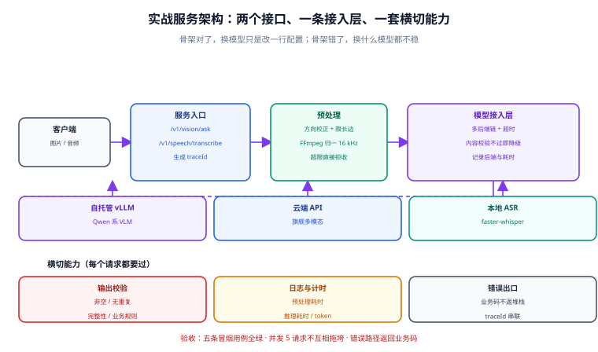

# 实战：图片问答 + 语音转写服务

本页把前面几条链路合起来做成**一个可运行、可调用、可验证的服务**：两个接口——图片问答与语音转写——共用一套模型接入层、一套错误处理、一套日志。做完这一页，你就有了一个能直接接进业务的多模态服务骨架。

::: tip 一句话理解
这个实战的重点**不是模型调用**（那只有十几行），而是把「预处理 → 调用 → 校验 → 错误处理 → 可观测」这套骨架搭对。骨架对了，后面换成什么模型都只是改一行。
:::



## 一、目标与验收标准

| 项 | 内容 |
| --- | --- |
| **接口 1** | `POST /v1/vision/ask`：上传图片 + 问题，返回文字答案 |
| **接口 2** | `POST /v1/speech/transcribe`：上传音频，返回文本与耗时 |
| **统一响应** | `{code, message, data, traceId}`，错误不返回堆栈 |
| **可观测** | 每次请求记录：输入大小、预处理耗时、推理耗时、token、后端、是否降级 |
| **容错** | 上游超时/限流自动降级；文件过大/格式不符返回明确错误码 |
| **验收** | 两个接口 curl 可调通；并发 5 请求不互相拖垮；错误路径返回规范响应 |

## 二、项目结构

```text
mm-service/
├─ app/
│  ├─ main.py              # FastAPI 入口与路由注册
│  ├─ config.py            # 后端配置（base_url / model / 超时）
│  ├─ schema.py            # 统一响应体与请求模型
│  ├─ vision.py            # 图片问答：预处理 + 调用
│  ├─ speech.py            # 语音转写：格式归一 + 调用
│  ├─ gateway.py           # 模型接入层（多后端 + 降级）
│  └─ obs.py               # 日志与计时
├─ tests/
│  └─ smoke.sh             # 冒烟脚本（本页的验证方式）
├─ requirements.txt
└─ README.md
```

## 三、依赖与配置

```text
# requirements.txt
fastapi==0.115.*
uvicorn[standard]==0.32.*
python-multipart==0.0.*
openai==1.*
pillow==11.*
faster-whisper==1.*
pydantic==2.*
```

```python
# app/config.py —— 配置集中，不散落在业务代码里
import os
from dataclasses import dataclass

@dataclass(frozen=True)
class Backend:
    name: str
    base_url: str | None
    api_key: str
    model: str
    timeout: float

VISION_CHAIN = [
    Backend("vllm", "http://127.0.0.1:8000/v1", "not-needed", "qwen3-vl-8b", 30.0),
    Backend("cloud", None, os.getenv("OPENAI_API_KEY", ""), "gpt-5.4", 60.0),
]

ASR_MODEL = os.getenv("ASR_MODEL", "large-v3-turbo")
ASR_DEVICE = os.getenv("ASR_DEVICE", "cuda")
ASR_COMPUTE = os.getenv("ASR_COMPUTE", "int8_float16")

MAX_IMAGE_BYTES = 10 * 1024 * 1024      # 单图 10 MB
MAX_AUDIO_SECONDS = 600                 # 单次音频 10 分钟
```

## 四、统一响应与错误码

```python
# app/schema.py
from typing import Any, Generic, TypeVar
from pydantic import BaseModel

T = TypeVar("T")

class Result(BaseModel, Generic[T]):
    code: int = 0
    message: str = "ok"
    data: T | None = None
    traceId: str = ""

class VisionAsk(BaseModel):
    question: str = "用一句话描述这张图。"

# 错误码约定（与 HTTP 状态码分开：HTTP 表达传输层，code 表达业务层）
E_FILE_TOO_LARGE = (413, 40001, "文件超过大小限制")
E_BAD_FORMAT     = (400, 40002, "文件格式不支持")
E_AUDIO_TOO_LONG = (400, 40003, "音频时长超限")
E_UPSTREAM_DOWN  = (503, 50001, "上游模型不可用")
```

::: warning 为什么业务码要与 HTTP 状态码分开
`413` 只能告诉调用方「太大了」，但**调用方需要知道下一步怎么办**：是压缩重传（40001）还是转成异步任务（40003）。把可执行的处置信息放进业务码，前端才能写出正确的重试逻辑。
:::

## 五、图片问答：预处理 + 调用 + 校验

```python
# app/vision.py
import base64
import io
import time
from fastapi import UploadFile
from PIL import Image, ImageOps

from .config import VISION_CHAIN, MAX_IMAGE_BYTES
from .schema import E_BAD_FORMAT, E_FILE_TOO_LARGE
from .gateway import call_vision

MAX_SIDE = 1280     # 长边上限：多模态省钱的第一杠杆

def preprocess(raw: bytes) -> tuple[str, tuple[int, int]]:
    """归一化：方向校正 → 转 RGB → 限长边 → base64。返回 (b64, 原始尺寸)。"""
    if len(raw) > MAX_IMAGE_BYTES:
        raise ValueError(E_FILE_TOO_LARGE[2])
    try:
        img = Image.open(io.BytesIO(raw))
    except Exception as e:
        raise ValueError(E_BAD_FORMAT[2]) from e

    origin = img.size
    img = ImageOps.exif_transpose(img).convert("RGB")
    w, h = img.size
    if max(w, h) > MAX_SIDE:
        s = MAX_SIDE / max(w, h)
        img = img.resize((int(w * s), int(h * s)), Image.LANCZOS)

    buf = io.BytesIO()
    img.save(buf, format="JPEG", quality=85)
    return base64.b64encode(buf.getvalue()).decode(), origin

def validate(text: str | None) -> bool:
    """内容完整性校验：模型返回空或明显异常时判定失败。"""
    if not text or len(text.strip()) < 2:
        return False
    # 重复循环检测：同一片段重复超过 8 次视为异常
    head = text[:40]
    return text.count(head) < 8

async def answer(file: UploadFile, question: str) -> dict:
    t0 = time.perf_counter()
    raw = await file.read()
    b64, origin = preprocess(raw)
    t_pre = time.perf_counter()
    text, backend = await call_vision(VISION_CHAIN, b64, question, validate)
    t_end = time.perf_counter()
    return {
        "answer": text,
        "backend": backend,
        "originSize": list(origin),
        "preprocessMs": round((t_pre - t0) * 1000),
        "inferMs": round((t_end - t_pre) * 1000),
    }
```

::: danger 两个必须做的校验
1. **长度校验**：模型返回空字符串或只有标点时，**不能当成成功**。这类「成功的空结果」在监控里看不出来，但用户会立刻发现。
2. **重复循环检测**：多模态模型（尤其自托管）会陷入重复输出。**不检测就等于把坏结果当正常结果返回**，而且会白烧掉 `max_tokens` 的全部额度。
   :::

## 六、语音转写：格式归一 + VAD + 时间戳

```python
# app/speech.py
import subprocess
import tempfile
import time
from pathlib import Path
from fastapi import UploadFile

from .config import ASR_MODEL, ASR_DEVICE, ASR_COMPUTE, MAX_AUDIO_SECONDS
from .schema import E_AUDIO_TOO_LONG, E_BAD_FORMAT

_model = None      # 懒加载：模型加载很慢，不要在导入时做

def get_model():
    global _model
    if _model is None:
        from faster_whisper import WhisperModel
        _model = WhisperModel(ASR_MODEL, device=ASR_DEVICE, compute_type=ASR_COMPUTE)
    return _model

def to_wav(src: Path) -> Path:
    """统一到 16 kHz 单声道 WAV：FFmpeg 负责解封装与重采样。"""
    dst = src.with_suffix(".norm.wav")
    proc = subprocess.run(
        ["ffmpeg", "-hide_banner", "-loglevel", "error", "-y",
         "-i", str(src), "-vn", "-ac", "1", "-ar", "16000", "-c:a", "pcm_s16le", str(dst)],
        capture_output=True, text=True,
    )
    if proc.returncode != 0:
        raise ValueError(E_BAD_FORMAT[2])
    return dst

def duration(wav: Path) -> float:
    out = subprocess.run(
        ["ffprobe", "-v", "error", "-show_entries", "format=duration",
         "-of", "default=nw=1:nk=1", str(wav)],
        capture_output=True, text=True,
    )
    return float(out.stdout.strip() or 0)

async def transcribe(file: UploadFile) -> dict:
    t0 = time.perf_counter()
    with tempfile.TemporaryDirectory() as td:
        src = Path(td) / (file.filename or "input.bin")
        src.write_bytes(await file.read())
        wav = to_wav(src)
        dur = duration(wav)
        if dur > MAX_AUDIO_SECONDS:
            raise ValueError(E_AUDIO_TOO_LONG[2])

        t_pre = time.perf_counter()
        segments, info = get_model().transcribe(
            str(wav), beam_size=5, vad_filter=True,
            vad_parameters=dict(min_silence_duration_ms=500),
        )
        items = [{"start": round(s.start, 2), "end": round(s.end, 2), "text": s.text.strip()}
                 for s in segments if s.text.strip()]      # 注意：segments 是生成器，只遍历一次
        t_end = time.perf_counter()

    return {
        "language": info.language,
        "durationSec": round(dur, 2),
        "segments": items,
        "text": "".join(i["text"] for i in items),
        "normalizeMs": round((t_pre - t0) * 1000),
        "inferMs": round((t_end - t_pre) * 1000),
    }
```

## 七、模型接入层：超时、重试与降级

```python
# app/gateway.py
import asyncio
import logging
from openai import AsyncOpenAI, APITimeoutError, APIError

log = logging.getLogger("gateway")

async def call_vision(chain, b64: str, question: str, validate) -> tuple[str, str]:
    last = None
    for b in chain:
        try:
            client = AsyncOpenAI(base_url=b.base_url, api_key=b.api_key or "not-needed")
            resp = await asyncio.wait_for(
                client.chat.completions.create(
                    model=b.model, max_tokens=512, temperature=0.2,
                    messages=[{"role": "user", "content": [
                        {"type": "text", "text": question},
                        {"type": "image_url",
                         "image_url": {"url": f"data:image/jpeg;base64,{b64}"}},
                    ]}],
                ),
                timeout=b.timeout,
            )
            text = (resp.choices[0].message.content or "").strip()
            if validate(text):                     # 内容校验不通过 = 换后端
                log.info("vision ok backend=%s len=%d", b.name, len(text))
                return text, b.name
            log.warning("vision invalid output backend=%s, fallback", b.name)
        except (asyncio.TimeoutError, APITimeoutError, APIError) as e:
            last = e
            log.warning("vision failed backend=%s err=%s", b.name, e)
    raise RuntimeError(f"all vision backends failed: {last}")
```

::: danger 校验失败也要降级，不能只降级异常
上面这段的关键点是：**`validate()` 不通过时同样走降级**。如果只在抛异常时才换后端，那「模型返回了乱码」这种情况会被当成成功返回给用户——**这是多模态服务最常见的静默故障**。
:::

## 八、入口与横切能力

```python
# app/main.py
import logging
import uuid
from fastapi import FastAPI, File, Form, UploadFile, Request
from fastapi.responses import JSONResponse

from . import vision, speech
from .schema import Result, E_UPSTREAM_DOWN

app = FastAPI(title="mm-service")
logging.basicConfig(level=logging.INFO, format="%(asctime)s %(levelname)s %(name)s %(message)s")

@app.middleware("http")
async def add_trace_id(request: Request, call_next):
    tid = request.headers.get("X-Trace-Id") or uuid.uuid4().hex[:16]
    request.state.trace_id = tid
    resp = await call_next(request)
    resp.headers["X-Trace-Id"] = tid
    return resp

@app.exception_handler(ValueError)
async def on_biz_error(request: Request, exc: ValueError):
    code = int(str(exc)) if str(exc).isdigit() else 40000
    return JSONResponse(status_code=400,
                        content=Result(code=code, message="请求不合法",
                                       traceId=request.state.trace_id).model_dump())

@app.post("/v1/vision/ask")
async def vision_ask(request: Request, file: UploadFile = File(...),
                     question: str = Form("用一句话描述这张图。")):
    try:
        data = await vision.answer(file, question)
    except ValueError as e:
        raise e
    except Exception as e:                       # 上游全挂：统一出口，不泄露堆栈
        logging.error("vision failed trace=%s err=%s", request.state.trace_id, e)
        return JSONResponse(status_code=503,
                            content=Result(code=E_UPSTREAM_DOWN[1], message=E_UPSTREAM_DOWN[2],
                                           traceId=request.state.trace_id).model_dump())
    return Result(data=data, traceId=request.state.trace_id)

@app.post("/v1/speech/transcribe")
async def speech_transcribe(request: Request, file: UploadFile = File(...)):
    try:
        data = await speech.transcribe(file)
    except ValueError as e:
        raise e
    except Exception as e:
        logging.error("speech failed trace=%s err=%s", request.state.trace_id, e)
        return JSONResponse(status_code=503,
                            content=Result(code=E_UPSTREAM_DOWN[1], message=E_UPSTREAM_DOWN[2],
                                           traceId=request.state.trace_id).model_dump())
    return Result(data=data, traceId=request.state.trace_id)

@app.get("/health")
async def health():
    return {"status": "UP"}
```

## 九、启动与验证

```shell
# ① 装依赖并启动（FFmpeg 必须先可用，见「环境搭建」）
pip install -r requirements.txt
uvicorn app.main:app --host 0.0.0.0 --port 8080
# 预期：日志出现 Uvicorn running on http://0.0.0.0:8080

# ② 健康检查
curl -s http://localhost:8080/health            # 预期 {"status":"UP"}

# ③ 图片问答（准备一张本地图片 sample.jpg）
curl -s -X POST http://localhost:8080/v1/vision/ask \
  -F "file=@sample.jpg" -F "question=图中主要物体是什么？" | head -c 400
# 预期：code=0，data.answer 非空，data.backend 有值，data.inferMs > 0

# ④ 语音转写（准备一段 wav/mp3）
curl -s -X POST http://localhost:8080/v1/speech/transcribe \
  -F "file=@sample.mp3" | head -c 400
# 预期：code=0，data.language 合理，data.segments 非空，data.text 非空

# ⑤ 错误路径：超大文件应返回业务码而不是 500
dd if=/dev/zero of=big.jpg bs=1M count=12 2>/dev/null
curl -s -X POST http://localhost:8080/v1/vision/ask -F "file=@big.jpg" -F "question=test"
# 预期：HTTP 400 + code 40001
```

完整冒烟脚本：

```bash
#!/usr/bin/env bash
# tests/smoke.sh —— 五条用例全过才算通过
set -e
BASE=http://localhost:8080
pass=0; fail=0
chk() { if [ "$2" = "1" ]; then echo "  OK  $1"; pass=$((pass+1)); else echo "  FAIL $1"; fail=$((fail+1)); fi; }

chk "健康检查" "$(curl -sf $BASE/health | grep -c UP)"
chk "图片问答" "$(curl -sf -X POST $BASE/v1/vision/ask -F file=@sample.jpg -F question=描述 \
                   | grep -c '"code":0')"
chk "语音转写" "$(curl -sf -X POST $BASE/v1/speech/transcribe -F file=@sample.mp3 \
                   | grep -c '"code":0')"
chk "错误码"   "$(curl -s -o /dev/null -w '%{http_code}' -X POST $BASE/v1/vision/ask \
                   -F file=@big.jpg -F question=t | grep -c 400)"
echo "通过 $pass / 失败 $fail"
[ "$fail" -eq 0 ]
```

## 十、并发与部署注意

| 项 | 建议 | 原因 |
| --- | --- | --- |
| Web 进程数 | 1~2（配合异步） | ASR 模型是**进程内单例**，多 worker 会各占一份显存 |
| ASR 并发 | 串行或信号量限制（如 2） | 转写是 GPU 密集任务，并发过高反而整体变慢 |
| 图片问答并发 | 可较高（IO 等待为主） | 但受上游模型并发限制约束 |
| 超时 | 图片 30 s / 音频 180 s | 分开设置，别用一个全局值 |
| 文件清理 | `TemporaryDirectory` 自动回收 | 中间 WAV 不落持久磁盘，避免写满 |
| 容器 | 镜像里预装系统 FFmpeg | 否则多模态路径启动即失败 |

::: warning 用 `--workers 1` 起步
FastAPI + 本地模型时，`uvicorn --workers 4` 会让每个 worker 各自加载一份模型，**显存直接翻四倍**。正确做法是单 worker + 异步 + 信号量控制并发；确实需要横向扩展时，把模型服务独立出去（vLLM），Web 层只做转发。
:::

## 十一、验证方式

| 检查项 | 期望 | 说明 |
| --- | --- | --- |
| 冒烟脚本 | `通过 4 / 失败 0` | 五条用例必须全绿 |
| 图片问答 P95 延迟 | 本地模型 < 3 s | 含预处理 |
| 语音转写速度 | ≥ 5× 实时（GPU、turbo 模型） | 1 分钟音频应在 12 s 内出结果 |
| 错误路径 | 返回业务码，无堆栈 | 检查响应体里没有 `Traceback` |
| 日志可复盘 | 每次请求含 traceId/耗时/后端 | 用 `X-Trace-Id` 串联上下游 |
| 降级演练 | 停掉主后端仍可用 | 用 `docker stop` 模拟 |
| 并发 5 请求 | 无 5xx，总耗时不超过单请求的 3 倍 | 超过说明有全局锁或资源争抢 |

## 参考资料

- FastAPI 官方文档（文件上传与中间件）：<https://fastapi.tiangolo.com/>
- faster-whisper（模型与参数）：<https://github.com/SYSTRAN/faster-whisper>
- OpenAI Python SDK（异步客户端与错误类型）：<https://github.com/openai/openai-python>
- Pillow 图像处理文档（`exif_transpose` 与缩放）：<https://pillow.readthedocs.io/>
- FFmpeg 文档（音视频格式归一）：<https://ffmpeg.org/documentation.html>
- 项目内相关：[模型接入与选型](../ModelAccess/index.md) ｜ [环境搭建](../Environment/index.md)
