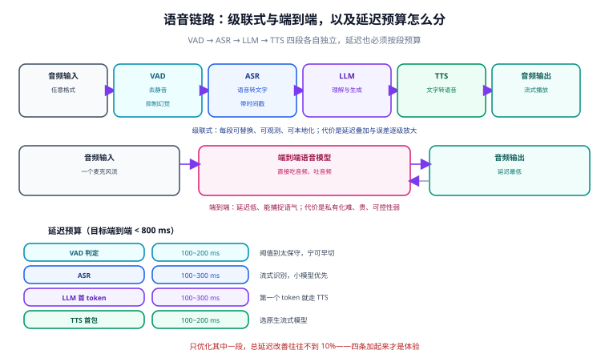

# 语音处理

语音链路是多模态里**最容易做出来、也最容易做砸**的一条：Demo 十分钟能跑通，上线后「口音听不准、长音频断句错、实时对话卡顿」三个问题会同时爆发。本页把语音拆成四段——**VAD → ASR → LLM → TTS**——逐段讲清选型、切分与延迟预算。

::: tip 一句话理解
语音工程的胜负手不在模型，在**切分**。整段丢进去和按语音活动切成句再送进去，识别质量是两回事；实时对话卡不卡，也基本由切分与首包延迟决定。
:::



## 一、音频基础：先把格式统一

所有语音模型的输入约定几乎都收敛到同一组参数，**在链路入口就把格式归一化**，能省掉后面 80% 的诡异问题。

| 参数 | 约定值 | 说明 |
| --- | --- | --- |
| 采样率 | **16 kHz** | Whisper 系与主流 ASR 的训练采样率；高了没用、低了掉点 |
| 声道 | **单声道** | 立体声需要先混音，否则部分库直接报错 |
| 位深/格式 | 16-bit PCM（WAV） | 模型内部要转 float32；先用 FFmpeg 转好最稳 |
| 时长切片 | **≤ 30 s** | Whisper 的窗口是 30 秒；长了要自己切 |

```shell
# 把任意格式音频（含视频里的音轨）转成统一格式
# -vn：丢掉视频轨；-ac 1：单声道；-ar 16000：16 kHz
ffmpeg -i input.mp4 -vn -ac 1 -ar 16000 -c:a pcm_s16le output.wav

# 验证
ffprobe -v error -show_entries stream=sample_rate,channels,codec_name -of default=nw=1 output.wav
# 预期：codec_name=pcm_s16le / sample_rate=16000 / channels=1
```

::: warning 别在 Python 里做这步
`librosa.load(..., sr=16000)` 之类的调用也能重采样，但**它不支持容器格式（mp4/mkv/webm）**，而且重采样质量与性能都不如 FFmpeg。音频解码统一交给 FFmpeg，Python 只读已经规整好的 WAV。
:::

## 二、VAD：最便宜、收益最大的一步

VAD（Voice Activity Detection，语音活动检测）负责找出「哪里有人在说话」。它有两个不可替代的作用：

1. **去掉静音**——一小时会议里真正的语音可能只有 35 分钟，剪掉静音直接省掉三分之一成本与时间。
2. **抑制幻觉**——ASR 模型在长静音段上会**凭空生成文本**（把静音「脑补」成一句话），这是 Whisper 系最著名的坑之一。VAD 先剪掉静音就从根上避免了。

```python
# vad_split.py —— 用 Silero VAD 找出语音区间（需 pip install silero-vad torch torchaudio）
from silero_vad import load_silero_vad, read_audio, get_speech_timestamps

model = load_silero_vad()
wav = read_audio("output.wav", sampling_rate=16000)
segments = get_speech_timestamps(wav, model, sampling_rate=16000, return_seconds=True)

print(f"检出 {len(segments)} 段语音")
for s in segments[:5]:
    print(f"  {s['start']:.2f}s ~ {s['end']:.2f}s")
```

::: tip 用 VAD 还是用库自带的 `vad_filter`
**两者都要**。`faster-whisper` 的 `vad_filter=True` 是推理内部的粗过滤，适合单文件；当你要做「切片 → 并发 → 合并」的流水线时，需要自己用 VAD 切出**带时间戳的片段**，才能把结果拼回同一根时间轴。切片时相邻段保留 **0.2~0.5 s 重叠**，避免把词切两半。
:::

## 三、ASR：Whisper 家族怎么选

Whisper 仍是 2026 年开源转写的主力。关键结论只有一条：**默认用 `large-v3-turbo`，只有需要「翻译」时才回到 `large-v3`**。

| 模型 | 参数 | 相对速度 | 许可 | 适用 |
| --- | --- | --- | --- | --- |
| `tiny` / `base` | 39M / 74M | 极快 | MIT | 嵌入式、语音命令、树莓派 |
| `small` / `medium` | 244M / 769M | 快 | MIT | 纯 CPU 环境、非英语 |
| `large-v3` | 1.55B | 1× | MIT | **翻译任务**、劣质录音、多语种高精度 |
| **`large-v3-turbo`** | **809M** | **约 3~8×** | MIT | **2026 年默认选择**：准确率与 v3 差距很小（英文约 0.3~0.7 个 WER 点），显存约 1.5 GB（INT8） |

::: danger turbo 有一个明确的短板：不做翻译
`large-v3-turbo` 的解码器被从 32 层剪到 4 层，**损失的主要是「翻译成英文」的能力**。如果你的需求是「中文语音 → 英文文本」，必须用 `large-v3` 或 `medium`；只做「同语言转写」时才用 turbo。这一点在部署时经常被忽略，直到上线才发现译文质量断崖式下降。
:::

### 运行时的选择

同一份权重，换运行时差别比换模型还大：

| 运行时 | 最佳硬件 | 词级时间戳 | 说话人分离 | 适用 |
| --- | --- | --- | --- | --- |
| **faster-whisper** | NVIDIA GPU | 段级 | 否 | **GPU 批量的默认选择**（CTranslate2 后端，INT8/FP16 量化） |
| whisper.cpp | Apple Silicon、CPU、嵌入式 | 段级 | 否 | Mac、实时、纯离线设备 |
| WhisperX | NVIDIA GPU | **词级**（wav2vec2 对齐） | **是**（pyannote） | 要做字幕对齐与「谁说的」 |
| distil-whisper | GPU / CPU | 段级 | 否 | 追求极限速度（英文），误差约 1 个 WER 点 |

### 最小可用转写

```python
# transcribe.py —— faster-whisper 批量转写（pip install faster-whisper）
from faster_whisper import WhisperModel

model = WhisperModel("large-v3-turbo", device="cuda", compute_type="int8_float16")
# 纯 CPU 环境改成： WhisperModel("large-v3-turbo", device="cpu", compute_type="int8")

segments, info = model.transcribe(
    "output.wav",
    beam_size=5,
    vad_filter=True,                       # 必开：抑制静音段幻觉
    vad_parameters=dict(min_silence_duration_ms=500),
)
print(f"识别语言: {info.language} (置信度 {info.language_probability:.2f})")

for seg in segments:
    print(f"[{seg.start:7.2f} → {seg.end:7.2f}] {seg.text.strip()}")
```

::: danger 三个必踩的坑
1. **不开 `vad_filter`** → 长静音段被「脑补」出根本不存在的句子。这是最常见的线上事故来源。
2. **把 `segments` 当列表用** → `transcribe()` 返回的是**生成器**，遍历一次就空了。要复用必须先 `list(...)`。
3. **中文不加标点就送下游** → Whisper 的中文输出默认标点不稳定，如果下游要按句切分或做摘要，必须显式做标点与断句后处理。
:::

### 长音频与说话人分离

| 需求 | 做法 |
| --- | --- |
| 长音频（> 30 min） | VAD 切片 → 分批并发转写 → 按时间戳合并；每片记录偏移量 |
| 词级时间戳（做字幕） | 用 WhisperX；或对段级结果再过一遍强制对齐模型 |
| 说话人分离 | WhisperX（内置 pyannote）；pyannote 需要接受许可并配置访问令牌 |
| 多语种混说 | 按 VAD 切片后**逐片做语言识别**，不要整段猜一次语言 |

## 四、TTS：先看许可，再看音质

2026 年开源 TTS 的音质已经接近商业服务，**真正的分水岭是权重许可**——很多音质最好的模型权重是「非商用」或「有用户数上限」。

| 模型 | 规模 | 许可 | 音色克隆 | 适用 |
| --- | --- | --- | --- | --- |
| **Kokoro-82M** | 82M | **Apache-2.0** | 否 | **默认首选**：纯 CPU 跑得动，多语言，商用无限制 |
| **CosyVoice 2/3** | 0.5B | **Apache-2.0** | 是（少样本） | 中文韵律优秀，原生流式，适合实时对话 |
| Piper | 小 | GPL v3 | 否 | 完全离线、树莓派、Home Assistant |
| MeloTTS | 小 | MIT | 否 | CPU 实时、多口音 |
| F5-TTS | 330M | 代码 MIT / **权重 CC-BY-NC** | 是（5 s 参考） | 研究与非商用；商用需重新训练 |
| Chatterbox | ~1B | MIT | 是（零样本） | 低延迟语音智能体，自带水印 |
| Fish Speech | ~500M | 代码 Apache-2.0 / **权重 CC-BY-NC-SA** | 是（10~30 s） | 同理，商用受限 |
| Zonos / Zonos2 | 1.6B / 8B | Apache-2.0 | 是 | 高质量克隆，需 16 GB 级显卡 |
| IndexTTS-2 | — | 自有许可 | 是 | 时长与情感控制强，商用需单独授权 |
| GPT-SoVITS | ~1B | MIT | 是（1 分钟音频） | 相似度最高的少样本克隆路线 |

```python
# tts_kokoro.py —— 最小 TTS（pip install kokoro soundfile）
import soundfile as sf
from kokoro import KPipeline

pipeline = KPipeline(lang_code="z")      # z=中文，a=美式英语
audio_chunks = [audio for _, _, audio in pipeline("这是本地合成的语音。", voice="zf_xiaobei")]
sf.write("tts_out.wav", audio_chunks[0], 24000)
print("已生成 tts_out.wav")
```

::: danger TTS 的合规红线
1. **音色克隆必须获得授权**。克隆他人声音用于对外发布，在多数司法辖区涉及人格权/声音权，不是技术问题而是法律问题。
2. **别用「非商用权重」做商业产品**。CC-BY-NC 一类条款明确禁止商用，重新训练或购买授权是唯一出路。
3. **输出要加水印或可追溯标记**。部分开源模型（如 Chatterbox）默认带 PerTh 水印，自建方案建议保持这一习惯。
   :::

## 五、实时语音对话：延迟预算才是主战场

实时语音有两条路，**选择它决定了你的架构**：

| 方案 | 结构 | 首包延迟 | 优点 | 代价 |
| --- | --- | --- | --- | --- |
| **级联式** | VAD → ASR → LLM → TTS 四段拼装 | 500 ms ~ 1.5 s | 每段可换、可本地、可观测 | 链路长，误差与延迟叠加 |
| **端到端 realtime** | 单一模型直接吃音频吐音频 | 数百毫秒 | 延迟低、能捕捉语气 | 私有化难、贵、可控性弱 |

开源侧的级联方案已经相当成熟：Hugging Face 的 `speech-to-speech` 项目把 **Silero VAD v5 → ASR（默认 NVIDIA Parakeet TDT）→ LLM → TTS（默认 Qwen3-TTS）** 串成一条管道，并且**对外暴露 OpenAI Realtime 兼容的 WebSocket 接口**（默认 `ws://localhost:8765/v1/realtime`）。这意味着现成客户端改两个 URL 就能连到自建实例：

```python
# 把已有的 OpenAI Realtime 客户端指向自建语音服务
from openai import OpenAI

client = OpenAI(
    base_url="http://localhost:8765/v1",
    websocket_base_url="ws://localhost:8765/v1",
    api_key="not-needed",                 # 自建服务不校验
)

with client.realtime.connect(model="local") as conn:
    conn.send({
        "type": "session.update",
        "session": {
            "type": "realtime",
            "instructions": "你是一个简洁的助手。",
            "audio": {"input": {"turn_detection": {"type": "server_vad", "interrupt_response": True}}},
        },
    })
    for event in conn:
        print(event.type)
        if event.type == "response.done":
            break
```

::: tip 延迟预算怎么分（目标 < 800 ms）
| 环节 | 预算 | 关键手段 |
| --- | --- | --- |
| VAD 判定 | 100~200 ms | 阈值别太保守，宁可早切 |
| ASR | 100~300 ms | 流式识别 + 小模型；不要在整句结束后才开始 |
| LLM 首 token | 100~300 ms | 流式输出，第一个 token 就走 TTS |
| TTS 首包 | 100~200 ms | 选原生流式模型（如 CosyVoice）；不要等全文合成完 |

**四条加起来才是体验**。只优化其中一段（例如只把 ASR 换成更快的），总延迟改善可能不到 10%。
:::

## 六、常见坑速查

| 现象 | 原因 | 解法 |
| --- | --- | --- |
| 静音段出现不存在的文字 | ASR 在静音上幻觉 | 开 VAD，剪掉静音；`vad_filter=True` |
| 时间戳整体偏移 | 分片转写后没加偏移量 | 合并时 `绝对时间 = 分片偏移 + 片内时间` |
| 一句话被切成两句乱码 | 切片没留重叠，词被切断 | 相邻片保留 0.2~0.5 s 重叠，并做边界去重 |
| 中文输出没有标点/断句乱 | 模型标点不稳定 | 增加标点恢复后处理，或按 VAD 段天然断句 |
| 转写结果第二次为空 | `transcribe()` 返回生成器已耗尽 | 需要复用时先 `list()` |
| 显存 OOM 但只有一条音频 | `beam_size` 与批大小叠加 | 降 `beam_size`，或按 VAD 片段串行处理 |
| 实时对话「抢话」 | VAD 未开打断（interrupt） | 开启 `interrupt_response`，并做回声消除 |
| 云端 TTS 费用失控 | 按字符计费 + 全文重试 | 加缓存（同文本同音色直接命中），失败只重试未完成分片 |
| 识别率在特定口音上崩塌 | 训练数据偏置 | 用自有数据微调，或换在目标语种上更强的模型 |

## 七、验证方式

语音任务的验证**必须落到 WER（词错率）/ CER（字错率）上**，不能靠「听着差不多」。

```shell
# ① 准备一份 20~50 条、总时长 10~30 分钟的抽样集，人工转写为 expected.txt
# ② 跑转写
python transcribe.py > hyp.txt

# ③ 计算字错率（中文用 CER，英文用 WER）
pip install jiwer
python -c "
import jiwer
ref = open('expected.txt', encoding='utf-8').read()
hyp = open('hyp.txt', encoding='utf-8').read()
print('CER =', round(jiwer.cer(ref, hyp), 4))
print('WER =', round(jiwer.wer(ref, hyp), 4))
"
```

判定口径：

| 场景 | 及格线 | 说明 |
| --- | --- | --- |
| 清晰普通话/英语（近场） | CER ≤ 5% | 加了 VAD 之后应显著优于不加 |
| 会议录音（远场、有噪声） | CER ≤ 15% | 远场不要期待近场指标 |
| 关键实体（人名/金额/编号） | 单独统计，目标 ≥ 99% | 必要时配热词表或后处理校正 |
| 实时对话端到端延迟 | P95 < 800 ms | 用真实麦克风测，不要在本地文件上测 |
| TTS 可用性 | 主观盲听 5 分制 ≥ 4 分 | 音质必须真人盲听，指标测不出来 |

::: warning 加 VAD 前后必须各跑一次
这是最容易被跳过、收益却最大的一次对照实验。**同一份音频，对比「直接转写」与「VAD 切片后转写」的 CER 与耗时**。多数真实数据上，两者都会变好——这也顺便证明了你的 VAD 阈值设得是否合适。
:::

## 参考资料

- Whisper 官方仓库与模型表（含 `large-v3-turbo` 与翻译能力说明）：<https://github.com/openai/whisper>
- faster-whisper（CTranslate2 后端与量化选项）：<https://github.com/SYSTRAN/faster-whisper>
- WhisperX（词级时间戳与说话人分离）：<https://github.com/m-bain/whisperX>
- Silero VAD 使用文档：<https://github.com/snakers4/silero-vad>
- Hugging Face `speech-to-speech`（OpenAI Realtime 兼容的开源语音管道）：<https://github.com/huggingface/speech-to-speech>
- Kokoro-82M 模型卡与许可：<https://huggingface.co/hexgrad/Kokoro-82M>
- CosyVoice 项目（流式合成与少样本克隆）：<https://github.com/FunAudioLLM/CosyVoice>
- OpenAI Realtime API 文档：<https://platform.openai.com/docs/guides/realtime>
- jiwer（WER/CER 计算库）：<https://github.com/jitsi/jiwer>
- 项目内相关：[多模态应用概述](../Overview/index.md) ｜ [视频处理](../VideoProcessing/index.md)（字幕与时间轴对齐同一套思路） ｜ [模型接入与选型](../ModelAccess/index.md)
