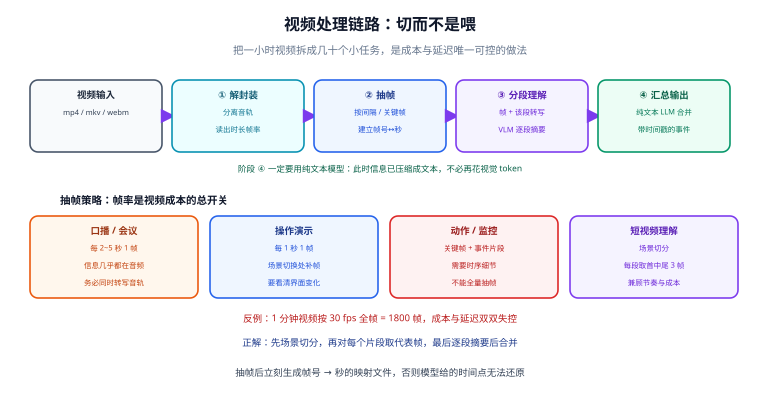

# 视频处理

视频是多模态里**最贵、最慢、也最容易失控**的一类输入：token 消耗随时长线性增长，一个小时的素材直接丢给模型可能一次请求就烧掉几十美元。本页讲的是工程化的解法——**先把视频降维成「帧 + 音频 + 时间戳」，再分段交给模型**。

::: tip 一句话理解
处理视频的正确姿势是**「切」而不是「喂」**：切场景、切片段、抽关键帧、分离音轨，把「一小时的视频」变成「几十个几百毫秒的小任务」。推理框架能不能直接吃长视频，是能力问题；要不要这么做，是成本问题。
:::



## 一、为什么视频必须切：先算一笔账

| 输入形态 | token 量级 | 说明 |
| --- | --- | --- |
| 单张图片 | 数百~数千 | 与分辨率相关 |
| 1 分钟视频按 1 fps 抽帧 | 60 × 单帧 token | 已相当于 60 张图 |
| 1 分钟视频按 30 fps 全帧 | 1800 × 单帧 token | **几乎不可用**：成本与延迟都失控 |
| 1 小时视频按 0.2 fps 抽帧 | 约 720 × 单帧 token | 仍偏贵，需要先做场景切分 |

结论很清楚：**帧率是视频成本的总开关**。工程上的默认档位是：

| 场景 | 抽帧策略 | 理由 |
| --- | --- | --- |
| 口播/讲座/会议 | 每 2~5 秒 1 帧 | 画面变化小，信息几乎都在音频里 |
| 操作演示/教程 | 每 1 秒 1 帧 + 场景切换补帧 | 需要看清界面变化 |
| 动作/体育/监控 | 关键帧 + 事件触发片段 | 需要时序细节，但不能全量 |
| 短视频内容理解 | 场景切分后每段取首/中/尾 3 帧 | 兼顾节奏与成本 |

::: danger 三个高频误判
1. **把「模型支持视频输入」当成「可以直接喂原片」**。支持不等于划算：同一个模型吃 1 帧和吃 1800 帧，单次请求的成本能差三个数量级。
2. **只抽帧、丢音轨**。口播类内容 80% 的信息在音频里，只抽帧等于把最有价值的部分扔了。
3. **抽帧后丢掉时间戳**。模型说「大约在第 253 帧出现了问题」对用户毫无意义，必须映射回**秒**。
:::

## 二、解封装：把视频拆成零件

FFmpeg 一次调用就能拆出你能用的全部原料。

```shell
# ① 分离音轨（交给语音链路）
ffmpeg -i input.mp4 -vn -ac 1 -ar 16000 -c:a pcm_s16le audio.wav

# ② 固定间隔抽帧：每 2 秒 1 帧，长边限制 1280，输出到 frames/
mkdir -p frames
ffmpeg -i input.mp4 -vf "fps=1/2,scale='min(1280,iw)':-2" -q:v 3 frames/f_%05d.jpg

# ③ 只抽关键帧（I 帧），数量最少、画面最稳定
ffmpeg -skip_frame nokey -i input.mp4 -vsync 0 -q:v 3 keyframes/k_%05d.jpg

# ④ 场景切换检测（画面变化超过阈值时抽一帧，用于内容理解）
ffmpeg -i input.mp4 -vf "select='gt(scene,0.3)',scale='min(1280,iw)':-2" -vsync vfr -q:v 3 scene/s_%05d.jpg

# ⑤ 看基本信息（时长、帧率、分辨率、码率）
ffprobe -v error -show_entries format=duration,bit_rate -show_entries stream=codec_type,width,height,r_frame_rate -of default=nw=1 input.mp4
```

::: warning 抽帧的三个参数细节
- **`scale='min(1280,iw)':-2`**：等比缩放且保证高度是偶数（奇数高度在部分编码器/模型上是错的）。别把固定尺寸写死，竖屏视频会变形。
- **`fps=1/2` 而不是 `fps=0.5`**：分数写法更直观，「每 N 秒一帧」。
- **`-vsync vfr`**：配合 `select` 过滤时必须加，否则 FFmpeg 会按原帧率补齐，白抽出一堆重复帧。
:::

## 三、时间戳：抽帧后最重要的映射

抽完帧你会得到 `f_00001.jpg`、`f_00002.jpg`……**必须立刻建立「帧序号 → 秒」的映射**，否则模型的输出无法还原到时间轴。

```python
# frames_map.py —— 建立并保存帧序号到时间的映射
import json

FPS_EXTRACT = 0.5          # 每 2 秒一帧
frames = []

def build(n_frames: int, interval: float = 1 / FPS_EXTRACT):
    return [{"idx": i, "t_sec": round(i * interval, 2), "path": f"frames/f_{i:05d}.jpg"}
            for i in range(1, n_frames + 1)]

if __name__ == "__main__":
    frames = build(n_frames=30)
    json.dump(frames, open("frames.json", "w", encoding="utf-8"), ensure_ascii=False, indent=2)
    print(json.dumps(frames[:3], ensure_ascii=False))
    # 预期：[{"idx": 1, "t_sec": 2.0, ...}, {"idx": 2, "t_sec": 4.0, ...}, ...]
```

::: danger 时间偏移的三个来源
1. **抽帧间隔不等于 `1/fps`**：`fps=1/2` 时第一帧的时间戳是 2.0 s 还是 0.0 s，取决于工具行为，**不要凭感觉**，用 `ffprobe` 对第一帧时间做一次实际核对。
2. **源视频有起始偏移**：部分录制文件带非零起始时间（`start_time`），需要从其值开始累加。
3. **片段合并时漏加偏移**：把长视频切成 10 分钟一段并发处理，每段内部时间必须**加上段首偏移**才是绝对时间。
:::

## 四、视频理解的三种策略

| 策略 | 做法 | 成本 | 适合 |
| --- | --- | --- | --- |
| **抽帧 + VLM 逐帧** | 抽帧后每帧单独问答，再汇总 | 中 | 画面信息为主、时长较短 |
| **场景切分 + 分段摘要** | 先按场景切开，每段取代表帧做摘要，再对摘要做汇总 | **低** | 长视频（> 10 min）内容理解 |
| **原生视频输入** | 直接把视频（或其张量）交给支持视频的 VLM | 高 | 需要精确时序推理、且时长可控 |

主流开源 VLM（Qwen 系、GLM 系等）都能接受视频输入，支持**时间戳对齐**与**秒级事件定位**，长上下文可以做到 256K 级别。但要注意：

::: danger 原生视频输入的两个隐性成本
1. **视觉 token 仍然吃上下文**。模型的上下文再长，视频帧编码出的 token 也在里面占位置，多图/长视频会挤掉留给文本的空间。
2. **帧采样参数由你决定，不由模型决定**。推理框架通常提供类似「每秒抽几帧」或「一共抽多少帧」的参数——**不显式设置就会用默认值**，而默认值往往不省。部署时把它当成必配项。
   :::

实用做法（长视频摘要）是**两阶段**：

```text
① 场景切分 → 得到 N 个片段，每段记录 [start, end]
② 每段取代表帧（首/中/尾）+ 该段音频转写 → 让 VLM 输出「片段摘要 + 关键事件 + 时间戳」
③ 把所有片段摘要（文本，几百字）汇总 → 让纯文本 LLM 生成全局摘要
```

**阶段 ③ 用纯文本模型**，因为它便宜得多，而且此时信息已经压缩成文本，不需要再花视觉 token。

```python
# video_summary.py —— 两阶段摘要的骨架（伪代码式，聚焦流程）
from openai import OpenAI
client = OpenAI()

def summarize_segment(frames: list[str], transcript: str) -> str:
    content = [{"type": "text", "text": "以下是视频某个片段的若干代表帧与音频转写，"
                                       "请输出：① 画面描述 ② 关键事件 ③ 出现的信息（文字/数字）"}]
    for f in frames:
        content.append({"type": "image_url", "image_url": {"url": f"data:image/jpeg;base64,{b64(f)}"}})
    content.append({"type": "text", "text": f"音频转写：{transcript}"})
    resp = client.chat.completions.create(
        model="gpt-5.4",
        messages=[{"role": "user", "content": content}],
        max_tokens=512,
    )
    return resp.choices[0].message.content

def summarize_all(segment_summaries: list[str]) -> str:
    # 阶段 ③：纯文本汇总——这一步不要再用视觉模型
    joined = "\n\n".join(f"片段 {i+1}：\n{s}" for i, s in enumerate(segment_summaries))
    resp = client.chat.completions.create(
        model="gpt-5.4",
        messages=[{"role": "user", "content": f"把下面各片段摘要合并成一份连贯的视频摘要：\n\n{joined}"}],
        max_tokens=800,
    )
    return resp.choices[0].message.content
```

## 五、字幕与时间轴对齐

字幕是视频链路里**最容易做到高可用**的一个产出，流程完全确定：

| 步骤 | 工具/做法 | 产出 |
| --- | --- | --- |
| ① 分离音轨 | FFmpeg | 16 kHz 单声道 WAV |
| ② 转写 | faster-whisper / WhisperX | 带时间戳的文本段 |
| ③ 词级对齐（可选） | WhisperX（wav2vec2 对齐） | 词级时间戳，字幕不跳 |
| ④ 生成字幕 | `faster_whisper` 的 `output_format="srt"` | `.srt` |
| ⑤ 压制或外挂 | `ffmpeg -i in.mp4 -vf subtitles=out.srt out.mp4` | 带字幕视频 |

```python
# srt.py —— 直接产出 SRT
from faster_whisper import WhisperModel

model = WhisperModel("large-v3-turbo", device="cuda", compute_type="int8_float16")
segments, info = model.transcribe("audio.wav", vad_filter=True, beam_size=5)

def fmt(t: float) -> str:
    h, rem = divmod(t, 3600)
    m, s = divmod(rem, 60)
    return f"{int(h):02d}:{int(m):02d}:{s:06.3f}".replace(".", ",")

with open("out.srt", "w", encoding="utf-8") as f:
    for i, seg in enumerate(segments, 1):       # 直接遍历生成器，边转边写，省内存
        f.write(f"{i}\n{fmt(seg.start)} --> {fmt(seg.end)}\n{seg.text.strip()}\n\n")
print("已生成 out.srt")
```

::: tip 中文字幕的两个实用调整
1. **行宽限制**：中文单行建议 ≤ 20 字，超过要拆行，否则播放器会截断。
2. **最短显示时长**：极短的段（< 0.8 s）会被闪过去，需要与前一段合并或延长显示时间。
   :::

## 六、视频生成：边界在哪

多模态的另一半是**生成**（文生视频、图生视频）。工程上把它当成**独立链路**对待，不要和「理解」混在一个服务里：

| 维度 | 视频理解 | 视频生成 |
| --- | --- | --- |
| 输入 | 视频 | 文本 / 图片 |
| 输出 | 文本 | 视频文件 |
| 主要成本 | token（抽帧数量） | 生成时长 × 分辨率 |
| 典型延迟 | 秒级 | 分钟级 |
| 可控性 | 高（预处理可控） | 低（随机性强，需要多轮重试） |

::: danger 生成侧的三条硬约束
1. **必须异步**。分钟级延迟不能放在同步 HTTP 请求里，标准做法是「提交任务 → 返回任务 ID → 轮询/回调」。
2. **必须限流与配额**。单次生成成本远高于理解，一次误用的代价可能是理解任务的上百倍。
3. **产物要落对象存储并设过期策略**。视频文件体积大，放在本地磁盘上会迅速吃满空间。
   :::

## 七、常见坑速查

| 现象 | 原因 | 解法 |
| --- | --- | --- |
| 抽帧数量远超预期 | 用了 `select` 但未加 `-vsync vfr` | 补上参数，或改用 `fps=` 直接抽 |
| 帧图片竖屏被压扁 | 写死了 `scale=1280:720` | 用 `scale='min(1280,iw)':-2` 等比缩放 |
| 高度为奇数导致编码/推理失败 | `-2` 写成了 `-1` | 用 `-2` 保证偶数 |
| 模型给的时间点对不上真实视频 | 未建立帧号↔秒的映射，或漏加段偏移 | 抽帧后立刻生成 `frames.json`；分片处理时累加偏移 |
| 长视频请求超时 | 单次请求塞了太多帧 | 场景切分 + 分批并发 + 结果汇总 |
| 抽帧后画面全一样 | 画面静止（口播）却按高帧率抽 | 按场景类型选抽帧策略（见第一节） |
| 音画不同步 | 音轨与视频轨起始时间不同 | 用 `ffprobe` 核对两条流的起始时间，剪辑时统一 |
| 磁盘被中间产物写满 | 帧图片按原分辨率大量落盘 | 抽帧即压缩、及时清理、产物落对象存储 |

## 八、验证方式

视频链路的验证要分三层，缺一层都会在线上翻车：

```shell
# ① 抽帧正确性：抽出的帧数应与「时长 ÷ 间隔」基本一致
ffprobe -v error -show_entries format=duration -of default=nw=1:nk=1 input.mp4
ls frames/ | wc -l
# 预期：两者相除接近你设定的抽帧间隔（误差来自关键帧对齐）

# ② 时间戳正确性：抽查第 3 帧与视频第 6 秒的画面是否一致
ffmpeg -ss 6 -i input.mp4 -frames:v 1 check.jpg
# 人工比对 check.jpg 与 frames/f_00003.jpg

# ③ 端到端：摘要里出现的时间戳必须能在视频里找到对应画面
```

| 检查项 | 及格线 | 说明 |
| --- | --- | --- |
| 抽帧数量偏差 | ≤ 5% | 与理论值对比，超了说明参数没生效 |
| 时间戳准确性 | 抽查 5 点全部命中 | 命中 = 前后 2 秒内能定位到同一画面 |
| 摘要可用性 | 人工评分 ≥ 4/5 | 关键事件无遗漏、无编造 |
| 单分钟处理成本 | 有明确预算并落监控 | 按「抽帧数 × 单价」估算，上线前必须算过 |
| 字幕同步 | 肉眼抽查无跳字 | 用词级对齐可显著改善 |

::: warning 一定要留「抽样人工校验」这一环
视频链路的错误往往**整体一致**（比如整段抽帧参数错了、时间戳整体偏移了同一秒钟）。这种错误不会被单点抽查发现，必须**拿完整视频从头看到尾一次**。上线前的验收清单里请保留这一条。
:::

## 参考资料

- FFmpeg 官方文档（`fps` / `select` / `-skip_frame` / `scale` 滤镜）：<https://ffmpeg.org/ffmpeg-filters.html>
- FFmpeg 官方下载与版本说明（当前主线 9.0 "Lei"）：<https://ffmpeg.org/download.html>
- faster-whisper（字幕与 SRT 输出）：<https://github.com/SYSTRAN/faster-whisper>
- WhisperX（词级时间戳，字幕同步的关键）：<https://github.com/m-bain/whisperX>
- Qwen 系列模型卡（视频输入与时间戳对齐能力）：<https://github.com/QwenLM/Qwen3-VL>
- vLLM 多模态服务参数（帧采样相关配置）：<https://docs.vllm.ai/>
- OpenAI 视频输入与视觉参数文档：<https://platform.openai.com/docs/guides/vision>
- 项目内相关：[多模态应用概述](../Overview/index.md) ｜ [语音处理](../SpeechProcessing/index.md)（音轨转写与字幕） ｜ [模型接入与选型](../ModelAccess/index.md)
