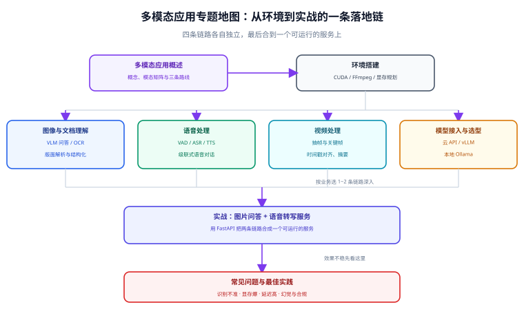

# 多模态应用

多模态应用（Multimodal Application）指让模型**同时处理文本以外的信号**——图片、文档、语音、视频，并把这些信号接进一条能被监控、能被计价、能出故障也能查的工程链路里。

本专题的组织逻辑只有一条：**按链路切，不按模型切**。因为多模态的难点从来不在「哪个模型更强」，而在解码、抽帧、重采样、切分、编码这些步骤里——模型只占其中一环，前面任何一步做错，后面再强的模型也救不回来。

## 专题导航

- [概述](Overview/index.md)：四类模态与任务矩阵、三条技术路线（原生/拼接/两阶段）、2026 模型生态速览与选型前的三项核对
- [环境搭建](Environment/index.md)：Python 与 CUDA、FFmpeg、PyTorch、模型权重缓存与显存规划——后续所有页面的共同地基
- [图像与文档理解](ImageUnderstanding/index.md)：VLM 图像问答、OCR 与版面解析、票据与表格结构化
- [语音处理](SpeechProcessing/index.md)：VAD、ASR（Whisper 系）、TTS、级联式语音对话
- [视频处理](VideoProcessing/index.md)：抽帧与关键帧、时间戳对齐、视频摘要与字幕生成
- [模型接入与选型](ModelAccess/index.md)：云 API、自托管 vLLM、本地 Ollama 三种接入形态与选型矩阵
- [实战：图片问答 + 语音转写服务](Practice/index.md)：用 FastAPI 把两条链路合成一个可运行、可验收的服务
- [常见问题与最佳实践](FAQ/index.md)：识别不准、显存爆、延迟高、幻觉与合规的排障路径

::: tip 一句话理解
纯文本应用的输入是**你已经理解过的数据**；多模态应用的输入是**原始信号**。多出来的全部工作量，都在「把原始信号变成模型能用的形式」这一段。
:::

## 按环节找页面

不确定从哪页读起时，按自己卡住的环节对号入座：

| 环节 | 典型问题 | 去哪看 |
| --- | --- | --- |
| **环境与依赖** | 装不上、版本打架、显存不够、权重下载不动 | [环境搭建](Environment/index.md) |
| **预处理与编码** | 图片太大识别不准；音频里有静音导致切片乱；视频时长一小时不知道怎么送 | 各模态页的「预处理」小节 |
| **模型与接入** | 用云 API 还是自托管？数据不能出网怎么办？ | [模型接入与选型](ModelAccess/index.md) |
| **服务化与并发** | 单次能跑，一上并发就超时 | [实战](Practice/index.md)、[本地模型部署](../LocalModel/InferenceServer/index.md) |
| **质量与成本** | 准确率忽高忽低；账单长得比预期快 | [概述 · 成本与延迟的直觉](Overview/index.md) |
| **合规与许可** | 权重能不能商用？数据能不能出网？ | [概述 · 选型前的三项核对](Overview/index.md)、[常见问题与最佳实践](FAQ/index.md) |

## 按目标选读路径

页面顺序不是阅读顺序。按自己的目标挑一条：

- **「我要把一批 PDF / 票据 / 扫描件变成结构化数据」** → [环境搭建](Environment/index.md) → [图像与文档理解](ImageUnderstanding/index.md) → [常见问题与最佳实践](FAQ/index.md) 的「抽取不准」分支
- **「我要把会议录音变成纪要」** → [环境搭建](Environment/index.md) → [语音处理](SpeechProcessing/index.md) → 要再落成可检索知识库，接 [RAG 检索增强](../RAG/index.md)
- **「我要做一个能看图的问答机器人」** → [概述](Overview/index.md) → [模型接入与选型](ModelAccess/index.md) → [实战](Practice/index.md)
- **「我要先评估能不能自托管」** → [模型接入与选型](ModelAccess/index.md) → [环境搭建](Environment/index.md) 的显存规划 → [本地模型部署](../LocalModel/index.md)
- **「线上效果不稳，要排障」** → [常见问题与最佳实践](FAQ/index.md) 的决策树，先定位到具体环节

## 三件事先说在前面

这三点在本专题每页都会反复用到，先记住可以少走弯路：

1. **Token 消耗取决于预处理，而不是模型定价。** 同一张扫描件，原图直送和先做版面分析再按块裁切，输入 token 能差一个数量级。省钱口诀：**图像靠裁，音频靠切，视频靠抽帧**。
2. **代码许可 ≠ 权重许可。** 不少项目代码是 Apache-2.0，权重却是 CC-BY-NC 或自定义协议（禁商用，或超过营收/用户阈值需单独授权）。选型时打开权重仓库的模型卡，别只看 GitHub 首页的徽章。
3. **「本地部署」是合规方案的入场券，不是备选。** 客户合同、病历、身份证这类数据丢给云端 API，在很多行业是直接违规。要把本地部署的硬件与运维成本提前算进方案，而不是事后追加。

## 相关专题

- [RAG 检索增强](../RAG/index.md)：向量化、索引、召回与评估的完整工程结论——多模态检索（以图搜图、以文搜图）是同一套工程的模态扩展；嵌入与向量库的数学口径见 [嵌入与向量基础](../RAG/Embedding/index.md) 与 [向量库与索引](../RAG/VectorStore/index.md)
- [大模型应用开发](../LLMApp/index.md)：纯文本链路的 API 调用、结构化输出、成本与限流——多模态是它的**增量**，不是替代
- [本地模型部署](../LocalModel/index.md)：显存规划、量化、推理服务与压测；本专题「自托管」相关内容直接复用其结论
- [提示词工程](../PromptEngineering/index.md)：多模态提示词是提示词工程的一个分支，本专题只写多模态特有的部分
- [Agent 应用](../Agent/index.md)：把「看」与「听」封成工具交给 Agent 编排——感知层与决策层解耦的做法
- [LangChain](../LangChain/index.md)：多模态内容块在框架侧怎么进消息；框架与直接调 SDK 的分工判据见该页
- [大模型微调](../FineTuning/index.md)：视觉指令微调与多模态数据构造——数据工程、LoRA、评测门禁那一整套方法论完全复用

## 参考资料

- OpenAI 多模态输入文档（图像与音频输入的参数与限制）：<https://platform.openai.com/docs/guides/vision>
- Qwen 系列模型卡与官方仓库（视觉能力与上下文配置）：<https://github.com/QwenLM/Qwen3-VL>
- Whisper 官方仓库与模型表（含 `large-v3-turbo`）：<https://github.com/openai/whisper>
- FFmpeg 官方文档（音视频预处理的事实标准）：<https://ffmpeg.org/>
- vLLM 官方文档（多模态模型服务化）：<https://docs.vllm.ai/>
- Hugging Face Transformers 多模态任务文档：<https://huggingface.co/docs/transformers/main/en/tasks>
