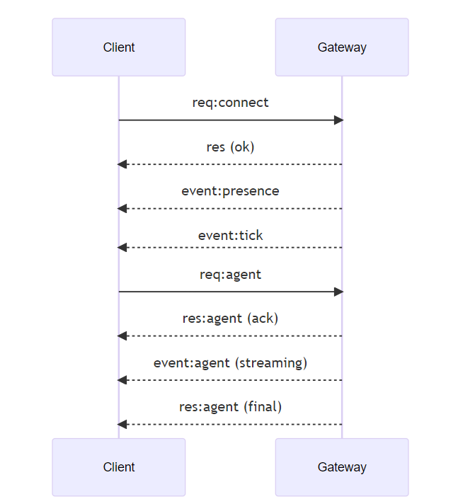

# 系统架构

OpenClaw 采用模块化架构设计，通过 **Gateway（网关）** 作为核心调度枢纽，连接渠道、智能体、工具和模型，形成一个完整的 AI Agent 执行框架。

## 四大核心组件

### Gateway 网关

Gateway 是 OpenClaw 的"大脑中枢"，负责管理所有外部连接、消息路由和任务调度：

- **消息路由**：接收来自各渠道（WhatsApp、Telegram、Discord 等）的消息，分发给对应的 Agent
- **WebSocket 服务**：提供统一的通信协议，客户端（macOS App、CLI、Web UI）通过 WebSocket 连接到 Gateway
- **模型调用**：管理 LLM 提供商的 API 连接，包括认证、故障转移、速率限制处理
- **工具调度**：协调 Agent 对工具的调用，管理执行策略和安全边界
- **节点管理**：支持 macOS/iOS/Android/Headless 节点连接，提供摄像头、屏幕录制、定位等设备能力

::: tip 重要
每个主机只能运行一个 Gateway。Gateway 是唯一可以打开 WhatsApp 会话的地方。
:::

### Agent 智能体

Agent 是执行实际任务的 AI 实体，具备以下特征：

- **拥有记忆**：通过工作空间文件（`MEMORY.md`、`memory/` 目录）维持长期记忆
- **具有个性**：通过 `SOUL.md`、`IDENTITY.md` 定义其声音、风格和行为边界
- **能使用工具**：可以读写文件、执行命令、搜索网络、控制浏览器等
- **独立工作空间**：每个 Agent 有自己的工作目录，多 Agent 之间相互隔离

### Channels 渠道

Channels 是用户与 OpenClaw 交互的消息平台。OpenClaw 支持丰富的渠道：

- **即时通讯**：WhatsApp、Telegram、Discord、Slack、Signal、微信、飞书、钉钉
- **邮件与协作**：Google Chat、Microsoft Teams、Mattermost
- **Web 界面**：内置 WebChat、Control UI
- **其他**：iMessage、IRC、LINE、Matrix、Nostr、Twitch 等

每个渠道独立配置 DM 策略、群组权限和消息分发规则。

### Tools 工具

Tools 赋予 Agent 实际操作系统的能力：

| 类别 | 工具示例 |
|------|---------|
| 文件系统 | `read`、`write`、`edit` |
| 命令执行 | `exec`（shell 命令） |
| 网络搜索 | `web_search`、`web_fetch` |
| 浏览器控制 | `browser`（基于 CDP 的浏览器自动化） |
| 记忆管理 | `memory_search`、`memory_get` |
| 子智能体 | `sessions_spawn`（创建子 Agent 执行任务） |
| 媒体处理 | 图像生成、视频生成、TTS 语音合成 |

工具策略可通过配置进行安全管控（允许/拒绝列表、执行审批等）。

## 架构拓扑

```text
┌──────────────────────────────────────────────────────────────┐
│                         OpenClaw System                       │
├──────────────────────────────────────────────────────────────┤
│                                                              │
│  ┌──────────┐  ┌──────────┐  ┌──────────┐  ┌──────────┐    │
│  │ WhatsApp │  │ Telegram │  │ Discord  │  │  WebChat │    │
│  └────┬─────┘  └────┬─────┘  └────┬─────┘  └────┬─────┘    │
│       │              │              │              │         │
│       └──────────────┼──────────────┼──────────────┘         │
│                      │              │                        │
│                      ▼              ▼                        │
│              ┌───────────────────────────┐                   │
│              │        Gateway            │                   │
│              │   (WebSocket Server)      │                   │
│              │   Port: 18789 (default)   │                   │
│              └─────────────┬─────────────┘                   │
│                            │                                 │
│              ┌─────────────┼─────────────┐                   │
│              ▼             ▼             ▼                   │
│       ┌──────────┐ ┌──────────┐ ┌──────────────┐            │
│       │  Agent   │ │  Agent   │ │   Control    │            │
│       │  (main)  │ │  (work)  │ │   UI / CLI   │            │
│       └────┬─────┘ └────┬─────┘ └──────────────┘            │
│            │             │                                    │
│            ▼             ▼                                    │
│    ┌─────────────┐ ┌─────────────┐                           │
│    │  Workspace  │ │  Workspace  │                           │
│    │   (main)    │ │   (work)    │                           │
│    └──────┬──────┘ └──────┬──────┘                           │
│           │               │                                   │
│           ▼               ▼                                   │
│    ┌─────────────────────────────────┐                       │
│    │         LLM Providers           │                       │
│    │  DeepSeek / OpenAI / Anthropic  │                       │
│    │  Ollama / Groq / OpenRouter ... │                       │
│    └─────────────────────────────────┘                       │
│                                                              │
└──────────────────────────────────────────────────────────────┘
```

## WebSocket 协议

所有客户端（包括 CLI、macOS App、Control UI、节点设备）通过 **WebSocket** 连接到 Gateway：

- **默认端口**：`18789`
- **传输格式**：JSON 文本帧
- **连接流程**：`connect` 握手 → 身份验证 → 双向通信
- **消息类型**：
  - `req`：客户端请求（如 `agent`、`send`、`health`）
  - `res`：网关响应（包含 `ok` 或 `error`）
  - `event`：网关推送事件（如 `presence`、`tick`、`agent` 流式输出）

### 连接生命周期



::: warning 安全检查
WebSocket 连接需要身份认证（共享密钥或设备配对令牌）。非本地连接必须通过明确的配对审批。远程访问建议使用 Tailscale 或 SSH 隧道。
:::

## 数据流详解

一次完整的用户交互流程：

```text
1. 用户发消息（WhatsApp "帮我分析这段代码"）
         │
         ▼
2. Channel 层接收 → 解析发送者身份 → 确定目标 Agent
         │
         ▼
3. Gateway 将消息路由到指定 Agent 的会话队列
         │
         ▼
4. Agent 开始执行循环：
   ├── 读取工作空间文件（AGENTS.md、SOUL.md、MEMORY.md）
   ├── 加载会话历史
   ├── 构建系统提示词
   ├── 调用 LLM 推理
   ├── LLM 决定调用工具（read → 读取代码文件）
   ├── 工具执行完成，结果返回 LLM
   ├── LLM 继续推理或生成回复
         │
         ▼
5. 响应通过 Gateway 返回 Channel → 用户收到分析结果
```

## 远程访问

OpenClaw 支持通过以下方式实现远程访问：

- **Tailscale（推荐）**：自动 VPN，无需手动配置网络
- **SSH 隧道**：

  ```bash
  ssh -N -L 18789:127.0.0.1:18789 user@host
  ```

- **TLS + 证书锁定**：可为 WebSocket 启用 TLS 加密

## 不变性规则

以下几个设计约束是 OpenClaw 架构的核心保证：

1. **单 Gateway 原则**：每个主机只允许一个 Gateway 实例，控制唯一的 Baileys 会话
2. **强制握手**：任何非 JSON 或非 `connect` 的首帧都导致连接立即关闭
3. **事件不复放**：Gateway 推送的事件不会重放，客户端需自行刷新
4. **会话隔离**：不同用户的会话天然隔离（通过 DM Scope 配置）
