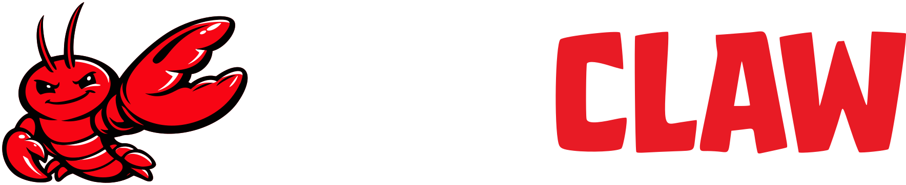
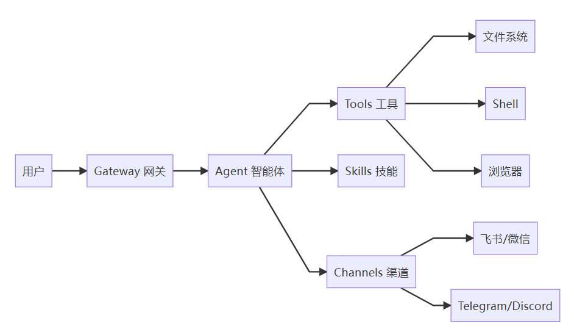

# OpenClaw 概述

**OpenClaw**（原名 ClawdBot）是一个开源的 **AI Agent 智能体框架**。它在 GitHub 上已获得超过 **143K Star**，是目前最受关注的 AI Agent 项目之一。

不同于传统的聊天 AI，OpenClaw 的核心价值在于「**让 AI 长出双手**」——它不仅能理解和生成文本，更能直接操控你的电脑、自动执行任务、连接你的所有沟通渠道，成为真正能「做事」的 AI 助手。

::: tip 一句话理解
传统 AI 告诉你"怎么做"，OpenClaw **直接帮你做**。
:::



## 核心理念

市面上大多数 AI 产品（ChatGPT、Claude 等）的核心交互方式是**对话**：你问，它答。这种模式在信息获取和内容生成方面表现出色，但有一个根本局限——**它只能"说"，不能"做"**。

OpenClaw 的设计哲学完全不同：

- **Agent First**（智能体优先）：AI 是行动者，而非对话者
- **Tool-Use Native**（工具原生）：内置文件系统、Shell、浏览器、自动化等能力
- **Local First**（本地优先）：数据留在你的设备上，隐私可控
- **Extensible**（可扩展）：通过 Skills 和 Plugins 生态无限扩展能力



## 核心特性

### 多平台支持

| 平台 | 支持方式 |
|------|----------|
| Windows 10/11 | 原生安装 / WSL2 / Docker |
| macOS 10.15+ | Homebrew / 手动安装 |
| Linux (Ubuntu/Debian/CentOS) | npm 全局安装 / Docker |

### 多渠道接入

OpenClaw 可以作为消息中枢，连接你使用的所有沟通平台：

- **飞书** — 企业办公场景
- **微信** — 个人微信/企业微信
- **Telegram** — 全球用户首选
- **Discord** — 社区与游戏场景
- **Slack** — 团队协作
- **WebChat** — 浏览器直接使用

在任一渠道发送消息，OpenClaw 都能统一响应和执行任务。

### 多模型接入

OpenClaw 不绑定任何单一 AI 模型，你可以自由选择或组合使用：

- **OpenAI** — GPT-4o, GPT-4-turbo, o1 系列
- **Anthropic** — Claude 3.5 Sonnet, Claude Opus
- **DeepSeek** — DeepSeek-V3, DeepSeek-R1
- **Ollama** — 本地运行 Llama、Mistral、Qwen 等开源模型
- **Google** — Gemini 系列
- **自定义 API** — 任何兼容 OpenAI API 格式的服务

::: tip 💡 省钱小技巧
日常任务用 DeepSeek 或本地 Ollama 模型，复杂任务切换到 Claude 或 GPT-4o。灵活组合，成本可控。
:::

### 可扩展架构

- **Skills（技能）** — 社区贡献的能力模块，安装即用
- **Plugins（插件）** — 更底层的扩展机制，可接入任意 API
- **Tools（工具）** — 内置的工具集：文件操作、Shell 执行、网络请求、截图等
- **自定义指令** — 通过 System Prompt 和 Rules 定制 Agent 行为

### 本地优先 · 隐私可控

- 所有数据和配置存储在本地
- 支持完全离线运行（搭配 Ollama 本地模型）
- Gateway 模式支持局域网内多设备访问，数据不出局域网
- 开源代码，可审计、可定制

## 架构概览

OpenClaw 采用分层架构，核心由四个部分组成：

```
┌─────────────────────────────────────────┐
│              Channels 渠道层             │
│  飞书 │ 微信 │ Telegram │ Discord │ Web  │
└─────────────────┬───────────────────────┘
                  │
┌─────────────────▼───────────────────────┐
│            Gateway 网关层               │
│   消息路由 │ 会话管理 │ 认证 │ 任务调度  │
│          Web 控制台 :18789              │
└─────────────────┬───────────────────────┘
                  │
┌─────────────────▼───────────────────────┐
│            Agent 智能体层               │
│   上下文理解 │ 任务规划 │ 工具调用       │
│   模型切换 │ Skills 管理 │ 记忆系统     │
└─────────────────┬───────────────────────┘
                  │
┌─────────────────▼───────────────────────┐
│             Tools 工具层                │
│  文件读写 │ Shell │ 浏览器 │ API │ 截图  │
│  邮件 │ 日历 │ 数据库 │ ...（可扩展）    │
└─────────────────────────────────────────┘
```

### Gateway（网关）

Gateway 是 OpenClaw 的「中枢神经」，负责：
- 统一接收来自所有渠道的消息
- 管理用户会话和认证
- 调度任务到 Agent 执行
- 提供 Web 控制台（默认端口 `18789`）
- 支持本地模式和远程模式

### Agent（智能体）

Agent 是 OpenClaw 的「大脑」，负责：
- 理解用户意图
- 规划和分解任务
- 调用合适的工具和技能
- 维护对话上下文和记忆
- 根据任务复杂度选择合适的模型

### Channels（渠道）

Channel 是 OpenClaw 的「感官」，让 AI 能够：
- 在飞书、微信、Telegram 等平台接收消息
- 以对应平台的身份进行回复
- 支持群聊和私聊两种模式
- 统一管理所有渠道的消息流

### Tools（工具）

Tool 是 OpenClaw 的「双手」，提供实际操作能力：
- **文件系统**：读写、搜索、管理文件
- **Shell**：执行命令行指令
- **浏览器**：网页抓取、自动化操作
- **网络**：HTTP 请求、API 调用
- **系统**：进程管理、截图、通知

## 与传统聊天 AI 的对比

| 维度 | 传统聊天 AI | OpenClaw |
|------|-------------|----------|
| **交互方式** | 纯文本对话 | 文本 + 实际行动 |
| **任务执行** | 只给建议和方案 | 直接替你执行完成 |
| **系统集成** | 无 | 深度集成操作系统和软件 |
| **消息渠道** | 单一平台 | 多平台统一接入 |
| **模型选择** | 仅自家模型 | 自由切换多个模型 |
| **数据隐私** | 数据上云 | 本地优先，数据可控 |
| **自动化能力** | 需人工操作 | 全自动执行 |
| **扩展性** | 有限 | 开放的 Skills 和 Plugins 生态 |
| **部署方式** | SaaS 云服务 | 本地 / 自托管 / Docker |

**场景：整理项目文件夹中的混乱文件**

- ❌ **传统 AI**：「可以按文件类型创建子文件夹，然后把对应文件移动进去。用 Python 写个脚本来自动化这个流程...」（需要自己动手）
- ✅ **OpenClaw**：直接扫描文件夹 → 按类型分类 → 创建子文件夹 → 移动文件 → 报告结果（全程自动，只需说一句话）

## 应用场景

### 自动化办公

- 自动处理邮件和消息通知
- 定时数据采集和报表生成
- 文档自动整理、格式转换、归档
- 会议记录整理和待办事项提取

### 系统管理

- 自动截屏和系统状态监控
- 磁盘空间管理和自动清理
- 定时备份和恢复
- 日志分析、异常告警

### 开发辅助

- 在本地项目中执行代码重构
- 自动化测试运行和结果分析
- Git 操作辅助和 PR 审查
- API 文档和注释自动生成
- 依赖更新和安全漏洞检查

### 个人助理

- 跨平台消息统一管理和回复
- 日历管理和日程提醒
- 信息搜索和总结
- 自动化个人工作流（如每日站会总结、周报生成）

## 社区与资源

| 资源 | 地址 |
|------|------|
| GitHub 源码 | [github.com/openclaw](https://github.com/openclaw) |
| 官方文档 | [docs.openclaw.ai](https://docs.openclaw.ai) |
| Discord 社区 | [discord.gg/openclaw](https://discord.gg/openclaw) |
| NPM 包 | [npmjs.com/package/openclaw](https://www.npmjs.com/package/openclaw) |
| 问题反馈 | [GitHub Issues](https://github.com/openclaw/openclaw/issues) |

