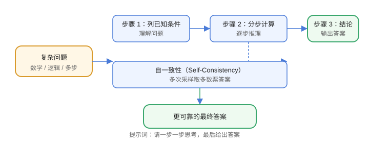

# 思维链（Chain of Thought）

思维链（CoT）让模型**分步推理**再给结论，是提升数学、逻辑、复杂任务准确率最有效的手段之一。



## 原理

直接问答案时，模型“一步到位”容易出错；让它把推理过程写出来，能降低错误率并暴露推理中的问题。

```text
❌ 一家店上午卖出 12 件，下午比上午多 8 件，今天一共卖出多少？
✅ 上午 12 件；下午 = 12 + 8 = 20 件；合计 = 12 + 20 = 32 件。答案：32
```

## 显式 CoT

```text
请一步一步思考，最后给出答案。
```

或更明确：

```text
先列出已知条件，再分步计算，最后输出结论。
```

## 隐式 CoT（few-shot 带推理）

```text
问题：A 有 5 元，B 比 A 多 3 元，两人一共多少？
推理：B = 5 + 3 = 8；合计 = 5 + 8 = 13。
答案：13

问题：...
```

示例中的推理步骤会“教”模型同样输出推理。

## 自我一致性（Self-Consistency）

同一问题多次采样（如 temperature=0.7，跑 5 次），取出现最多的答案：

```text
采样 1：答案 32
采样 2：答案 32
采样 3：答案 30
→ 多数票：32
```

能显著提升数学类任务准确率，代价是多次调用成本。

## 适用与不适用

| 场景 | 是否用 CoT |
| --- | --- |
| 数学、逻辑、多步任务 | 强烈建议 |
| 事实问答、简单抽取 | 可不用 |
| 创意写作 | 按需，避免过度格式化 |

## 易错点

::: danger 常见错误
1. 用 CoT 但输出“假推理”：要求“先写关键计算过程”，避免模型编造步骤。
2. 长推理链错误累积：及时校验中间步骤，或用工具计算。
3. 推理过程泄漏到最终产品：用 `stop` 或输出格式只保留结论。
4. 每个问题都开多路采样：成本高，只在关键任务用 Self-Consistency。
5. 与 few-shot 冲突：示例带推理，而要求里又说“不要解释”，指令矛盾。
:::

## 验证方式

1. 用同一批数学题对比「直接回答」与「CoT」的准确率。
2. 用 Self-Consistency 采样 5 次，对比多数票结果。
3. 检查输出中的推理步骤与最终答案是否一致。

## 参考资料

- Chain-of-Thought Prompting（论文）：https://arxiv.org/abs/2201.11903
- Self-Consistency（论文）：https://arxiv.org/abs/2203.11171
- Prompt Engineering Guide（CoT）：https://www.promptingguide.ai/zh/techniques/cot
