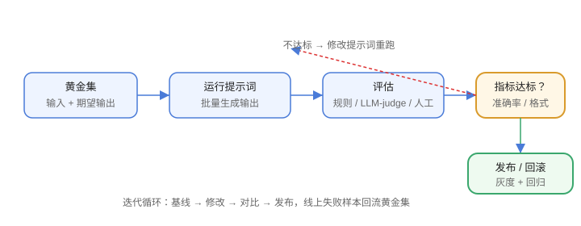

# 效果评估

提示词好不好，不能靠感觉。建立**评估集 + 评估方法 + 指标**，才能持续迭代而不退化。



## 评估维度

| 维度 | 说明 |
| --- | --- |
| 准确性 | 答案是否正确 |
| 相关性 | 是否切题 |
| 格式合规 | JSON/列表等是否可解析 |
| 一致性 | 同输入多次输出是否稳定 |
| 安全性 | 是否泄露、越权、诱导 |
| 成本与延迟 | Token 消耗、响应时间 |

## 评估集（黄金集）

```text
黄金集 = 有代表性的输入 + 期望输出（或评分标准）
```

构建要点：

1. 覆盖正常、边界、异常输入。
2. 每类至少 20~50 条。
3. 定期更新，加入线上真实失败样本。

## 评估方法

| 方法 | 说明 | 适用 |
| --- | --- | --- |
| 人工评估 | 标注员打分 | 小规模、质量要求高 |
| 规则断言 | 校验格式/关键词/JSON schema | 格式类任务 |
| LLM-as-judge | 用大模型打分 | 大规模、主观任务 |
| 自动化指标 | 准确率、Pass@k、BLEU 等 | 可量化任务 |

## LLM-as-judge 示例

```text
你是评估员。根据以下标准给回答打分（1~5）：
- 准确性：是否与参考答案一致
- 完整性：是否覆盖要点

参考答案：{{expected}}
模型回答：{{answer}}
输出 JSON：{"score": 1-5, "reason": "..."}
```

注意评估模型本身的偏差（顺序偏差、长度偏差），可多次采样取均值。

## 指标与回归

```shell
# 回归测试：跑一遍黄金集，对比指标
python evaluate.py --dataset gold.json --prompt v1.2
```

常见指标：

| 指标 | 用途 |
| --- | --- |
| 准确率 / F1 | 分类、抽取 |
| 格式合规率 | JSON/结构化输出 |
| 解析成功率 | 下游可直接使用 |
| 平均得分（LLM-judge） | 综合质量 |
| 延迟 / Token 成本 | 工程指标 |

## 迭代流程

```text
1. 建立基线（当前提示词的指标）
2. 修改提示词
3. 跑黄金集对比
4. 有提升则发布，否则回滚
```

## 易错点

::: danger 常见错误
1. 用少量“感觉”样本评估：波动大，至少几十条。
2. 评估集与开发集重叠：过拟合黄金集，换数据就退化。
3. 只评估准确率不看格式：下游解析失败等于没用。
4. LLM-as-judge 直接信单次结果：多次采样或人工抽检。
5. 只加样本不加失败案例：线上问题回流到评估集。
6. 忽略成本：效果 +5% 但 Token 翻倍，要权衡。
:::

## 验证方式

1. 建一个 30 条的黄金集，跑通基线评估。
2. 修改提示词后对比指标，确认提升方向。
3. 对 LLM-as-judge 结果抽样人工复核。

## 参考资料

- 评估最佳实践：https://developers.openai.com/api/docs/guides/evaluation-best-practices
- OpenAI Evals：https://github.com/openai/evals
- Prompt Engineering Guide（评估）：https://www.promptingguide.ai/zh

## 相关专题

- [大模型应用开发 · 实战：智能工单助手](../../LLMApp/Practice/index.md)：评测集、指标与回归脚本的工程化示例
- [大模型应用开发 · 成本核算与限流降级](../../LLMApp/CostRateLimit/index.md)：把准确率与成本放在一起比较
