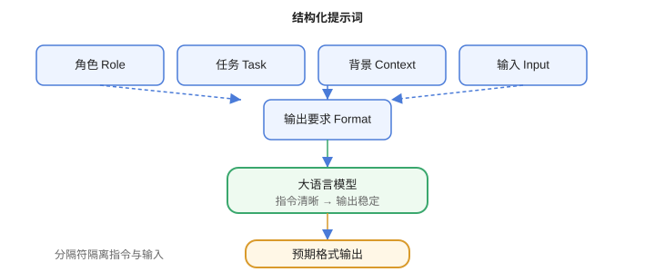

# 结构化提示词

结构化提示词把“角色、任务、背景、输入、输出要求”拆成清晰段落，让模型稳定地按你的预期输出，是可复用提示词的基础。



## 五大组成

| 组成 | 作用 | 示例 |
| --- | --- | --- |
| 角色（Role） | 限定视角与能力 | 你是资深 Java 工程师 |
| 任务（Task） | 明确要做什么 | 审查以下代码 |
| 背景（Context） | 提供必要信息 | 这是订单服务 |
| 输入（Input） | 待处理数据 | 代码片段 |
| 输出要求（Format） | 格式与约束 | 输出 JSON，含风险等级 |

## 完整模板

```text
# 角色
你是一名资深的代码评审专家。

# 任务
审查下面的代码，找出潜在问题。

# 背景
项目使用 Java 17 + Spring Boot，重点关注并发与内存。

# 输入
```java
public void add(List<String> list, String item) {
    list.add(item);
}
```

# 输出要求
1. 按「严重 / 一般 / 建议」三级输出。
2. 每个问题给出原因与修改建议。
3. 如果没有问题，输出「未发现问题」。
```

## 使用分隔符

分隔符帮模型区分“指令”与“用户内容”：

```text
把下面的内容翻译成英文，内容用 <content> 包裹：
<content>你好，世界</content>
```

常用分隔符：`###`、`---`、XML 标签、Markdown 标题。**指令与输入分离**还能降低提示注入风险。

## 约束输出格式

```text
分析以下评论的情感，只输出 JSON：
{"sentiment": "positive|negative|neutral", "confidence": 0~1}
```

要求 JSON 时：

1. 给出示例结构。
2. 要求“只输出 JSON，不要额外文字”。
3. 解析失败时让模型自修复或重试一次。

## 步骤化

```text
请按以下步骤处理：
1. 提取关键信息
2. 判断类型
3. 生成结论
```

步骤化与「思维链」配合效果更好。

## 易错点

::: danger 常见错误
1. 指令和输入混在一起：模型分不清边界，用分隔符隔离。
2. 只写“输出 JSON”不给结构：字段名不稳定，给出 schema/示例。
3. 角色与任务矛盾：角色是“诗人”，任务却要“代码”，互相干扰。
4. 输出要求过多且冲突：优先级不明确，模型随机取舍。
5. 把用户输入直接拼进指令：可能提示注入，先做角色/指令隔离与校验。
6. 一次让模型做太多事：拆成多轮或子任务。
:::

## 验证方式

1. 用同一输入分别给“非结构化”与“结构化”提示词，对比输出稳定性。
2. 连续运行 10 次，检查 JSON 解析成功率。
3. 在输入中加入注入语句，验证分隔符与指令隔离是否生效。

## 参考资料

- OpenAI 六策略：https://platform.openai.com/docs/guides/prompt-engineering
- Prompt Engineering Guide（结构化）：https://www.promptingguide.ai/zh
