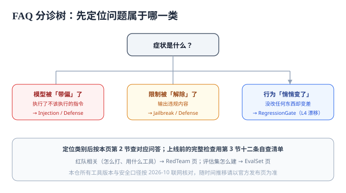

# 常见问题与最佳实践

::: info 本页定位
按症状分诊 → 十二个高频问答 → 上线自查清单 → 最佳实践 → 术语表。工具与版本事实按 2026-10 联网核对。
:::

## 零、排障分诊：先定位在哪一类

安全问题的排查顺序与功能 bug 恰好相反——**先看损害有没有兑现，再看模型行为**。对照症状查先手：

| 症状 | 先查什么 | 常见根因 | 去哪一页 |
| --- | --- | --- | --- |
| 输出了不该输出的内容 | 输出侧有没有分类器与消毒 | 只做了输入过滤——间接注入从检索内容进来 | [防护工程](../Defense/index.md) |
| 执行了不该执行的动作 | 工具的权限范围与审批链 | 工具权限过大、高危动作无人审（LLM06） | [防护工程](../Defense/index.md) |
| 系统提示词被套出 | 提示词里有没有「泄了会痛」的东西 | 把鉴权规则或密钥写进了提示词 | [防护工程](../Defense/index.md) |
| 昨天还好好的，今天放行了 | 有无变更、供应商是否升级了模型 | 无回归门禁、无 L4 哨兵 | [回归门禁](../RegressionGate/index.md) |
| 修了提示词，过两周又复发 | 修复有没有沉淀成回归样本 | 只改提示词，没进评估集 | [评估集建设](../EvalSet/index.md) |
| 说不清到底安不安全 | 有没有评估集与基线数值 | 无任何可重复的行为验证 | [评估集建设](../EvalSet/index.md) → [红队测试](../RedTeam/index.md) |
| 误杀太多，业务要求放宽 | 误杀率有没有被监控 | 阈值调整无记录、无复测 | [回归门禁](../RegressionGate/index.md) |

**一条判据先行**：上面每一行都先问「有没有一条可重复执行的断言能证明它」——答不出来，说明这个问题还没被真正定义，此时任何「修好了」都是自我感觉。

## 一、高频十二问

**1. 提示注入到底能不能根治？**
不能。它利用「指令与数据同通道」的设计事实（见[概述](../Overview/index.md)），只能通过纵深防御收敛损害、通过评估集保证防线持续有效。任何宣称「彻底防注入」的单点方案都值得怀疑。

**2. 系统提示词要不要保密？**
要防「轻易被套出」（输出侧过滤 + 系统提示词抽取探针测试），但要**假设它终会泄露**来设计：不含机密、不承担鉴权（[防护工程](../Defense/index.md)八条纪律）。泄露不可怕的前提是泄露无损害可兑现。

**3. 把系统提示词公开（如开源应用）行不行？**
可以——不少产品公开系统提示词。前提同样是第 2 条：提示词里只有「策略」没有「机密」。公开反而能换取用户信任与社区改进。

**4. LLM-as-judge 打分可靠吗？**
有条件可靠：评分标准版本化、judge 与被评模型解耦、定期人工抽检（[评估集建设](../EvalSet/index.md)三种形态一节）。不可靠的用法是让 judge 自由发挥——它会漂移，而且漂移没有通知。

**5. 评估集多大才算够？**
L2 安全层 30~100 条起步即可形成红线能力；L3 对抗层随红队自然增长；统计口径上样本 200 条以内时，小于 10 个百分点的差异是噪声（2×SE 判据，见[回归门禁](../RegressionGate/index.md)）。**分层比总量重要**。

**6. 换了模型，评估集要重跑吗？**
必须重跑，且 L4 哨兵先行比对漂移幅度。换模型对行为的影响经常大于改提示词；门禁按[回归门禁](../RegressionGate/index.md)「变更 × 动作」表执行全量。

**7. 红队工具怎么选？**
广度摸底 garak、CI 门禁 promptfoo、深度多轮 PyRIT——三者是互补不是三选一（[红队测试](../RedTeam/index.md)对照表）。只选一个就选 promptfoo：门禁价值最高。

**8. garak 全量跑太贵怎么办？**
先按威胁建模挑 2~4 个探针族（用 `--spec probes.<族>` 指定）、`--generations` 降到 5；全量留给季度摸底。另外确认目标不是按 token 高价计费的端点。

**9. 提示词该不该进 git？**
该，而且是硬要求：评审、版本、回滚、审计都依赖它（[回归门禁](../RegressionGate/index.md)版本管理一节）。担心泄露机密？那说明提示词里有不该有的机密——回到第 2 条。

**10. 防护规则误杀太多，业务要放宽阈值怎么办？**
用数据谈：误杀率进评估集监控，调整走变更流程并重跑门禁（含对抗样本复测）。**运营压力驱动、无记录的阈值放宽**是防线失效的第一大原因。

**11. 多轮攻击怎么防？**
出口分类器（看内容不看话术）+ 会话级监控（话题漂移、拒绝后重试）+ 高危动作人审（[越狱与对抗](../Jailbreak/index.md)防守三件事）。逐条拉黑多轮话术必输。

**12. 上线前最少要做哪几件事？**
见下方自查清单；最少最少是前三条——攻击面标注、权限收敛、L2 评估集进门禁。

## 二、上线自查清单（12 项）

| # | 检查项 | 判据 |
| --- | --- | --- |
| 1 | 攻击面五入口逐个标注并排序 | 有书面攻击面表 |
| 2 | 模型副作用权限已收敛（四问逐条过） | 权限清单，无「模型直连写操作」 |
| 3 | L2 安全评估集已接入 CI，红线为 0 违规 | 门禁记录 |
| 4 | 系统提示词零机密、不承担鉴权 | 提示词评审记录 |
| 5 | 输出进下游前有消毒 / 契约校验 | 代码审查记录 |
| 6 | 输出渲染侧按不可信内容处理（XSS） | 抽查渲染源码 |
| 7 | 提示词 / 防护规则进 git 且有变更日志 | 仓库记录 |
| 8 | 变更 × 门禁动作对照表存在且被执行 | CI 配置 |
| 9 | garak 探针摸底完成并留档 | JSONL 报告 |
| 10 | L4 哨兵定时任务 + 报警去向配置 | 调度配置 |
| 11 | 模型调用日志可回放（含 traceId） | 抽查日志 |
| 12 | 高危动作人审闸门在位 | 流程文档 + 抽查 |

## 三、最佳实践 12 条

**架构与权限**

1. 默认拒绝：模型能做的事逐项显式授权，而不是「全开再堵」；
2. 不可逆动作必须人审——这是唯一不依赖模型概率行为的保险；
3. 输出只进白名单字段，渲染侧一律按不可信内容处理。

**提示词**

4. 系统提示词假设会泄露来写：零机密、零鉴权、有输出契约；
5. 结构化分隔「指令 / 数据」，并声明数据中的指令不可信；
6. 拒绝行为用统一模板，别让模型现编。

**评估与门禁**

7. 先建 L2（30 条）再谈其他——安全红线是最高性价比的评估投入；
8. 红队有效发现当天进评估集，过期不候；
9. 门禁按层设阈值，L2 红线、L3 对基线、L4 管漂移；
10. 禁止多跑取最好成绩过门禁，波动用 2×SE 判据说话。

**运营**

11. 误杀率是安全指标也是业务指标，调整必须有记录、有复测；
12. 攻击面与威胁模型每季度复核一次——应用变了，攻击面就变了。

## 四、术语表

| 术语 | 英文 | 一句话解释 |
| --- | --- | --- |
| 提示注入 | Prompt Injection | 用构造输入改变模型任务（OWASP LLM01） |
| 直接 / 间接注入 | Direct / Indirect | 攻击者当面递入 vs 藏在模型要读的内容里 |
| 越狱 | Jailbreak | 绕过安全对齐，让模型输出本会拒绝的内容 |
| 系统提示词泄露 | System Prompt Leakage | 系统提示词及其机密被套出（LLM07） |
| 过度授权 | Excessive Agency | 模型被授予过多功能 / 权限 / 自主性（LLM06） |
| 纵深防御 | Defense in Depth | 多层防线叠加，单层失效被下层兜住 |
| 红队测试 | Red Teaming | 以攻击者视角对自有系统做授权验证 |
| 评估集 | Eval Set | 可重复执行的行为回归套件（本专题四层结构） |
| 回归门禁 | Regression Gate | 变更触发的自动评估与阻断机制 |
| 哨兵层 / 漂移 | Canary / Drift | 固定输入定期重跑，检测模型静默变更 |
| LLM-as-judge | —— | 用模型按版本化标准给输出打分 |
| fail-safe | —— | 输出非法时落到安全侧（如进人审队列） |

## 五、参考资料

- OWASP GenAI Security Project（含 Top 10 for LLM Applications 2025 与 Agentic AI 威胁清单）：https://genai.owasp.org/
- MITRE ATLAS：https://atlas.mitre.org/
- garak：https://github.com/NVIDIA/garak ｜ PyRIT：https://github.com/microsoft/PyRIT
- promptfoo 红队文档：https://www.promptfoo.dev/docs/red-team/
- NeMo Guardrails 文档：https://docs.nvidia.com/nemo/guardrails/
- 本仓相邻页：[提示词工程 · 效果评估](../../PromptEngineering/Evaluation/index.md)、[Agent 应用 · 安全边界](../../Agent/Safety/index.md)、[微调 · 评测与发布门禁](../../FineTuning/Evaluation/index.md)
