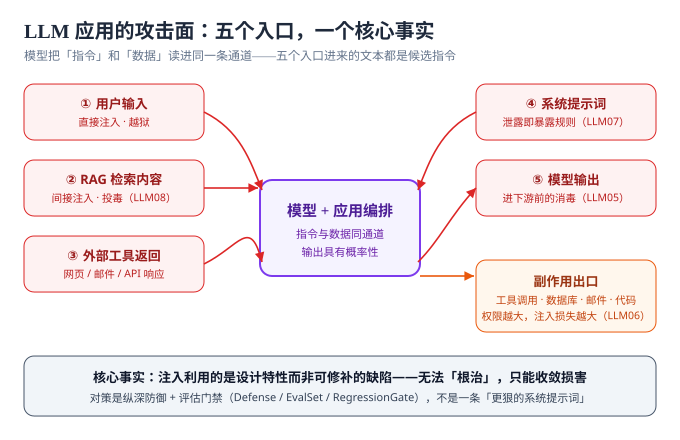

# 概述：攻击面全景与 OWASP Top 10

::: info 本页定位
本页回答三个问题：LLM 应用的攻击面到底长什么样、OWASP Top 10 for LLM Applications（2025 版）每一项在你系统里「真实可达」吗、以及动手之前需要满足哪些前置条件。细节操作全部留给后续页面。
:::

## 一个核心事实：指令和数据走同一条通道

传统应用里，「程序」和「用户输入」是两个世界：代码经过编译、输入经过解析，解析器天然能区分「命令」和「参数」。大模型打破了这个假设——**任何进入上下文窗口的文本，无论来自系统提示词、用户输入还是检索到的文档，在模型眼里都是同一种东西：候选指令**。

由此推出三条推论，后面所有页面都建立在这三条上：

1. **模型是无法被「修补」的组件**。注入利用的是设计特性而不是 bug，没有补丁可打，只能收敛损害（[防护工程](../Defense/index.md)）。
2. **输出是概率性的**。同一个提示词跑十次，九次拒绝、一次越界也是失败。安全结论必须建立在**重复实验**上（[红队测试](../RedTeam/index.md)）。
3. **能力放大风险**。模型能调用工具、写数据库、发邮件的那一刻，一次成功的注入就能兑换成真实世界的损害（LLM06 过度授权）。

## 五个攻击入口

| # | 入口 | 谁在控制 | 典型风险 | 对应 OWASP |
| --- | --- | --- | --- | --- |
| ① | 用户输入 | 攻击者本人 | 直接注入、越狱 | LLM01 |
| ② | RAG 检索内容 | 任何能往语料里写东西的人 | 间接注入、语料投毒 | LLM01 / LLM04 / LLM08 |
| ③ | 外部工具返回 | 网页作者、邮件发送者、第三方 API | 间接注入、SSRF 联动 | LLM01 / LLM05 |
| ④ | 系统提示词 | 应用开发者自己 | 泄露规则与机密 | LLM07 |
| ⑤ | 模型输出 | 模型（可被前四者操纵） | XSS、SQL/命令注入、越权副作用 | LLM02 / LLM05 / LLM06 |

**入口④值得单独强调**：系统提示词是自己写的，但它会被入口①~③的攻击「套」出来（详见[提示注入](../Injection/index.md)与 OWASP LLM07），所以「系统提示词里不放机密、不承担鉴权职责」是防护的底线纪律，见[防护工程](../Defense/index.md)。

## OWASP Top 10 for LLM Applications（2025 版）速览

该清单由 OWASP GenAI Security Project 维护，是当前 AI 应用安全最通用的**共同语言**——不是逐项打勾的合规表，而是帮助你识别「哪些风险在我的系统里真实可达」的地图。

| ID | 风险 | 一句话描述 | 本专题对应页面 |
| --- | --- | --- | --- |
| LLM01 | 提示注入 | 精心构造的输入改变模型行为 | [Injection](../Injection/index.md) / [Defense](../Defense/index.md) |
| LLM02 | 敏感信息泄露 | PII、凭据、内部规则经输出或日志外泄 | [Defense](../Defense/index.md) |
| LLM03 | 供应链 | 第三方模型、数据集、插件、依赖被污染 | 规划中的「AI 安全与合规」主题 |
| LLM04 | 数据与模型投毒 | 训练 / 微调 / RAG 数据被植入后门 | [Injection](../Injection/index.md)（RAG 投毒） |
| LLM05 | 输出处理不当 | 模型输出未经校验直接进下游系统 | [Defense](../Defense/index.md)（输出消毒） |
| LLM06 | 过度授权 | 模型被授予过多功能、权限或自主性 | [Defense](../Defense/index.md)（权限最小化）、[Agent 应用 · 安全边界](../../Agent/Safety/index.md) |
| LLM07 | 系统提示词泄露 | 系统提示词及其中的机密被套出 | [Injection](../Injection/index.md) / [Defense](../Defense/index.md) |
| LLM08 | 向量与嵌入弱点 | RAG 向量库被投毒、跨租户信息泄漏 | [Injection](../Injection/index.md) / [RAG 检索增强](../../RAG/index.md) |
| LLM09 | 错误信息 | 自信的幻觉输出被当成事实 | [评估集建设](../EvalSet/index.md)（忠实性断言） |
| LLM10 | 资源消耗失控 | 无限调用导致 DoS、成本攻击、模型窃取 | [回归门禁](../RegressionGate/index.md)（预算上限）、[成本核算与限流](../../LLMApp/CostRateLimit/index.md) |

::: tip 怎么用这张清单
按「可达性」排序，不要按清单顺序执行：一个从未接入工具的纯文本问答应用，LLM06 就是不可达的；一个把用户上传文档喂进 RAG 的系统，LLM01 的间接注入几乎是必然可达的。先画出你自己的[攻击面图](#五个攻击入口)，再决定投入顺序。
:::

## 术语对齐：注入、越狱、泄露

三个词经常混用，本专题全程按下面的口径区分：

| 术语 | 英文 | 攻击者想要什么 | 与谁有关 |
| --- | --- | --- | --- |
| 提示注入 | Prompt Injection | **改变任务**：让模型执行攻击者指定的指令 | 应用层与模型层都有关 |
| 越狱 | Jailbreak | **解除限制**：绕过安全对齐，让模型输出本会拒绝的内容 | 主要是模型层 |
| 系统提示词泄露 | System Prompt Leakage | **拿走规则**：套出系统提示词全文与其中机密 | 应用层为主 |

[越狱与对抗](../Jailbreak/index.md)里有更细的手法分类；三者在真实攻击里经常组合出现——先用注入改任务，再用越狱话术解除拒绝，最后套走系统提示词为下一轮铺路。

## 什么时候该做、什么时候可以先不做

**必须做的信号**（满足任意一条）：

1. LLM 输出能触发副作用：写库、调工具、发通知、改配置。
2. 输入包含不可信内容：公众用户、UGC、外部文档、网页、邮件。
3. 输出直接渲染给其他用户：XSS 与存储型注入联动（LLM05）。
4. 系统提示词或 RAG 语料里有任何「泄了会痛」的内容。

**可以先缓一缓的情况**（但仍要建立[评估集](../EvalSet/index.md)，因为质量与安全共用同一套机制）：

1. 内部工具、输入只来自受信任员工、输出只进日志。
2. 无工具调用的纯生成任务，且输出经人工复核后才使用。

::: danger 三个最常见的误解
1. **「我在系统提示词里写清楚了禁止事项，就安全了」**——系统提示词不是安全边界，攻击者一句「忽略之前的指令」就可能覆盖它，正确做法见[防护工程](../Defense/index.md)的纵深防御五层。
2. **「把恶意关键词拉黑就能防注入」**——注入的表层数不胜数（编码、拆字、多语言、隐喻），黑名单永远滞后，应当按「意图与损害」而非「关键词」设防。
3. **「上线前人工测一遍就够了」**——模型与提示词都会变，没有[回归门禁](../RegressionGate/index.md)的防护会静默失效。
:::

## 可达性自评：先算分，再排期

清单不是逐项打勾的检查表。用下面六个问题把「我的系统里哪些条目真实可达」先问一遍，答案直接决定投入顺序：

| 自评问题 | 答「是」意味着什么 |
| --- | --- |
| 模型输出会触发任何写操作或工具调用吗？ | LLM06 / LLM05 可达，[权限最小化](../Defense/index.md)必须做 |
| 输入里有任何非员工可控的内容吗（UGC、上传文档、网页、邮件）？ | LLM01 **间接注入**可达——投入产出比最高的一项 |
| 输出会渲染给其他用户看吗？ | LLM05 与 XSS 联动可达（存储型注入） |
| 检索语料能被非管理员写入吗？ | LLM04 / LLM08 可达，需要语料准入与来源标记 |
| 系统提示词里有任何「泄了会痛」的东西吗？ | LLM07 从「泄露」升级为「事故」 |
| 单次调用没有配额或预算上限吗？ | LLM10 可达（成本攻击与资源耗尽） |

**打分规则**：每命中一项，对应条目就从「清单上的一项」升级成「本周要处理的项」。六个问题全答「否」的系统（纯内部、只读、输出只进日志）可以先只做 L2 最小评估集，把投入留给真正可达的面——**这正是「按可达性排序」的操作化定义**。

## 最小起步三步

1. **画攻击面**：照「五个攻击入口」表填一遍你的应用，标注每个入口谁可控、输出到哪去。
2. **收敛权限**：找出模型能触发的所有副作用，逐个问「能不能不做 / 能不能降级为人审」，见[防护工程](../Defense/index.md)第四节。
3. **建最小评估集**：从 L2 安全策略层开始，20~30 条「该拒的」样本，接入 CI，见[评估集建设](../EvalSet/index.md)。

**验证方式**：完成三步后，你应该能不查资料地回答三个问题——我的系统里哪几个 OWASP 条目是可达的、模型每一次输出会流到哪里、以及上一次提示词变更是谁在什么时候批准的。答不上来就回到对应步骤。

## 参考资料

- OWASP GenAI Security Project（Top 10 for LLM Applications 2025 与 Agentic AI 威胁清单）：https://genai.owasp.org/
- OWASP LLM Top 10 逐条解读（2025 版）：https://genai.owasp.org/llm-top-10/
- MITRE ATLAS（AI 攻击战术与技术知识库）：https://atlas.mitre.org/
- NIST AI Risk Management Framework（治理侧语言体系）：https://www.nist.gov/itl/ai-risk-management-framework
- 本仓相邻页：[提示词工程](../../PromptEngineering/index.md)（方法论）、[Agent 应用 · 安全边界](../../Agent/Safety/index.md)（边界设计）、[RAG 检索增强](../../RAG/index.md)（语料与检索链路）
