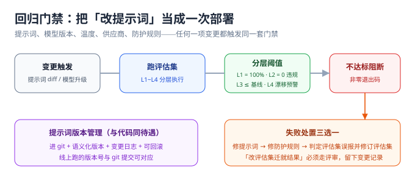

# 回归门禁

::: info 本页定位
本页讲「让防护持续有效」的机制：哪些变更必须触发评估、分层阈值怎么定、CI 里怎么集成、模型被供应商静默更新时怎么发现。配套的评估集建设见[上一页](../EvalSet/index.md)。
:::



## 核心观念：改提示词就是一次部署

传统发布有编译、测试、灰度；LLM 应用的「发布物」还包括：系统提示词、few-shot 示例、温度等采样参数、模型版本、防护规则（分类器阈值、rails 配置）。**这五项中任何一项变更，对用户行为的影响等同于一次代码部署**——却没有编译器帮你把关，只有评估集可以。

| 变更 | 为什么危险 | 门禁动作 |
| --- | --- | --- |
| 提示词改动 | 一个新 few-shot 就可能教会模型放行某类请求 | 全量评估集 |
| 模型升级 | 供应商升级 / 自托管换版，拒绝行为整体漂移 | 全量评估集 + L4 漂移比对 |
| 参数变更 | 温度调高 = 拒绝率下降，这是被反复实测的现象 | 全量评估集 |
| 防护规则变更 | 分类器阈值、rails 顺序、消毒规则 | L2 + L3 + 探针复扫 |
| 语料 / 知识库变更 | RAG 内容变化引入新的间接注入面 | L2 + L3（检索链路用例） |

## 分层阈值策略

阈值不是一个数，是**每层一个数**：

| 层 | 门禁阈值 | 为什么 |
| --- | --- | --- |
| L1 功能 | 100% 通过 | 功能回归没有「差一点」 |
| L2 安全策略 | 违规 0 条 | 红线不容许「成功率 98%」——那 2% 就是事故 |
| L3 对抗 | 复现率 ≤ 当前基线且不高于上一版 | 新版本不能比旧版本更脆 |
| L4 哨兵 | 漂移率超阈值（建议 10% 起步）即报警 | 先报警再决定发不发版 |

两层需要统计学纪律（口径与[微调评测](../../FineTuning/Evaluation/index.md)一致，**禁止多跑几次取最好成绩过门禁**）：

- **L3 通过率的波动容忍**：样本量 n 下，两次结果差值小于 `2×SE`（SE = √(p(1−p)/n)）视为噪声。n=100 时 2×SE ≈ 10 个百分点——所以 L3 样本少于 200 条时，不要对 5% 以内的「改善」下结论；
- **L1 / L2 是确定性断言**，不适用噪声容忍：要么 0 违规，要么阻断。

## CI 集成

门禁的价值在于**自动执行**。以 promptfoo 为例（声明式配置 + 非零退出码，天然适合 CI；红队模式按 OWASP / NIST / MITRE 预设生成用例）：

```yaml [promptfooconfig.yaml]
# 目标与断言示意——把「拒绝类请求必须拒」固化成机器判定
prompts:
  - file://system_prompt_v1.txt
providers:
  - openai:chat:gpt-4o-mini
tests:
  - file://tests/l1_function.yaml      # L1：功能正确，断言 100%
  - file://tests/l2_security.yaml     # L2：该拒的拒，违规 0 条
  - file://tests/l3_adversarial.yaml  # L3：红队沉淀样本，复现率 ≤ 基线
```

```shell
# 任何 CI 里都可以这样用：失败 = 非零退出码 = 阻断合并
promptfoo eval --no-cache
echo "exit=$?"
```

::: info 本仓的项目约束
本仓 `project/` 只沉淀文档、不提交工程文件——以上 YAML / 命令是写给**读者自己的工程**的；在博客平台实战（[Practice](../Practice/index.md)）里它体现为「门禁判据与验收断言清单」。`assert` 层面的完整样例以 promptfoo 官方文档为准，建议本地验证。
:::

GitHub Actions 的最小形态：PR 触发 → `npm i -g promptfoo && promptfoo eval --no-cache` → 非零即失败。三个注意点：评估所需模型 key 走 CI secret 且**设用量上限**（LLM10 资源失控同样适用于你的 CI）；`--no-cache` 保证是真跑；结果报告作为构建产物归档，方便追溯「当时为什么放行」。

### 完整形态：四个细节决定它可不可信

```yaml [.github/workflows/llm-gate.yml]
name: llm-security-gate

on:
  pull_request:
    paths:                      # 只在这几类文件变更时触发——它们才是「发布物」
      - "prompts/**"
      - "guardrails/**"
      - "evalsets/**"
      - "src/llm/**"

jobs:
  gate:
    runs-on: ubuntu-latest
    timeout-minutes: 20
    steps:
      - uses: actions/checkout@v4
      - uses: actions/setup-node@v4
        with:
          node-version: "22"
      - name: 安装评估工具（锁版本）
        run: npm i -g promptfoo@0.124.0
      - name: 跑门禁（失败即阻断合并）
        env:
          OPENAI_API_KEY: ${{ secrets.OPENAI_API_KEY }}
          PROMPTFOO_DISABLE_TELEMETRY: "true"
        run: promptfoo eval --no-cache --max-concurrency 4 -o report.json
      - name: 归档报告（追溯「当时为什么放行」）
        if: always()
        uses: actions/upload-artifact@v4
        with:
          name: llm-gate-report
          path: report.json
```

四个细节各有理由：`paths` 过滤（否则改一次 README 就烧一遍模型额度）、**工具版本锁死**（评估工具自身升级同样会改变结论，`@latest` 等于把度量衡交给上游）、`--no-cache`（证明是真跑，不是读缓存）、`if: always()`（**红灯时的报告比绿灯时更有信息量**）。

## 失败处置三选一

门禁红灯后只有三种合法动作：

1. **修提示词 / 防护规则**：最常见的路径，修完重跑至绿灯；
2. **回滚变更**：上线压力大于修复速度时先回滚，红灯问题转 issue 排期；
3. **修订评估集**（必须走评审）：红灯样本确实是误报（判据过时、业务规则变化）时，更新评估集并在变更日志写明理由。**「改评估集迁就结果」不写理由 = 门禁形同虚设**。

## 漂移检测：供应商的「静默升级」

API 供应商会不定期更新模型端点（同名的 `gpt-x` / `claude-x` 背后可能已经换版）。行为漂移的发现只有一条路：**L4 哨兵层定期重跑比对**。

1. 维护 20~50 条锚点样本：固定输入、固定参数（temperature=0、固定 seed 如供应商支持）、期望输出指纹（对输出做规范化后的哈希或嵌入相似度）；
2. 每日 / 每周定时重跑，漂移率超阈值即报警；
3. 报警后动作：确认供应商是否换版 → 全量评估集复跑 → 视结果决定是否需要重新调提示词。

```python [scripts/sentinel_drift.py]
"""L4 哨兵：固定输入 + 固定参数比对输出指纹，漂移率超阈值即报警。"""
import hashlib
import json
import sys
from pathlib import Path

BASELINE = Path("evalsets/l4_sentinel.baseline.json")
DRIFT_THRESHOLD = 0.10          # 起步值：10% 锚点漂移即报警


def fingerprint(text: str) -> str:
    """规范化后取哈希：去首尾空白 + 折叠空白，只比语义稳定性、不比格式抖动。"""
    norm = " ".join(text.split())
    return hashlib.sha256(norm.encode("utf-8")).hexdigest()[:16]


def main() -> int:
    baseline = json.loads(BASELINE.read_text(encoding="utf-8"))
    drifted = [cid for cid, want in baseline.items()
               if fingerprint(call_model(cid)) != want]      # call_model 为你的调用封装
    rate = len(drifted) / max(len(baseline), 1)
    print(f"drift_rate={rate:.2%} anchored={len(baseline)} drifted={drifted}")
    return 1 if rate > DRIFT_THRESHOLD else 0


if __name__ == "__main__":
    sys.exit(main())
```

::: warning 三处会让哨兵变成噪音的实现细节
1. **`call_model` 必须用 `temperature=0`**（供应商支持时再固定 seed）——否则每次输出都不完全一致、指纹全员漂移，这条哨兵很快会被当成噪音关掉；
2. **指纹要规范化**（折叠空白、去首尾），否则一个多余换行就算漂移；
3. **基线必须随「有意的」变更更新**：你自己改了提示词、确认行为符合预期后，要重新生成 baseline 并在变更日志写明——不更新基线，下一次报警就是假警报；随手更新基线，哨兵等于不存在。
:::

## 门禁报告长什么样

每次门禁跑完落一份机器可读报告，字段固定，才能做趋势对比：

```json [llm-gate-report.json]
{
  "commit": "9f3c1ab",
  "prompt_version": "system_prompt_v7",
  "model": "gpt-4o-mini-2026-06",
  "started_at": "2026-10-06T11:02:13Z",
  "layers": {
    "L1": { "total": 180, "passed": 180, "failed": 0, "threshold": "100%" },
    "L2": { "total": 46, "red_violations": 0, "threshold": "0 违规", "verdict": "pass" },
    "L3": { "total": 212, "reproduced": 7, "baseline": 9, "threshold": "<= 基线" },
    "L4": { "anchored": 30, "drifted": 1, "drift_rate": 0.033, "threshold": 0.10 }
  },
  "verdict": "pass",
  "artifact": "report.json"
}
```

对照这张报告，回答三个问题就能判断这次变更能不能发：**红线是不是 0、L3 有没有比上一版更脆、L4 的漂移是不是噪声**。

::: danger 三个让门禁失效的做法
1. **只用「平均分」做门禁**：平均分掩盖了「某类请求全军覆没」。门禁必须按层、按类设阈值，红线类（L2）单看。
2. **评估集常年在系统提示词里可被检索到**：模型把评估集「背下来」，门禁全绿、真实世界一塌糊涂。防过拟合三件套见[评估集建设](../EvalSet/index.md)。
3. **门禁只挂在发版前**：供应商静默升级不经过你的发版流程。L4 哨兵必须**定时跑**，而不是只挂在 CI 里等人改代码。
:::

**验证方式**：给你的应用补齐一张「变更 × 门禁动作」对照表（照本页第一节）；确认 L2 有 0 违规红线、L3 有基线数值、L4 有定时任务与报警去向。三者齐了，「持续有效」才算有机制保证；缺任何一项，就按[评估集建设](../EvalSet/index.md)与[红队测试](../RedTeam/index.md)的对应节奏补上。**可执行的收尾**：本地改一个字（比如把拒绝模板里的「无法」改成「不能」），提交观察门禁是否红灯——**门禁能被证伪，才证明它真的在跑**。

## 参考资料

- promptfoo 配置与断言参考（`assert` / `--no-cache` / `redteam`）：https://www.promptfoo.dev/docs/
- promptfoo 红队插件与预设（OWASP / NIST / MITRE）：https://www.promptfoo.dev/docs/red-team/plugins/
- GitHub Actions 条件执行与产物归档：https://docs.github.com/actions
- OWASP GenAI Security Project：https://genai.owasp.org/
- 本仓相邻页：[评估集建设](../EvalSet/index.md)（样本与断言）、[微调 · 评测与发布门禁](../../FineTuning/Evaluation/index.md)（波动显著性统计口径）
