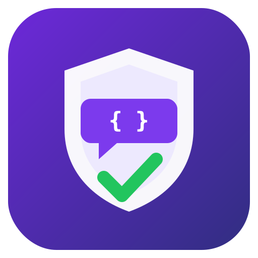
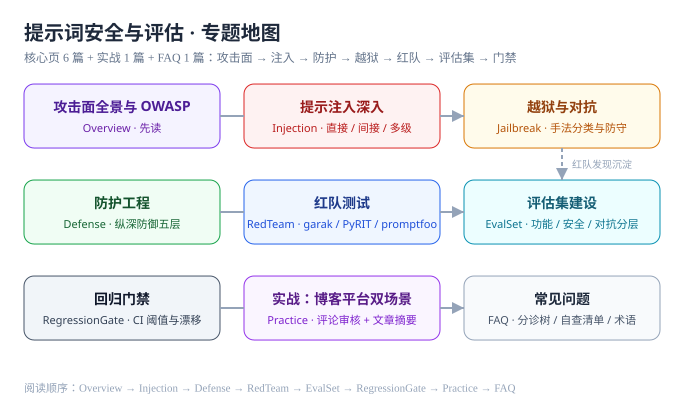

# 提示词安全与评估

提示词安全与评估解决的是同一个问题：**大模型应用上线后，「模型行为」本身成了随时可能被利用的攻击面，而它的变更（提示词、模型、参数）没有任何编译器或类型系统帮你把关**。本专题讲清楚提示词层面攻防的完整闭环——注入为什么无法根治只能收敛、纵深防御五层怎么落、红队怎么打、评估集怎么建、变更怎么设门禁，并用「博客平台评论审核 + 文章摘要」两个真实场景做一次完整实战。

::: tip 一句话理解
传统安全的思路是「找到漏洞 → 打补丁」；提示词安全没有补丁可打——注入利用的是「指令和数据走同一条通道」这个设计事实，你只能**收敛损害**（防护工程）+ **持续验证**（评估集与回归门禁），把「模型行为」当成需要测试和监督的活体来管理。
:::

## 与相邻专题的分工

| 专题 | 讲什么 | 与本专题的关系 |
| --- | --- | --- |
| 本专题 | 提示词层面的**攻防与评估工程化**：注入、越狱、防护、红队、评估集、回归门禁 | —— |
| [提示词工程](../PromptEngineering/index.md) | 通用提示**方法论**：结构化、few-shot、思维链、模板 | 方法论让模型「答得好」，本专题让模型「不被带偏」；那里的[效果评估](../PromptEngineering/Evaluation/index.md)讲评估维度与方法入门 |
| [Agent 应用 · 安全边界](../Agent/Safety/index.md) | Agent 形态下的**边界设计**：工具权限、人工介入、隔离 | 那里讲「怎么设计不越权的 Agent」，本专题讲「提示词这一层怎么防、怎么测」 |
| [Agent 框架 · 生产化](../AgentFramework/Production/index.md) | 框架级**生产化四件套**：部署、可观测、评估回归、成本安全 | 那里的「评估回归」是框架视角的操作清单，本专题展开评估集与门禁的完整建设 |
| [微调 · 评测与发布门禁](../FineTuning/Evaluation/index.md) | **模型侧**的训练评估与发布阈值 | 那里评的是微调后的模型本身，本专题评的是「提示词 + 模型 + 防护」组合成的应用 |
| [RAG 检索增强](../RAG/index.md) | 检索链路的构建与优化 | 间接注入最主要的载体之一就是 RAG 语料，[防护工程](./Defense/index.md)与[注入深入](./Injection/index.md)专门处理这条线 |
| [AI 编程助手](../AICodingAssistant/index.md) | 编程助手这个**协作形态** | 代码库里的 README、注释、issue 都能成为间接注入载体，[上下文工程](../AICodingAssistant/Context/index.md)与本专题的注入分类互补 |

::: info 规划中的相邻主题
后续轮次还有两个 AI 安全相关主题：**AI 应用观测与评估**（LangSmith / Langfuse、在线评估与成本看板）讲运行时的观测与在线评估；**AI 安全与合规**（数据脱敏、内容安全、审计）讲组织级的合规治理。两者都建立在本专题的「评估集 + 门禁」地基之上，分工页面落地时会补齐链接。
:::

## 专题地图

| 页面 | 内容 | 适合谁读 |
| --- | --- | --- |
| [概述：攻击面与 OWASP](./Overview/index.md) | 五个攻击入口、OWASP LLM Top 10（2025）、什么时候该做 | 所有人，先读 |
| [提示注入深入](./Injection/index.md) | 直接 / 间接注入的原理、载体、典型 payload、最小注入实验 | 所有写提示词的人，**重点读** |
| [防护工程](./Defense/index.md) | 纵深防御五层、防护工具选型、系统提示词纪律、权限最小化 | 写系统提示词与做架构的人 |
| [越狱与对抗](./Jailbreak/index.md) | 越狱手法分类、多轮升级攻击、防守视角 | 做内容安全与对抗测试的人 |
| [红队测试](./RedTeam/index.md) | 六步流程、garak / PyRIT / promptfoo 实操、报告模板 | 负责上线前验证的人 |
| [评估集建设](./EvalSet/index.md) | 四层结构、样本来源、期望输出形态、版本管理 | 所有要持续迭代提示词的人 |
| [回归门禁](./RegressionGate/index.md) | 变更触发、分层阈值、CI 集成、漂移检测 | 搭建发布流程的人 |
| [实战](./Practice/index.md) | 博客平台评论 AI 预审 + 文章 AI 摘要全流程 | 想看完整落地的人 |
| [常见问题](./FAQ/index.md) | 分诊树、十二问、上线自查清单、术语表 | 所有人 |

## 版本状态速览

按 **2026-10** 核对各官方发布页与 PyPI / npm：

| 工具 / 标准 | 当前版本 | 说明 |
| --- | --- | --- |
| OWASP Top 10 for LLM Applications | **2025 版** | LLM01 提示注入蝉联第一；LLM07 系统提示词泄露、LLM08 向量与嵌入弱点为新增；另有配套的 Agentic AI Top 10 |
| garak（NVIDIA） | **0.17.0**（2026-09-09） | LLM 漏洞扫描器；CLI 旗标为 `--target_type` / `--target_name`（旧资料里的 `--model_*` 是历史写法），探针族用 `--spec probes.<族>` 选择；0.17 新增 EU AI Act 映射标签；要求 Python **≥ 3.11**（3.11 / 3.12 / 3.13 均在官方 classifiers 内） |
| PyRIT（Microsoft） | **1.1.0**（2026-09-04，PyPI 核实） | AI 红队框架；1.0 起完成 API 稳定化，多轮编排（Crescendo / TAP）与 XPIA 是核心能力 |
| promptfoo | **0.124.0**（2026-10-06，npm 核实） | 2026-03-09 被 OpenAI 收购、保持 MIT 开源；红队预设覆盖 OWASP / NIST / MITRE；要求 Node ≥ 22.22.0；**收购带来「裁判独立性」问题**，见[红队测试](../RedTeam/index.md) |
| NeMo Guardrails（NVIDIA） | **0.24.1**（2026-09-16） | 编排框架，五类 rails；0.20 起 IORails 支持并行输入输出检查 |
| Llama Guard 4（Meta） | 12B（2025-04 发布） | 由 Llama 4 Scout 裁剪而来的**原生多模态**安全分类器，对齐 MLCommons 风险分类法；Llama Guard 3 转为 legacy |
| Llama Prompt Guard 2（Meta） | 86M / 22M 两个尺寸 | 专做**输入侧**筛查的小模型：把 prompt 判为 benign / prompt injection / jailbreak；22M 版 CPU / 边缘可跑 |
| Guardrails AI | **0.11.0**（2026-08-14） | 输出校验器库，schema 级强制 |

::: info 版本核对说明
以上版本按 NVIDIA garak 与 microsoft/PyRIT 的 GitHub Releases、PyPI（garak / pyrit）、npm（promptfoo）、NVIDIA NeMo Guardrails 发布页核对（2026-10 口径）。安全工具迭代极快（garak 几乎每月一版），选型前请重新核对发布页。
:::

## 成熟度自评：你在哪一档

| 档位 | 特征 | 下一步 |
| --- | --- | --- |
| L0 无防护 | 只在系统提示词里写了几句「不要做 X」 | 先做[可达性自评](./Overview/index.md)，再按四问收敛权限 |
| L1 有边界 | 权限已收敛、输出只进白名单字段、渲染按不可信内容处理 | 建 L2 安全评估集（30 条起步），把边界变成断言 |
| L2 可回归 | 评估集接入 CI，红线 0 违规 | 补一轮红队摸底（garak），把发现沉淀成 L3 |
| L3 可对抗 | 有 L3 对抗层与可复跑的基线数值 | 加 L4 哨兵，防供应商静默升级 |
| L4 可持续 | 分层门禁 + 定时漂移检测 + 变更评审流程 | 保持，并每季度复核威胁模型 |

五档之间的差别不是「做了什么」，而是**「能不能证明它还在生效」**——这也是本专题与「写几句安全提示词」的根本区别。

## 学习路径

1. **先读[概述](./Overview/index.md)**：确认你的应用里哪些 OWASP 风险是「真实可达」的——清单不是挨个执行的检查表，可达性决定优先级。
2. **精读[提示注入](./Injection/index.md)**：注入占了这个领域 80% 的实际风险，直接与间接两条通道都要过一遍。
3. **按[防护工程](./Defense/index.md)自检**：五层里你至少要有「应用层」那一层——它是不依赖模型听话的唯一硬边界。
4. **走一遍[红队流程](./RedTeam/index.md)**：用 garak 对自己的端点跑一轮探针，第一手体感比十篇文章有用。
5. **建评估集、上门禁**（[EvalSet](./EvalSet/index.md) → [RegressionGate](./RegressionGate/index.md)）：这是让防护「持续有效」的机制，红队的发现全部沉淀在这里。
6. **对照[实战](./Practice/index.md)落一个真实场景**，再通读[常见问题](./FAQ/index.md)收尾。

## 参考资料

- OWASP GenAI Security Project · Top 10 for LLM Applications（2025）：https://genai.owasp.org/
- garak 仓库与文档：https://github.com/NVIDIA/garak
- PyRIT 仓库：https://github.com/microsoft/PyRIT
- promptfoo 红队文档：https://www.promptfoo.dev/docs/red-team/
- NeMo Guardrails 文档：https://docs.nvidia.com/nemo/guardrails/
- Llama Guard 4 模型卡：https://huggingface.co/meta-llama/Llama-Guard-4-12B
- MITRE ATLAS（AI 攻击战术与技术知识库）：https://atlas.mitre.org/
