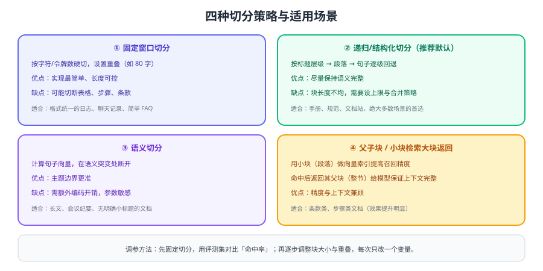

# 文档解析与切分

切分（Chunking）是 RAG 里**投入产出比最高的一环**：块切得对不对，直接决定检索能不能命中。绝大多数"答非所问"的根因不在模型，而在文档被切碎了。



## 先解析，再切分

| 步骤 | 目标 | 常见问题 |
| --- | --- | --- |
| 格式解析 | 把 PDF/Word/HTML 转成结构化文本 | 表格错位、页眉页脚混入正文 |
| 清洗 | 去掉噪声，保留标题层级 | 中英文空格、全角半角混用、乱码 |
| 标题补全 | 让每个块自带"路径"（一级/二级标题） | 脱离标题后段落语义模糊 |
| 元数据标注 | 来源、版本、日期、租户、权限标签 | 缺元数据就无法过滤与追溯 |

::: warning 最容易被忽略的一步
**给每个 chunk 拼上标题路径**（如「售后政策 > 退款 > 到账时间」）。同一段话在不同章节里含义可能完全不同，标题路径是提升检索精度的低成本手段。
:::

::: tip 切分没有「最佳参数」
切分参数由文档结构决定：条款类文档要小、叙述类可以大。唯一可靠的判断方式是**跑评测集看 Recall@K**，而不是照抄别人的数值。
:::

## 四种切分策略

### ① 固定窗口切分

```python [fixed_chunk.py]
def fixed_chunk(text: str, size: int = 600, overlap: int = 80) -> list[str]:
    """按字符滑窗切分，实现最简单，适合格式统一的文本。"""
    chunks, start = [], 0
    while start < len(text):
        chunks.append(text[start:start + size])
        start += size - overlap
    return chunks
```

适合：日志、聊天记录、结构简单的 FAQ。风险：表格、步骤、条款可能被切断。

### ② 递归 / 结构化切分（推荐默认）

按「标题 → 段落 → 句子」逐级回退，尽量保持语义完整：

```python [recursive_chunk.py]
def split_by_headings(text: str, max_len: int = 800) -> list[str]:
    """按 Markdown 标题切分，超长段落再按句子二次切分。"""
    sections, current = [], ""
    for line in text.splitlines(keepends=True):
        if line.startswith("#") and current.strip():
            sections.append(current)
            current = line
        else:
            current += line
    if current.strip():
        sections.append(current)

    chunks = []
    for section in sections:
        if len(section) <= max_len:
            chunks.append(section)
        else:
            sentences = section.replace("。", "。\n").split("\n")
            buf = ""
            for s in sentences:
                if len(buf) + len(s) > max_len and buf:
                    chunks.append(buf)
                    buf = s
                else:
                    buf += s
            if buf:
                chunks.append(buf)
    return chunks
```

### ③ 语义切分

先编码句子，再在相邻句子相似度骤降处断开。适合没有小标题的长文，代价是额外编码开销。

### ④ 父子块（小块检索、大块返回）

用小块做索引提高召回精度，命中后返回其所属父块（整节）给模型。对条款、配置说明、步骤类文档效果提升明显：

```python [parent_child.py]
children = []
for parent in split_by_headings(text, max_len=4000):
    for child in split_by_headings(parent, max_len=400):   # 小块建索引
        children.append({
            "text": child,
            "parent_id": hash(parent),                     # 返回时按 parent 取全文
            "parent_text": parent,
        })
```

## 参数怎么定

| 参数 | 起步值 | 调整方向 |
| --- | --- | --- |
| 块大小 | 400~800 字 | 条款/步骤类偏小，叙述类偏大 |
| 重叠 | 10%~20% | 边界易断开的文档调大 |
| 单块上限 | 不超过嵌入模型最大输入 | 超限会被静默截断 |
| 每文档块数 | 无硬性限制 | 块过多要检查是否切得过碎 |

::: danger 切分环节的六个坑
1. **按字符硬切且无重叠**：一句话被劈成两半，两边都检索不到。
2. **表格被逐行切散**：表头与数据分离，模型无法理解。
3. **丢失标题路径**：块脱离上下文后语义模糊。
4. **块太小（如 100 字）**：语义不完整，召回噪声大。
5. **块太大（如 3000 字）**：向量被多主题平均，检索相似度失真。
6. **切分参数改动后不重建索引**：新老块混在一个集合里，结果不可预期。
:::

## 验证方式

1. 抽 10 条真实问题，找到答案所在原文，确认答案**完整落在某个 chunk 内**（而不是跨两个 chunk）。
2. 把块大小从 300 调到 1200，各建一个小索引跑同一评测集，记录 Recall@K 变化曲线。
3. 打印几个检索命中的 chunk，人工判断"如果我是模型，只看这段能不能答对"。
4. 用父子块方案重跑一遍，对比引用正确率是否提升（通常在中长文档上提升明显）。

## 参考资料

- 文件检索与切分说明（官方文档）：https://developers.openai.com/api/docs/guides/tools-file-search
- 检索指南（官方文档）：https://developers.openai.com/api/docs/guides/retrieval
- 下一步：[向量库与索引](../VectorStore/index.md)
- 检索效果调优：[检索优化](../Retrieval/index.md)
