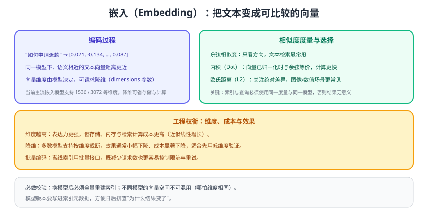

# 嵌入与向量基础

嵌入（Embedding）把文本映射成高维向量，让"语义相似"变成"距离更近"，这是 RAG 检索的数学基础。本页讲清模型怎么选、维度怎么权衡、距离怎么定，以及工程上最容易踩的坑。



## 基本概念

| 概念 | 说明 |
| --- | --- |
| 向量（Vector） | 一组浮点数，如 1536 维的 `[0.021, -0.134, ...]` |
| 相似度 | 两个向量之间的距离，距离越小表示语义越接近 |
| 归一化 | 把向量长度缩放到 1，使内积等价于余弦相似度 |
| 向量空间 | 同一模型编码出的语义空间；**不同模型的向量不可混用** |

## 模型选择

| 维度 | 说明 | 建议 |
| --- | --- | --- |
| 语言支持 | 中英文混合场景很常见 | 选多语言能力明确的模型 |
| 维度 | 常见 1536 / 3072，部分模型支持按需降维 | 先用较低维度验证，再按效果决定是否升维 |
| 最大输入长度 | 单次可编码的文本长度 | 必须大于你的 chunk 长度，否则会被截断 |
| 成本 | 按输入令牌计费 | 离线索引是主要开销，批量与降维能显著省钱 |
| 稳定性 | 是否会被下线 | 模型版本写入索引元数据，便于追溯 |

::: tip 一句话理解
嵌入模型决定了检索的"天花板"。**只要更换嵌入模型，就必须全量重建索引**——哪怕新旧模型维度完全相同，向量空间也不兼容，混用会导致检索结果随机变差且极难排查。
:::

## 距离度量

| 度量 | 含义 | 适用 |
| --- | --- | --- |
| 余弦相似度（Cosine） | 只看方向，忽略长度 | 文本检索最常用 |
| 内积（Dot Product） | 方向 + 长度；向量归一化后与余弦等价 | 追求计算效率 |
| 欧氏距离（L2） | 绝对差异 | 图像、数值型向量 |

工程约束：**索引的度量函数与查询必须一致**。若建立索引时用余弦、查询时按 L2 排序，结果会既不准也不稳定。

## 批量编码与降维

```python [embed_docs.py]
from openai import OpenAI

client = OpenAI()

def embed_batch(texts: list[str], dimensions: int = 1024) -> list[list[float]]:
    """离线索引：批量编码 + 按需降维（以官方文档当前支持的模型与参数为准）。"""
    resp = client.embeddings.create(
        model="text-embedding-3-small",     # 官方文档示例模型，实际以模型页为准
        input=texts,
        dimensions=dimensions,              # 降维：省存储与计算，效果略有下降
    )
    return [item.embedding for item in resp.data]

# 批量建议：单批 100~500 条文本，兼顾吞吐与失败重试成本
vectors = embed_batch(["如何申请退款？", "退款多久到账？"])
print(len(vectors), len(vectors[0]))       # 例如：2 1024
```

预期输出：打印批次条数与实际维度（等于 `dimensions` 的取值，前提是该模型支持该维度）。

::: danger 嵌入环节的六个坑
1. **换模型不重建索引**：新旧向量空间不兼容，检索质量断崖式下降。
2. **chunk 长度超过模型上限**：超出部分被静默截断，导致"结尾内容永远搜不到"。
3. **索引用余弦、查询用 L2**：度量不一致，排序无意义。
4. **单条请求逐条编码**：几十万 chunk 会产生大量请求，慢且容易触发限流。
5. **不保存文本哈希与模型版本**：无法判断哪些 chunk 需要重新编码。
6. **把原始敏感文本直接送去编码**：需先脱敏或使用私有化部署，合规问题优先于效果。
:::

## 增量与重算策略

| 场景 | 做法 |
| --- | --- |
| 文档内容变更 | 按文档 ID 删除旧 chunk → 重新切分编码 → 写入新 chunk |
| 切分参数变更 | 全量重建（切分变化会影响所有 chunk） |
| 嵌入模型变更 | 全量重建，并用评测集对比新旧命中率 |
| 仅元数据变更（如权限调整） | 更新元数据即可，无需重新编码 |

重算的判定依据：为每个 chunk 保存 `content_hash + model_version + chunk_config_version`，三者任一变化就需要重新编码。

## 归一化、内积与余弦：把公式用对

| 关系 | 公式 | 工程含义 |
| --- | --- | --- |
| 余弦相似度 | `cos(a,b) = (a·b) / (‖a‖·‖b‖)` | 只看方向，向量长度不影响结果 |
| 内积 | `a·b` | 同时受方向与长度影响 |
| 归一化之后 | `‖a‖ = ‖b‖ = 1` → `a·b = cos(a,b)` | **两者完全等价** |

文本嵌入里「方向」才代表语义，所以工程上通常在**写入索引前就做一次 L2 归一化**：此后内积与余弦等价，可以用更快的点积检索，也顺手消掉「长文本天然得分偏高」的偏差。

::: danger 归一化相关的三个坑
1. **只归一化查询、不归一化文档**：两者不在同一尺度，排序会系统性偏向长文本。
2. **归一化与度量函数重复或错配**：多数向量库在 `metric=cosine` 时会自行归一化，此时再手工归一化是幂等的、无害；但把 L2 距离和余弦混着用就会出问题。
3. **大批量归一化用 float16 算模长**：极小范数向量会被放大成噪声，模长与除法用 float32 算。
:::

## 多模态嵌入：让图和文本进入同一个空间

向量工程不止能编码文本——**图像与文本可以由同一个模型编码进同一空间**，这是「以图搜图」「以文搜图」以及「截张图去问文档」的基础。

| 能力 | 查询侧 | 被检索侧 | 依赖 |
| --- | --- | --- | --- |
| 以文搜图 | 文本向量 | 图像向量 | 图文对比学习（CLIP 类）模型，两侧共享向量空间 |
| 以图搜图 | 图像向量 | 图像向量 | 同上 |
| 以图问文档 | 图像 | 文本片段 | 两种做法：直接跨模态检索，或用 VLM 先把图转成文字再走普通文本检索 |

::: tip 什么时候真的需要多模态检索
**只有当「用户会拿图来搜」时才需要。** 如果用户永远用文字提问，先把图片转成文字（OCR / VLM 描述）再走普通文本检索，工程成本低一个量级——这也是多数团队的实际选择。

多模态检索的代价很实在：换模型必须**整体重建图文两侧**的索引，且可选模型远少于纯文本嵌入。
:::

- 多模态链路的完整工程（预处理、模型接入、成本结构）：[多模态应用 · 概述](../../Multimodal/Overview/index.md)
- 存储与检索侧的取舍与容量估算：[向量库与索引 · 多模态向量的存与查](../VectorStore/index.md)

## 验证方式

1. 用 5 条语义相近但用词不同的句子编码，确认两两相似度明显高于无关句子。
2. 用同一条文本分别用维度 1024 与默认维度编码，各建一个小索引，对比命中率与存储占用。
3. 故意把 chunk 长度设为超过模型上限，观察是否出现"尾部内容检索不到"，确认截断风险真实存在。
4. 打印 `usage` 中的令牌数，按官方定价估算索引全量重建的成本。

## 参考资料

- 嵌入指南（官方文档）：https://developers.openai.com/api/docs/guides/embeddings
- 检索指南（官方文档）：https://developers.openai.com/api/docs/guides/retrieval
- 向量库与索引：[向量库与索引](../VectorStore/index.md)
- 切分策略：[文档解析与切分](../Chunking/index.md)
- 把新知识注入模型的另一条路（以及为什么通常不该走）：[大模型微调](../../FineTuning/Overview/index.md)
