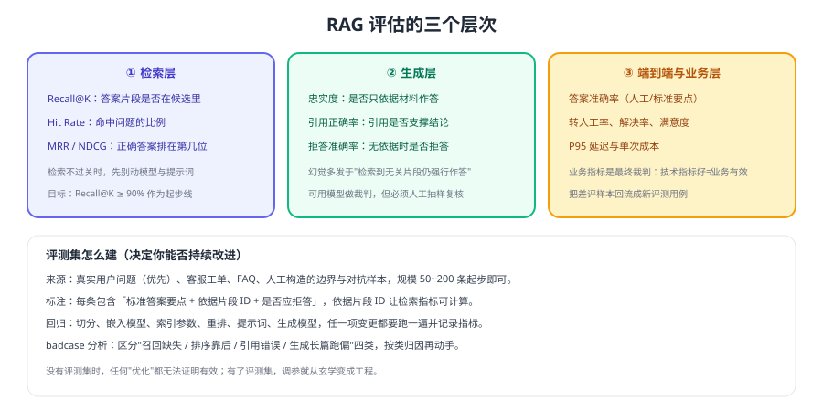

# RAG 评估体系

RAG 是"多环节串联"的系统：切分、嵌入、召回、重排、拼装、生成，任一环节退化都会让最终答案变差。如果只盯着"答案看起来对不对"，你永远不知道该修哪一环。评估的价值就是**把问题定位到具体环节**。



## 三个层次的指标

### ① 检索层（决定上限）

| 指标 | 定义 | 起步目标 |
| --- | --- | --- |
| Recall@K | 标准依据片段是否出现在 Top-K 候选中 | ≥ 90% |
| Hit Rate | 至少命中一个依据片段的问题占比 | ≥ 90% |
| MRR | 第一个正确片段的排名倒数均值 | 越高越好 |
| NDCG | 考虑排序位置的加权命中 | 用于对比重排效果 |

检索指标**不需要调用生成模型**，成本低、可高频跑，应作为日常回归的第一道闸门。

### ② 生成层（决定可信度）

| 指标 | 定义 | 说明 |
| --- | --- | --- |
| 忠实度 | 回答是否只依据给定材料 | 幻觉的直接度量 |
| 引用正确率 | 引用编号是否真的支撑对应结论 | 影响用户信任 |
| 拒答准确率 | 无依据时是否正确拒答 | 直接关系风险控制 |
| 完整性 | 标准要点是否覆盖 | 防止答案正确但残缺 |

生成层可用模型做裁判（LLM-as-judge）批量打分，但**必须人工抽样复核**，形成 10%~20% 的人工校准集。

### ③ 端到端与业务层（决定价值）

| 指标 | 说明 |
| --- | --- |
| 答案准确率 | 人工按标准要点打分 |
| 转人工率 / 解决率 | 业务是否真的被替代或提效 |
| 满意度 | 点赞/点踩与反馈原因 |
| P95 延迟、单次成本 | 能否长期承担 |

## 评测集怎么建

```json [evals/rag_cases.json]
[
  {
    "id": "q001",
    "question": "退款多久到账？",
    "expected_chunk_ids": ["policy-refund-002"],
    "answer_points": ["原路退回", "1~7 个工作日"],
    "should_refuse": false
  },
  {
    "id": "q002",
    "question": "你们支持美元支付吗？",
    "expected_chunk_ids": [],
    "answer_points": [],
    "should_refuse": true
  }
]
```

构建要点：

1. **来源真实**：优先用真实用户问题与客服工单，人工编造的样本容易过于"标准"。
2. **标注依据片段 ID**：没有 chunk ID 就无法计算检索指标。
3. **包含拒答样本**：至少 10%~20% 是知识库外问题，用于检验拒答与幻觉。
4. **覆盖边界**：口语化、拼写错误、超长问题、多问题混合、敏感问题。
5. **持续回填**：每周把线上差评样本整理进评测集。

## 回归脚本

```python [evals/run_rag_eval.py]
import json

def evaluate_rag(cases_path: str = "evals/rag_cases.json") -> dict:
    cases = json.load(open(cases_path, encoding="utf-8"))
    stats = {"recall_hit": 0, "refusal_ok": 0, "citation_ok": 0, "total": len(cases)}

    for case in cases:
        hits = retrieve(case["question"])                 # 返回带 chunk_id 的候选
        hit_ids = [h["chunk_id"] for h in hits[:20]]
        stats["recall_hit"] += int(
            all(cid in hit_ids for cid in case["expected_chunk_ids"]) if case["expected_chunk_ids"]
            else True
        )

        answer = generate(case["question"], hits[:5])
        if case["should_refuse"]:
            stats["refusal_ok"] += int("未在资料中找到依据" in answer["text"])
        else:
            stats["citation_ok"] += int(all(f"[{i+1}]" in answer["text"] for i in range(len(answer["refs"]))))

    for key in ("recall_hit", "refusal_ok", "citation_ok"):
        stats[key + "_rate"] = round(stats[key] / max(stats["total"], 1), 3)
    return stats

if __name__ == "__main__":
    print(evaluate_rag())
```

预期输出：形如 `{'recall_hit': 46, 'refusal_ok': 9, 'citation_ok': 40, 'total': 50, 'recall_hit_rate': 0.92, ...}`。每次改动切分、嵌入模型、检索参数、重排、提示词或生成模型，都要跑一次并保存结果。

## badcase 归因

| 类型 | 现象 | 根因方向 | 处理 |
| --- | --- | --- | --- |
| 召回缺失 | 依据片段不在候选中 | 切分、嵌入、过滤、改写 | 改切分/加关键词召回/放松过滤 |
| 排序靠后 | 在候选但被截断 | Top-K、重排缺失 | 扩召回 + 加重排 |
| 引用错误 | 引用了不相关片段 | 片段噪声、指令不严 | 压缩上下文、强化引用要求 |
| 幻觉 | 材料里没有却作答 | 提示词、阈值 | 要求拒答 + 相似度阈值 |
| 延迟/成本超标 | 端到端变慢变贵 | Top-K、上下文长度、模型档位 | 压缩 + 缓存 + 分级 |

::: tip 一个实用的归因习惯
对每条 badcase 记录三件事：**依据片段是否被召回、排在第几位、模型看到了什么**。坚持一个月，你会得到一份比任何教程都更有价值的"自己的坑位地图"。
:::

::: danger 评估环节的三个坑
1. **评测集与线上分布不一致**：只在"标准问法"上评测，上线后遇到口语化问题就崩。
2. **只看端到端准确率**：无法定位是检索还是生成的问题，优化变成盲试。
3. **用模型裁判却不校准**：LLM-as-judge 会系统性偏袒冗长或自信的回答，必须人工抽样复核。
:::

## 验证方式

1. 建 50 条评测集（含 10 条拒答样本），跑出基线指标并记录到版本库。
2. 把块大小从 300 改成 800，重跑评测，确认 Recall@20 的变化方向与幅度。
3. 累计 20 条 badcase，按上表归因分类，输出改进优先级清单。
4. 对 LLM-as-judge 的打分抽样 20 条人工复核，统计一致率；一致率过低时先修评分提示词。

## 参考资料

- 评估最佳实践（官方文档）：https://developers.openai.com/api/docs/guides/evaluation-best-practices
- 检索指南（官方文档）：https://developers.openai.com/api/docs/guides/retrieval
- 生产工程化：[生产工程化](../Pipeline/index.md)
- 本库提示词评估：[效果评估](../../PromptEngineering/Evaluation/index.md)
