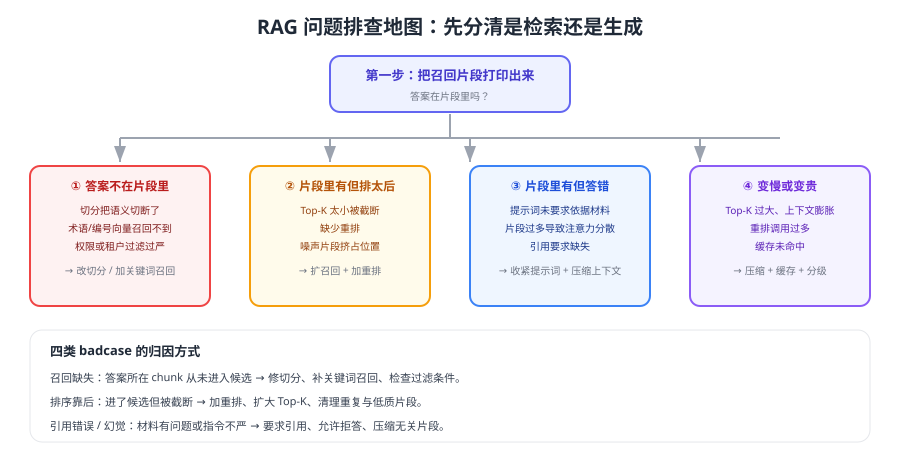

# 常见问题与最佳实践

RAG 的问题有一半来自"检索没做对"，另一半来自"把生成问题当成检索问题"。本页按现象给出排查路径，并汇总可长期执行的最佳实践清单。



## 排查第一步永远是打印召回片段

```python [debug_once.py]
def debug(question: str, user: dict) -> None:
    """一次完整链路的信息打印：先看检索，再看模型。"""
    queries = rewrite(question, user.get("history", []))
    hits = recall(queries[0], tenant=user["tenant"], groups=user["acl_groups"])
    top = rerank(question, hits, keep=5)

    print("改写后查询:", queries)
    print("候选片段:", [(h["chunk_id"], round(h.get("score", 0), 3)) for h in hits[:10]])
    print("重排后:", [(h["chunk_id"], round(h["rerank_score"], 3)) for h in top])
    print("上下文长度(字符):", sum(len(h["text"]) for h in top))

    answer = generate(question, top)
    print("回答:", answer["text"])
    print("引用:", answer["refs"])
```

判断规则：**答案不在片段里 → 检索问题；片段里有但答错 → 生成问题**。这一步能省掉大量无效调参。

## 1. 答案明明在知识库里，却答"找不到"

| 可能原因 | 验证方式 | 处理 |
| --- | --- | --- |
| 切分把语义切断了 | 看答案是否跨两个 chunk | 改用按标题/段落切分，增加重叠 |
| 只用向量检索 | 用关键词单独搜一次 | 加 BM25 混合召回 |
| 术语不匹配 | 检查查询与文档用词差异 | 查询改写 + 同义词表 |
| 过滤条件过严 | 去掉权限条件再搜一次 | 修正元数据或过滤表达式 |
| 索引未更新 | 直接查向量库是否有新内容 | 修复同步任务与水位记录 |

## 2. 检索到了却答错 / 答偏

1. **上下文太长**：5 个完整 chunk 里只有 1 段相关，模型容易被干扰 → 做句级压缩，只保留相关句。
2. **片段重复**：同一段落被多个 chunk 覆盖，模型重复引用 → 按内容去重。
3. **提示词不够硬**：没有"只依据材料回答"的约束 → 明确规则 + 要求引用 + 允许拒答。
4. **排序问题**：正确片段排在最后 → 加重排并把它提到前面。
5. **问题本身有歧义**：模型按字面理解 → 先反问澄清或按会话上下文补全。

## 3. 幻觉（编造内容）

| 手段 | 说明 |
| --- | --- |
| 强制引用 | 每个结论都要标注 `[编号]`，无依据不能写 |
| 允许拒答 | 明确"材料中没有就说未找到依据"，并接到人工 |
| 相似度阈值 | 最高分低于阈值时直接拒答，不进生成 |
| 上下文压缩 | 无关片段越少，越不容易"顺着编" |
| 高风险场景人工复核 | 金额、法律、医疗等不允许模型直接对外 |

## 4. 回答不稳定（同一问题时好时坏）

1. 生成温度调低或固定随机性（结构化任务尤其重要）。
2. 检查检索结果是否稳定：候选分差很小的时候，排序容易抖动 → 加重排或扩大候选。
3. 检查缓存键是否包含版本信息，避免新旧答案交替返回。
4. 检查是否有"并发写入索引"导致同一时刻读到不同版本。

## 5. 知识库更新了，用户还是拿到旧答案

| 环节 | 常见问题 |
| --- | --- |
| 同步任务 | 增量任务失败没有告警，或没有记录水位 |
| 向量库 | 只 upsert 未删除旧 chunk，或删除了但索引未刷新 |
| 缓存 | 答案缓存未随索引版本失效 |
| 生成 | 提示词里写死了"现行政策为……"这类旧内容 |

处理顺序：先确认向量库里确实有新内容（直接查询），再确认缓存已失效，最后才怀疑模型。

## 6. 越权检索

::: danger 三条底线
1. **过滤下推到检索层**，不能取回后在应用层丢弃。
2. **身份来自服务端会话**，不接受前端或模型传入的租户/用户标识。
3. **删除能力要真实可用**：文档下架后，向量与缓存都要同步清理，并验证检索不到。
:::

多租户隔离方式（逻辑过滤 / 独立集合 / 独立实例）与适用条件见 [生产工程化](../Pipeline/index.md)。

## 7. 延迟太高

按耗时占比优化：

| 环节 | 优化手段 |
| --- | --- |
| 查询改写 | 用更小的模型；简单问题跳过改写 |
| 多路召回 | 控制并发上限；关键词检索与向量检索并行 |
| 重排 | 只在候选中包含正确答案时启用；控制候选条数 |
| 生成 | 压缩上下文、限制输出长度、选择更快的模型 |
| 全链路 | 缓存命中直接返回；对重复问题走缓存 |

## 8. 成本失控

1. 上下文令牌是主要成本：Top-K、块大小、压缩策略都要设上限。
2. 重排按"查询 × 候选"计费，候选数量直接影响成本。
3. 嵌入成本集中在离线索引：降维、增量更新、避免无谓全量重建。
4. 缓存（查询向量、检索结果、答案）能显著降低重复问题的成本。
5. 按功能、租户、场景分别统计成本——只知道总账就无法优化。

## 9. 该不该换成更大的模型

先用数据回答三个问题：

1. Recall@K 是否达标？不达标换生成模型没用。
2. 片段里有答案吗？有而答错，说明是指令或上下文问题。
3. 换模型能提升多少？用评测集跑 A/B，对比准确率、延迟与成本。

## 10. 面试高频问题速答

| 问题 | 回答要点 |
| --- | --- |
| RAG 与微调怎么选 | 补知识用 RAG，改风格/格式用微调，先 RAG 后微调 |
| 为什么加关键词检索 | 向量对编号、术语不敏感，混合召回互补 |
| 重排的作用 | 把候选中的正确答案排到前面，提升引用正确率 |
| 怎么防幻觉 | 强制引用 + 允许拒答 + 相似度阈值 + 人工兜底 |
| 怎么评估 RAG | 分检索层、生成层、业务层三层指标，建评测集做回归 |
| 换嵌入模型注意什么 | 全量重建索引，新旧向量空间不能混用 |
| 文档更新怎么处理 | 先删旧 chunk 再写新 chunk，缓存按版本失效 |

## 最佳实践清单

::: tip 索引侧
1. 切分带上标题路径，块大小 400~800 字、重叠 10%~20%。
2. 每个 chunk 必带权限与版本元数据。
3. 每日增量 + 每周全量，删除要真实生效。
4. 换切分或换模型一定重建索引，并用评测集验证。
:::

::: tip 检索侧
1. 至少两路召回（向量 + 关键词），用 RRF 融合。
2. 权限过滤下推到检索层。
3. 有预算就加重排，先扩候选再精排。
4. 设相似度阈值，低置信度直接拒答。
:::

::: tip 生成与运营侧
1. 指令明确"只依据材料、必须引用、无依据拒答"。
2. 控制上下文令牌预算，留足输出空间。
3. 全链路埋点可回放，差评样本每周回流评测集。
4. 灰度上线、可回滚、可降级。
:::

## 验证方式

1. 用 `debug_once.py` 复现一次线上问题，明确归因到检索侧还是生成侧。
2. 构造一条越权样本（用 A 租户身份查询 B 租户文档），确认返回为空且有日志。
3. 在下架一篇文档后重跑相关问题，确认拒答或改用其他依据。
4. 用评测集验证一次优化：改动前后指标对比，确认方向与幅度。

## 参考资料

- 检索指南（官方文档）：https://developers.openai.com/api/docs/guides/retrieval
- 评估最佳实践（官方文档）：https://developers.openai.com/api/docs/guides/evaluation-best-practices
- 评估体系：[评估体系](../Evaluation/index.md)
- 本库大模型应用开发 FAQ：[常见问题与最佳实践](../../LLMApp/FAQ/index.md)
