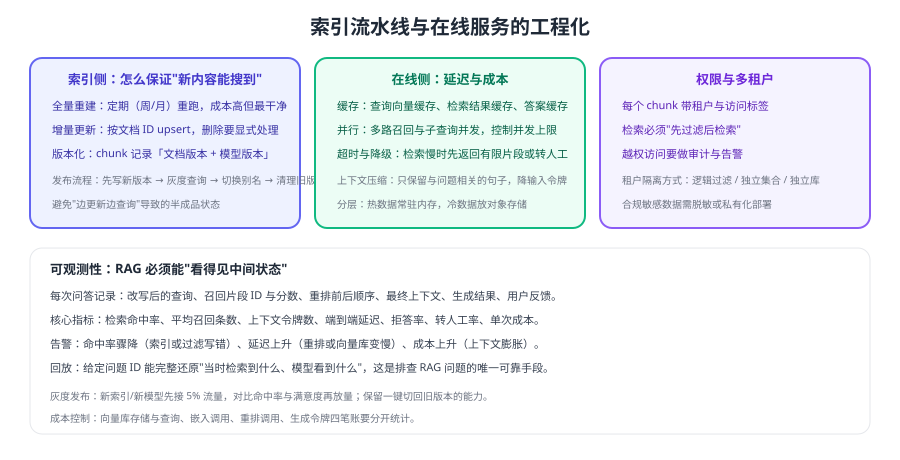

# 生产工程化

能把 RAG 跑通和能让它稳定服务一年，中间隔着工程化：索引怎么更新、权限怎么隔离、缓存怎么设计、出问题怎么定位。本页给出上生产前必须补齐的能力清单。



## 索引流水线

### 全量重建 vs 增量更新

| 方式 | 触发时机 | 优点 | 代价 |
| --- | --- | --- | --- |
| 全量重建 | 周/月定期，或切分、嵌入模型变更时 | 结果干净、可复现 | 计算与存储成本高 |
| 增量更新 | 文档新增/修改/删除时 | 及时、成本低 | 需要处理删除与去重 |

推荐的组合：**每日增量 + 每周全量**。增量保证时效，全量兜住脏数据。

```python [incremental_sync.py]
def sync_document(doc: dict) -> None:
    """单文档增量同步：先删旧 chunk，再写新 chunk，保证不残留。"""
    old = vector_store.query(filter={"doc_id": doc["id"]})       # 取旧 chunk
    if old:
        vector_store.delete(ids=[c["chunk_id"] for c in old])     # 先删除

    if doc.get("deleted"):
        return                                                    # 下架文档直接结束

    chunks = split_by_headings(parse(doc["content"]))
    vectors = embed_batch([c["text"] for c in chunks], dimensions=1024)
    vector_store.upsert([
        {
            "chunk_id": f"{doc['id']}#{i}",
            "doc_id": doc["id"],
            "vector": v,
            "text": c["text"],
            "title_path": c.get("title_path", ""),
            "tenant": doc["tenant"],
            "acl_group": doc["acl_group"],
            "doc_version": doc["version"],
            "embedding_model": "text-embedding-3-small",
            "content_hash": sha256(c["text"]),
        }
        for i, (c, v) in enumerate(zip(chunks, vectors))
    ])
```

::: danger 增量更新的四个坑
1. **只 upsert 不删除**：文档被删除或段落被删掉后，旧 chunk 仍然会被检索到。
2. **按内容 hash 判断"未变"却不校验模型版本**：换了嵌入模型仍然跳过，索引里新旧向量混放。
3. **别名切换不做**：更新期间用户会读到"半新半旧"的集合。
4. **不记录同步水位**：失败后无法续传，只能全量重跑。
:::

## 权限与多租户

| 隔离方式 | 实现 | 适用 |
| --- | --- | --- |
| 逻辑过滤 | 同一集合，查询带 `tenant`/`acl_group` 过滤 | 租户数量多、数据量中等 |
| 独立集合 | 每租户一个 collection | 租户数量少、隔离要求高 |
| 独立实例/库 | 完全物理隔离 | 强合规要求、大客户专享 |

::: warning 三条硬性要求
1. **过滤必须下推到检索层**，不能取回后再在应用层过滤。
2. **用户身份来自服务端会话**，不接受前端或模型传入的租户标识。
3. **越权尝试要留痕**：检索到 0 条与"被过滤掉"在日志上必须可区分，便于发现探测行为。
:::

::: tip 一条经验法则
**索引与查询分离部署、版本化切换**。索引属于数据面（重、慢、可重建），查询属于在线服务（轻、快、要稳定），两者混在一起时，一次重建就可能拖垮线上问答。
:::

## 缓存与降本

| 缓存层 | 缓存对象 | 命中效果 | 失效条件 |
| --- | --- | --- | --- |
| 查询向量 | 同一问题的向量 | 省一次嵌入调用 | 嵌入模型变化 |
| 检索结果 | 问题 → chunk ID 列表 | 省检索与重排 | 索引版本变化 |
| 最终答案 | 问题（归一化后） → 答案 | 省全链路成本 | 知识库更新或策略调整 |

缓存键要带**版本信息**（索引版本、提示词版本、模型版本），否则知识更新后仍会返回旧答案。

## 可观测与灰度

```python [trace_rag.py]
def traced_ask(question: str, user: dict) -> dict:
    trace = {"question": question, "user_tenant": user["tenant"]}
    trace["rewritten"] = rewrite(question, user.get("history", []))
    hits = recall(trace["rewritten"][0], user["tenant"])
    trace["hit_ids"] = [h["chunk_id"] for h in hits[:20]]
    trace["top_ids"] = [h["chunk_id"] for h in rerank(question, hits, keep=5)]
    answer = generate(question, [h for h in hits if h["chunk_id"] in trace["top_ids"]])
    trace["refs"] = answer["refs"]
    trace["tokens"] = answer["usage"]          # 输入/输出令牌，用于成本核算
    trace["latency_ms"] = answer["latency_ms"]
    trace["refused"] = "未在资料中找到依据" in answer["text"]
    logger.info("rag_trace", extra=trace)      # 可按 question_id 完整回放
    return answer
```

必须能回答的问题：**这次问答检索到了什么、模型看到了什么、花了多少钱、用户是否满意。**

## 上线检查清单

| 维度 | 检查项 |
| --- | --- |
| 数据 | 每日增量任务有水位记录；删除能生效；全量重建有评测通过记录 |
| 权限 | 过滤下推到检索层；身份来自服务端；越权尝试有日志 |
| 性能 | P95 延迟达标；Top-K 与上下文有上限；重排可降级 |
| 成本 | 嵌入、向量库、重排、生成四笔账分开统计；有日/月预算告警 |
| 质量 | 评测集可跑；每次变更记录指标；badcase 有归因 |
| 稳定性 | 向量库故障时可降级（返回有限片段或转人工）；有灰度开关 |
| 合规 | 敏感数据脱敏或私有化；日志不留原文；有数据删除能力 |

## 验证方式

1. 修改一篇文档后触发增量同步，确认旧 chunk 被删除、新 chunk 可检索到。
2. 删除一篇文档，确认其在检索结果中彻底消失。
3. 用两个租户的账号互相检索，确认无法越权命中。
4. 关闭向量库模拟故障，确认服务降级而不是整体 500。
5. 按 `question_id` 回放一次完整链路，确认中间状态齐全且令牌统计准确。

## 参考资料

- 检索指南（官方文档）：https://developers.openai.com/api/docs/guides/retrieval
- 速率限制与用量（官方文档）：https://developers.openai.com/api/docs/guides/rate-limits
- 评估体系：[评估体系](../Evaluation/index.md)
- 组件版本状态：[组件版本状态](../Version/index.md)
