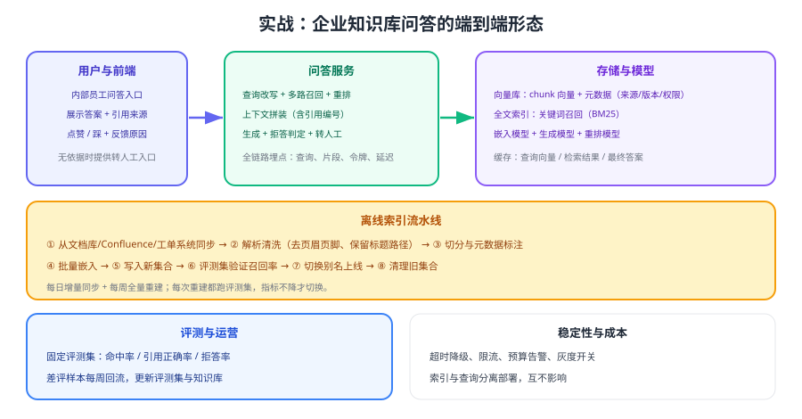

# 实战：企业知识库问答

把前面几页组装成一个可以上线的内部知识库问答：**离线索引流水线 + 在线问答服务 + 评测与运营**，并且从第一天起就带上权限过滤、缓存与可观测。本页给出端到端代码骨架、指标基线与故障演练清单。



## 场景与范围

| 项 | 设定 |
| --- | --- |
| 用户 | 内部员工（客服、销售、运营） |
| 知识源 | 政策文档、产品手册、FAQ、历史工单结论 |
| 目标 | 用引用回答政策/流程问题，不涉及金额计算与写操作 |
| 边界 | 无依据必须拒答；敏感数据不进入第三方模型 |
| 规模 | 初期 2 万 chunk，QPS 峰值 5 |

::: tip 先定「不做什么」
**首版不做**：不做写操作、不做金额计算、不接入客户隐私数据。范围清晰，评测与合规都好通过，上线速度也更快。
:::

## 离线索引

```python [build_index.py]
from hashlib import sha256

def build_index(docs: list[dict], collection: str = "kb_chunks_v4") -> dict:
    stats = {"docs": 0, "chunks": 0, "skipped": 0}
    for doc in docs:
        chunks = split_by_headings(parse(doc["content"]), max_len=800)
        if not chunks:
            stats["skipped"] += 1
            continue
        vectors = embed_batch([c["text"] for c in chunks], dimensions=1024)
        vector_store.upsert(collection, [
            {
                "chunk_id": f"{doc['id']}#{i}",
                "doc_id": doc["id"],
                "vector": v,
                "text": c["text"],
                "title_path": c.get("title_path", ""),
                "source": doc["source"],
                "tenant": doc["tenant"],
                "acl_group": doc["acl_group"],
                "doc_version": doc["version"],
                "embedding_model": "text-embedding-3-small",
                "content_hash": sha256(c["text"].encode()).hexdigest(),
            }
            for i, (c, v) in enumerate(zip(chunks, vectors))
        ])
        stats["docs"] += 1
        stats["chunks"] += len(chunks)
    return stats
```

要点：切分带标题路径、每个 chunk 带权限与版本元数据、批量嵌入控制请求数；索引完成后**必须跑评测再切别名**。

## 在线问答

```python [ask_service.py]
ANSWER_INSTRUCTIONS = """你是企业内部知识助手。严格按以下规则回答：
1) 只依据【材料】作答，材料中找不到依据时回答"未在资料中找到依据"，不要推测；
2) 每个结论后用 [编号] 标注依据；
3) 涉及时限、金额、责任条款必须原文引用；
4) 回答不超过 300 字，不使用营销话术。"""

def ask(question: str, user: dict) -> dict:
    # 1. 改写（复杂问题拆分为多条子查询）
    queries = rewrite(question, user.get("history", []))

    # 2. 多路召回 + 权限过滤（过滤下推到检索层）
    candidates = []
    for q in queries:
        candidates += recall(q, tenant=user["tenant"], groups=user["acl_groups"])
    candidates = dedup_by_chunk_id(candidates)

    # 3. 重排并截断
    top = rerank(question, candidates, keep=5)
    if not top or top[0]["rerank_score"] < REFUSAL_THRESHOLD:
        return {"text": "未在资料中找到依据", "refs": [], "handoff": True}

    # 4. 拼装上下文并生成（含引用编号）
    material = "\n\n".join(
        f"[{i+1}] {c['title_path']}\n{c['text']}" for i, c in enumerate(top)
    )
    resp = client.responses.create(
        model="gpt-5.6",
        instructions=ANSWER_INSTRUCTIONS,
        input=f"【材料】\n{material}\n\n【问题】{question}",
        max_output_tokens=600,
    )
    return {
        "text": resp.output_text,
        "refs": [{"chunk_id": c["chunk_id"], "source": c["source"]} for c in top],
        "usage": resp.usage,
        "handoff": "未在资料中找到依据" in resp.output_text,
    }
```

## 评测基线

```shell
# 直接用评测脚本跑基线（脚本见 评估体系 一页）
python evals/run_rag_eval.py --collection kb_chunks_v4 --top-k 20 --keep 5
```

| 指标 | 首版基线（示例） | 目标 |
| --- | --- | --- |
| Recall@20 | 0.88 | ≥ 0.93 |
| 引用正确率 | 0.90 | ≥ 0.95 |
| 拒答准确率 | 0.85 | ≥ 0.95 |
| P95 延迟 | 3.2s | ≤ 2.5s |
| 平均上下文令牌 | 4200 | ≤ 3000 |

::: warning 基线不是「及格线」，而是「比较基准」
先跑出真实数字，再谈优化。每次只改一个变量（切分、召回、重排、提示词、模型），跑完评测对比指标，**指标不降才上线**。
:::

## 故障演练

| 演练 | 操作 | 期望结果 |
| --- | --- | --- |
| 向量库不可用 | 停掉向量库 | 服务降级为提示稍后重试或转人工，不整体 500 |
| 重排服务超时 | 注入 3s 延迟 | 跳过重排，用向量候选直接生成，延迟可控 |
| 索引写错 | 故意写入无权限的 chunk | 检索层过滤使其永不返回，并告警 |
| 文档删除 | 下架一篇政策文档 | 相关问答立即拒答，不再引用旧政策 |
| 缓存污染 | 知识更新后不失效缓存 | 通过版本化缓存键避免返回旧答案 |
| 高并发 | 压测到 5 倍峰值 QPS | 触发限流与排队，核心问答仍可用 |

## 上线检查清单

1. 评测集可一键运行，基线指标已记录并可对比。
2. 权限过滤下推到检索层，并用两个租户互测验证。
3. 索引有每日增量与每周全量任务，删除能生效。
4. 链路埋点可回放：改写查询、召回片段、重排顺序、上下文、令牌、延迟。
5. 限流、预算告警、降级与灰度开关全部就绪。
6. 差评反馈入口可用，且有人每周整理回填评测集。

## 验证方式

1. 按上面脚本跑通「重建索引 → 评测 → 别名切换」的完整流程，记录耗时。
2. 用 20 条真实问题核对答案与引用，统计人工认可率。
3. 构造 5 条知识库外问题，确认全部拒答且提供转人工入口。
4. 执行故障演练表中至少三项，确认降级行为符合预期。

## 参考资料

- 检索指南（官方文档）：https://developers.openai.com/api/docs/guides/retrieval
- 嵌入指南（官方文档）：https://developers.openai.com/api/docs/guides/embeddings
- 评估体系：[评估体系](../Evaluation/index.md)
- 生产工程化：[生产工程化](../Pipeline/index.md)
- 应用侧接入：[大模型应用开发 · RAG 接入](../../LLMApp/RagOverview/index.md)
