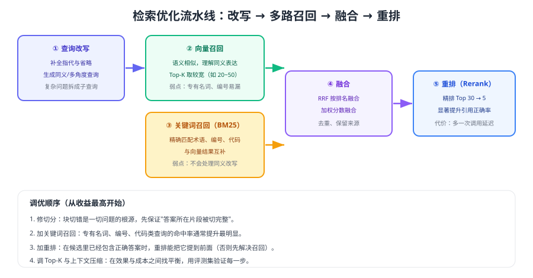

# 检索优化

检索优化决定 RAG 的**上限**。当答案确实存在于知识库却答不对时，问题几乎总出在这条流水线上：查询没改写、关键词没召回、候选没重排、上下文塞了太多噪声。



## 第一步：查询改写

| 场景 | 问题 | 改写动作 |
| --- | --- | --- |
| 口语化提问 | "这个咋退" | 补全为"如何申请退款、退款流程是什么" |
| 指代与省略 | "它多久到账" | 用会话上下文补全"退款多久到账" |
| 复杂多问题 | "退款和换货分别要多久" | 拆成两个子查询分别检索 |
| 术语不一致 | 用户说"发货"，文档写"出库" | 生成同义表述，扩大召回 |

```python [rewrite.py]
REWRITE_INSTRUCTIONS = """你是检索查询改写器。把用户问题改写为适合检索的查询：
1) 补全指代与省略，保留订单号、型号等实体；
2) 若包含多个问题，拆分为多条查询；
3) 只输出 JSON：{"queries": ["...", "..."]}，不要解释。"""

def rewrite(question: str, history: list[str]) -> list[str]:
    resp = client.responses.create(
        model="gpt-5.6",                     # 可用更便宜的模型
        instructions=REWRITE_INSTRUCTIONS,
        input=f"【历史】{history[-3:]}\n【当前问题】{question}",
        text={"format": {"type": "json_schema", "name": "queries",
                         "schema": {"type": "object",
                                    "properties": {"queries": {"type": "array", "items": {"type": "string"}}},
                                    "required": ["queries"], "additionalProperties": False},
                         "strict": True}},
        max_output_tokens=200,
    )
    return json.loads(resp.output_text)["queries"]
```

::: warning 改写是把双刃剑
改写会引入模型的理解偏差：把"退货"改写成"退款"可能检索到错误政策。上线前必须用评测集验证，并保留"使用原查询"的回退开关。
:::

::: tip 先扩召回，再谈精排
如果正确答案根本不在候选里，重排模型无能为力。**召回阶段要"宁滥勿缺"，重排阶段才做"精准收敛"**，两段职责不要混淆。
:::

## 第二步：多路召回

| 召回方式 | 擅长 | 不擅长 |
| --- | --- | --- |
| 向量检索 | 同义改写、语义相近 | 精确编号、专有名词、代码 |
| 关键词检索（BM25） | 术语、编号、型号、人名 | 同义表达、口语化提问 |
| 元数据过滤 | 缩小范围、权限隔离 | 无法判断相关性 |
| 结构化查询 | 数值、状态、时间条件 | 非结构化内容 |

工程上建议**至少两路**：向量 + 关键词，各取 20~50 条候选，再用融合与重排收敛到 3~5 条。

```python [hybrid_recall.py]
def recall(query: str, tenant: str, top_k: int = 30) -> list[dict]:
    vector_hits = vector_store.search(embed(query), top_k=top_k, filter={"tenant": tenant})
    keyword_hits = bm25_index.search(query, top_k=top_k, filter={"tenant": tenant})
    return fuse_rrf(vector_hits, keyword_hits)     # 按排名融合，避免分数不可比
```

## 第三步：融合与重排

**融合**解决"两路候选怎么合并"：不同检索器的分数量纲不可比，推荐用 RRF（Reciprocal Rank Fusion，按排名倒数加权），实现简单且鲁棒。

**重排（Rerank）** 解决"候选里谁最相关"：用交叉编码器对「查询 + 片段」逐对打分，精度显著高于向量相似度，代价是多一次调用与延迟。

```python [rerank.py]
def rerank(query: str, candidates: list[dict], keep: int = 5) -> list[dict]:
    """按相关性精排并截断；生产环境用专门的重排模型或服务。"""
    scored = []
    for c in candidates:
        score = rerank_model.score(query, c["text"])   # 交叉编码：查询与片段一起编码
        scored.append({**c, "rerank_score": score})
    scored.sort(key=lambda x: x["rerank_score"], reverse=True)
    return scored[:keep]
```

## 第四步：上下文压缩

把 5 个完整 chunk 直接塞进提示词，往往包含大量无关句子。压缩做法：

1. **句级筛选**：只保留与问题相关的句子（可用模型或关键词打分）。
2. **去重**：同一段落被多个 chunk 覆盖时去重。
3. **按预算截断**：设定总令牌上限，按重排分数从高到低填充。
4. **保留标题路径**：让模型知道这段话来自哪一节，减少误用。

::: danger 检索优化的六个坑
1. **只用向量检索**：编号、型号类查询命中率低，必须配关键词。
2. **Top-K 设得过大**：把噪声交给模型，既贵又容易答错。
3. **不看重排**：正确答案进了候选却被截断，白白浪费召回。
4. **改写后不校验**：改写偏了会稳定地检索到错误内容。
5. **忽略权限过滤**：检索层不过滤，等于把越权内容喂给模型。
6. **不记录中间状态**：出问题时无法判断是"没召回"还是"排太后"。
:::

## 参数调优清单

| 参数 | 起步值 | 调整依据 |
| --- | --- | --- |
| 向量召回 Top-K | 20~50 | 看 Recall@K 是否达到 90% 以上 |
| 关键词召回 Top-K | 20~50 | 术语类 badcase 是否减少 |
| 重排后保留数 | 3~5 | 引用正确率与令牌成本的平衡 |
| 上下文令牌上限 | 按模型窗口的 30%~50% | 留足输出空间，避免被截断 |
| 相似度阈值 | 先不设，观察分布后再定 | 低分片段直接拒答，可减少幻觉 |

## 验证方式

1. 用同一评测集对比"仅向量"与"向量 + 关键词"两种召回的 Recall@20。
2. 加速重排后重跑，对比引用正确率与 P95 延迟，确认收益值得延迟代价。
3. 打印一次完整问答的中间状态：改写后查询、两路候选、重排顺序、最终上下文，确认链路符合预期。
4. 把相似度阈值逐步调高，观察拒答率与幻觉率的变化，找到业务可接受的平衡点。

## 参考资料

- 检索指南（官方文档）：https://developers.openai.com/api/docs/guides/retrieval
- 嵌入与向量检索（官方文档）：https://developers.openai.com/api/docs/guides/embeddings
- 评估体系：[评估体系](../Evaluation/index.md)
- 常见问题排查：[常见问题与最佳实践](../FAQ/index.md)
