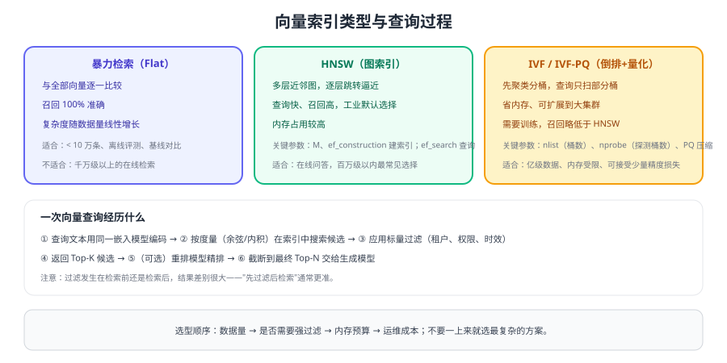

# 向量库与索引

选向量库之前先回答三个问题：**数据量多大、过滤条件多复杂、团队能维护什么**。大多数项目并不需要最复杂的方案，PostgreSQL + pgvector 往往就能撑住百万级以内的知识库。



## 选型对比

| 方案 | 当前版本（2026-09 核对） | 优势 | 代价 | 适用 |
| --- | --- | --- | --- | --- |
| PostgreSQL + pgvector | 0.8.x（v0.8.6） | 与业务库同源，事务一致，运维最省 | 大体量与高并发下需分片 | 已有 PG、百万级以内 |
| Milvus | 3.x（v3.0.1）；2.6.x 维护线 | 分布式、亿级规模、生态成熟 | 组件多，运维成本高 | 大规模、独立检索平台 |
| Qdrant | 1.x（v1.19.1） | 过滤能力强，部署简单 | 生态相对小 | 中等规模、强过滤需求 |
| Chroma | 1.x（1.5.9） | 轻量、上手快 | 不适合大规模生产 | 原型验证、小数据集 |
| Elasticsearch | 9.x（v9.5.3） | 全文 + 向量统一，聚合分析强 | 资源占用高，调优复杂 | 已有 ES、需要混合检索 |

::: tip 一句话理解
**先问运维，再问性能**。向量库一旦上线就要长期维护（备份、升级、扩容），选一个团队真正能运维的方案，比选一个跑分最高的方案更重要。
:::

## 索引类型

| 类型 | 原理 | 特点 | 关键参数 |
| --- | --- | --- | --- |
| Flat（暴力） | 全量逐一比较 | 召回 100%，随数据量线性变慢 | 无 |
| HNSW | 多层近邻图 | 快、召回高，内存占用大 | `M`、`ef_construction`（建索引），`ef_search`（查询） |
| IVF | 聚类分桶，只扫部分桶 | 省内存，可扩展到亿级 | `nlist`（桶数）、`nprobe`（探测桶数） |
| IVF-PQ | IVF + 乘积量化压缩 | 内存大幅下降，召回略降 | 子空间数、量化位数 |

调参经验：

1. `ef_search` 越大越准也越慢，通常从 64 起步逐步上调，用评测集找拐点。
2. 数据量小（< 10 万）时 HNSW 与 Flat 的差距不明显，可以先用 Flat 拿基线。
3. 内存不足时优先考虑量化或降维，而不是牺牲 `nprobe`（召回会明显掉）。

## 过滤：先过滤还是后过滤

| 方式 | 行为 | 风险 |
| --- | --- | --- |
| 先过滤（pre-filter） | 先按元数据缩小候选集，再在子集内做向量检索 | 过滤后候选过少时召回下降 |
| 后过滤（post-filter） | 先向量检索 Top-K，再按元数据过滤 | 过滤条件苛刻时会"过滤完什么都不剩" |

**权限与租户过滤必须使用先过滤**（或引擎原生的带过滤检索），否则等于把无权内容取回来再丢弃，既不安全也浪费资源。

```python [search_with_filter.py]
def search(question: str, tenant: str, user_groups: list[str], top_k: int = 20):
    """带权限过滤的检索：过滤条件必须下推到检索层。"""
    vector = embed(question)
    return vector_store.search(
        vector=vector,
        top_k=top_k,
        filter={
            "tenant": tenant,                  # 租户隔离
            "acl_group": {"any_of": user_groups},  # 与用户可见范围取交集
            "status": "published",             # 只检索已发布版本
        },
    )
```

## 集合（Collection）设计

```json [collection-schema.json]
{
  "name": "kb_chunks_v3",
  "vector": { "size": 1024, "metric": "cosine" },
  "fields": {
    "doc_id": "string",
    "chunk_id": "string",
    "text": "string",
    "source": "string",
    "title_path": "string",
    "tenant": "string",
    "acl_group": "string[]",
    "doc_version": "string",
    "embedding_model": "string",
    "content_hash": "string",
    "updated_at": "int64"
  }
}
```

必带的元数据有三类：**定位**（doc_id/chunk_id/source/title_path）、**权限**（tenant/acl_group）、**版本**（doc_version/embedding_model/content_hash）。

## 版本与迁移

大版本升级（例如 Milvus 跨大版本、ES 大版本）通常**不能原地平滑升级**，稳妥做法是：

1. 新版本起一套新集群；
2. 用离线流水线重新索引（顺便换新模型、新切分）；
3. 双写或双读灰度，用评测集对比命中率与延迟；
4. 切换别名后下线旧集群。

具体版本状态与升级注意见 [组件版本状态](../Version/index.md)。

::: danger 向量库使用的六个坑
1. **过滤条件写在业务代码里而不是检索里**：先取出再过滤，等于没有权限隔离。
2. **维度与索引不一致**：写入 1536 维、索引用 1024 维，直接报错或静默截断。
3. **不做删除**：文档下架后 chunk 仍在库里继续被检索到。
4. **一个集合混放多个租户**：靠代码保证隔离，容易出现越权。
5. **索引参数照抄博客**：不同数据分布最优参数不同，必须用评测集验证。
6. **只备份向量不备份原文与元数据**：向量无法反推文本，恢复时无法重建。
:::

## 验证方式

1. 用 1 万条 chunk 建 HNSW 索引，把 `ef_search` 从 32 调到 256，记录 Recall@20 与查询延迟的拐点。
2. 构造两个租户的数据，用各自的用户身份检索，确认无法命中对方内容。
3. 删除一篇文档后重新检索，确认相关 chunk 不再出现（验证删除链路）。
4. 对比 Flat 与 HNSW 在同一评测集上的召回差异，确认近似索引带来的精度损失可接受。

## 参考资料

- pgvector 官方仓库（含索引类型与参数说明）：https://github.com/pgvector/pgvector
- Milvus 官方文档：https://milvus.io/docs
- Elasticsearch 向量检索文档：https://www.elastic.co/guide/en/elasticsearch/reference/current/knn-search.html
- 组件版本状态：[组件版本状态](../Version/index.md)
