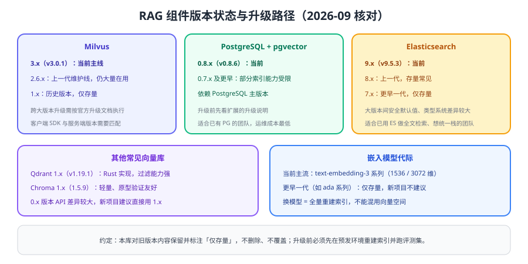

# 组件版本状态与升级

RAG 的"大版本"差异主要体现在**向量库与嵌入模型**上：向量库大版本之间往往索引格式、客户端 SDK、部署架构都不兼容；嵌入模型换一代就必须全量重建索引。本页给出当前状态与升级路径；旧版本内容在本库中保留、标注状态，不删除、不覆盖。



## 向量库版本状态

| 组件 | 当前版本 | 上一代 | 更早（仅存量） | 升级要点 |
| --- | --- | --- | --- | --- |
| Milvus | **3.x（v3.0.1）** | 2.6.x（维护线，v2.6.23） | 1.x | 跨大版本需按官方升级文档执行；客户端 SDK 与服务端需匹配 |
| Qdrant | **1.x（v1.19.1）** | — | — | 1.x 内部小版本升级通常兼容，注意配置项变更 |
| Chroma | **1.x（1.5.9）** | 0.x | — | 0.x 到 1.x API 差异较大，新项目直接用 1.x |
| PostgreSQL + pgvector | **0.8.x（v0.8.6）** | 0.7.x | 更早版本 | 升级扩展后需重建索引以使用新能力 |
| Elasticsearch | **9.x（v9.5.3）** | 8.x | 7.x | 大版本间安全默认值、类型与 API 差异较大，需按官方升级指南 |

::: info 版本标注约定
「当前」指新项目应采用的版本；「上一代」仍在维护或仍被大量使用，本库保留其说明；「仅存量」指历史版本，仅用于维护既有系统，新项目不要采用。所有版本以官方发布页为准，升级前必须在预发环境验证。
:::

::: tip 升级之前先问一句
**这次升级能带来什么业务收益？** 如果只是为了"用新版本"而升级，收益可能抵不过重建索引与回归测试的成本。把升级与"换更好的嵌入模型/更好的切分"打包做，收益更划算。
:::

## 嵌入模型代际

| 代际 | 状态 | 说明 |
| --- | --- | --- |
| text-embedding-3 系列 | 当前主线 | 支持按需指定维度（如 1536 / 3072），可在效果与成本间权衡 |
| 更早一代嵌入模型（如 ada 系列） | 仅存量 | 新项目不建议使用；如仍在用，迁移时需全量重建索引 |
| 第三方/自建嵌入模型 | 可选 | 私有化部署场景常用；需自行评估效果、成本与稳定性 |

::: danger 换嵌入模型的唯一正确做法
**全量重建索引**。新旧模型的向量空间不兼容，即使维度相同也不能混用；若只重建部分文档，检索结果会变得随机且难以排查。重建流程见 [生产工程化](../Pipeline/index.md)。
:::

## 升级标准流程

1. **冻结变更**：升级窗口内不做切分、提示词等其他改动，避免多变量叠加。
2. **准备新环境**：新版本向量库使用独立实例与新集合，不动旧数据。
3. **重建索引**：用当前最优切分与嵌入模型重建，记录耗时与成本。
4. **评测对比**：用同一评测集对比新旧环境的 Recall@K、引用正确率、P95 延迟。
5. **灰度切换**：按 5% → 20% → 100% 逐步放量，随时可切回。
6. **保留回滚**：旧集合与旧配置保留至少一个观察周期再清理。

```shell
# 示例：用别名切换实现"零停机"上线（具体命令随组件不同）
# 1) 新集合写入完成并跑通评测
python evals/run_rag_eval.py --index kb_chunks_v4

# 2) 切换查询别名指向新集合
vector_store.alias_switch(alias="kb_chunks_current", to="kb_chunks_v4")

# 3) 观察指标后清理旧集合
vector_store.drop_collection("kb_chunks_v3")
```

预期结果：切换期间线上检索不中断；切换后评测指标不低于旧版本；出现异常可把别名切回。

## 兼容性检查清单

| 检查项 | 说明 |
| --- | --- |
| 客户端 SDK 与服务端版本 | 大版本升级通常要求同步升级 SDK |
| 索引格式 | 大版本间会变化，需重建而非原地升级 |
| 度量与维度 | 升级后确认索引度量与查询一致 |
| 过滤语法 | 过滤表达式语法可能变化，需要回归权限过滤 |
| 备份与恢复 | 确认新版本备份方案可用，并做过一次恢复演练 |
| 监控指标 | 新版本指标名可能变化，看板与告警需同步更新 |

::: danger 升级期的五个高危动作
1. 在业务高峰执行索引重建与切换。
2. 原地升级向量库而不重建索引。
3. 新旧版本混跑同一个集合（读写协议不一致）。
4. 只升级服务端不升级客户端 SDK。
5. 升级后立刻删除旧集合，失去回滚能力。
:::

## 验证方式

1. 记录当前各组件版本（`milvus_version`、`pgvector` 扩展版本、ES 版本）并写入运维文档。
2. 在测试环境执行一次"新集合 → 评测 → 别名切换"的完整演练，记录耗时。
3. 核对客户端 SDK 版本与服务端是否匹配，确认无兼容警告。
4. 用同一评测集在新旧索引上各跑一次，输出对比表格作为升级依据。

## 参考资料

- Milvus 官方文档与发布说明：https://milvus.io/docs
- pgvector 官方仓库（版本与变更）：https://github.com/pgvector/pgvector
- Qdrant 官方文档：https://qdrant.tech/documentation/
- Elasticsearch 官方升级指南：https://www.elastic.co/guide/en/elasticsearch/reference/current/upgrade.html
- 嵌入指南（官方文档）：https://developers.openai.com/api/docs/guides/embeddings
