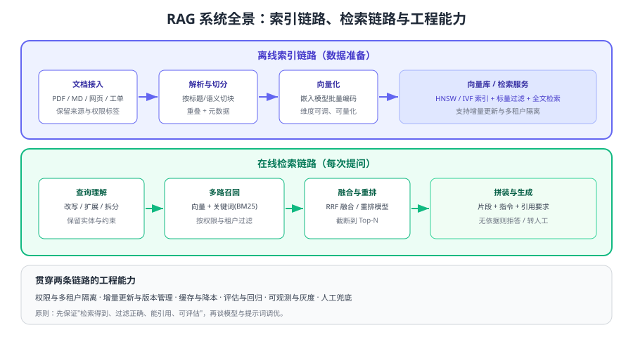

# RAG 检索增强

RAG（Retrieval-Augmented Generation，检索增强生成）是当前最通用的「让大模型用上私有知识」的方案：**先检索、再生成**。它把"知识"从模型参数里拿出来，放进可随时更新的知识库，从而同时解决三个问题——模型不知道你的业务、知识会过期、回答无法溯源。



## 专题导航

- [嵌入与向量基础](Embedding/index.md)：模型选择、维度、距离度量与批处理
- [文档解析与切分](Chunking/index.md)：解析清洗、四种切分策略与元数据设计
- [向量库与索引](VectorStore/index.md)：索引类型、过滤策略与选型对比
- [检索优化](Retrieval/index.md)：查询改写、多路召回、融合、重排与参数调优
- [评估体系](Evaluation/index.md)：三层指标、评测集构建与回归流程
- [生产工程化](Pipeline/index.md)：增量索引、权限多租户、缓存降本与可观测
- [组件版本状态](Version/index.md)：Milvus、pgvector、Elasticsearch 等大版本与升级路径
- [实战：企业知识库问答](Practice/index.md)：端到端落地、评测与故障演练
- [常见问题与最佳实践](FAQ/index.md)：答非所问、幻觉、变慢变贵的排查

::: tip 一句话理解
RAG 的效果上限由**检索**决定：检索不到，再强的模型也只能编；检索到了但排得太后，模型同样会答错。所以调优顺序永远是「先修检索，再调提示词」。
:::

## 两条链路

| 链路 | 触发频率 | 主要工作 | 常见瓶颈 |
| --- | --- | --- | --- |
| 离线索引 | 每日增量 / 每周全量 | 解析、切分、嵌入、写入索引、评测 | 文档格式复杂、更新不及时 |
| 在线问答 | 每次提问 | 改写、召回、融合、重排、拼装、生成 | 召回不准、上下文过长、延迟 |

两条链路的**组件是解耦的**：换嵌入模型只需重建索引，换生成模型不影响索引；反过来说，任何一侧的改动都必须用同一套评测集验证。

## 什么时候该用 RAG，什么时候不该

| 场景 | 判断 | 建议 |
| --- | --- | --- |
| 知识量大、更新频繁、需要引用 | 典型 RAG 场景 | 直接上 RAG |
| 数据量小且稳定（一个配置文件） | 可直接写进提示词 | 不必引入检索 |
| 需要改变模型的表达风格/格式 | 属于能力问题 | 提示词工程或微调更合适 |
| 需要严格数值计算、精确统计 | 模型不可靠 | 走工具调用/SQL 查询，不让模型算 |
| 权限复杂、数据敏感 | RAG + 严格过滤 | 检索层做权限，必要时私有化部署 |

::: warning 三类常见的「不该用 RAG」
1. **用 RAG 掩盖结构问题**：答案明明在数据库里，应该用工具查询而不是向量检索。
2. **用 RAG 替代权限设计**：把全部文档塞进一个索引，靠提示词约束权限——这是数据泄露风险。
3. **上来就追求复杂方案**：还没做评测集就上 GraphRAG、多路 Agent，最后无法判断有没有变好。
:::

## 组件与版本速览

以下版本按 2026-09 官方仓库核对，详细状态与升级注意见 [组件版本状态](Version/index.md)。

| 组件 | 当前版本 | 说明 |
| --- | --- | --- |
| Milvus | 3.x（v3.0.1） | 2.6.x 为上一代维护线，1.x 仅存量 |
| Qdrant | 1.x（v1.19.1） | 过滤能力强，部署简单 |
| Chroma | 1.x（1.5.9） | 轻量，适合原型与中小规模 |
| PostgreSQL + pgvector | 0.8.x（v0.8.6） | 已有 PG 的团队运维成本最低 |
| Elasticsearch | 9.x（v9.5.3） | 全文检索 + 向量检索统一在一套栈里 |
| 嵌入模型 | text-embedding-3 系列 | 维度可选（如 1536 / 3072），换模型必须重建索引 |

::: info 大版本处理约定
本库对存在大版本差异的主题采用「主线 + 旧版本存档并标注状态」的方式组织：主线面向各组件当前稳定版；旧版本（如 Milvus 2.x/1.x、ES 8.x/7.x）**保留说明、不删除、不覆盖**，并在 [组件版本状态](Version/index.md) 中标注维护状态与升级路径。升级必须先重建索引并用评测集验证。
:::

## 从零落地的五步

1. **定场景与评测集**：先选一个边界清晰的场景（如"售后政策问答"），准备 50 条真实问题与标准答案要点。
2. **打通最小链路**：解析 → 切分 → 嵌入 → 检索 → 生成，用最简单的配置跑通，拿到基线指标。
3. **修检索**：看 badcase 属于切分问题还是召回问题，优先做关键词混合召回与重排。
4. **控成本与延迟**：压缩上下文、加缓存、按场景分级选择模型。
5. **工程化**：增量索引、权限过滤、可观测、灰度与回滚，最后才考虑扩规模。

```python [smoke_test.py]
# 最小冒烟验证：确认「检索 → 生成 → 引用」链路可用
question = "退款多久到账？"
hits = retrieve(question, tenant="demo", top_k=5)     # 检索
assert hits, "检索为空：先检查索引与过滤条件"

answer = generate(question, hits)                      # 生成（要求带引用）
print(answer["text"])
print("引用片段:", [h["chunk_id"] for h in hits])
```

预期输出：一段带 `[编号]` 引用的回答，以及对应的 chunk 编号列表；若检索为空，应先排查索引与权限过滤，而不是先改提示词。

::: danger 新手最容易踩的五个坑
1. **没有评测集就开始调参**：改了半天无法证明变好，只是"感觉"。
2. **切分按固定长度硬切**：条款、步骤被切断，检索永远命中不了完整语义。
3. **只用向量检索**：编号、型号、代码类查询必须配合关键词检索。
4. **不写权限过滤**：检索层不过滤等于把 A 部门资料给 B 部门。
5. **换嵌入模型不重建索引**：新旧向量空间混用，结果随机变差且极难排查。
:::

## 验证方式

1. 用 20 条真实问题跑通最小链路，人工核对"召回片段 + 生成答案 + 引用"三者的对应关系。
2. 统计基线指标：Recall@K、引用正确率、拒答率、平均延迟与单次成本，作为后续对比基准。
3. 故意问一个知识库外的问题，确认系统拒答而不是编造。
4. 修改一篇文档并触发增量更新，确认新内容在检索结果中出现（验证索引链路）。

## 相关专题

- [大模型应用开发](../LLMApp/index.md)：API 调用、上下文管理、成本与限流的工程基础
- [大模型应用开发 · RAG 接入](../LLMApp/RagOverview/index.md)：把检索接入应用的快速上手版本
- [提示词工程](../PromptEngineering/index.md)：让模型"只依据材料回答"的指令设计
- [Agent 应用 · 记忆与上下文](../Agent/MemoryContext/index.md)：检索作为长期记忆的使用方式

## 参考资料

- 嵌入与向量检索（官方文档）：https://developers.openai.com/api/docs/guides/embeddings
- 检索指南（官方文档）：https://developers.openai.com/api/docs/guides/retrieval
- 文件检索工具（官方托管方案）：https://developers.openai.com/api/docs/guides/tools-file-search
- Milvus 官方文档：https://milvus.io/docs
- pgvector 官方仓库：https://github.com/pgvector/pgvector
- Elasticsearch 官方文档：https://www.elastic.co/guide/en/elasticsearch/reference/current/index.html
