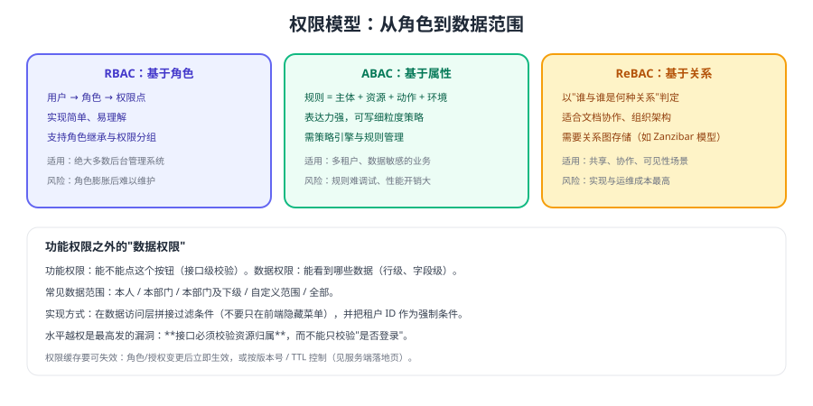

# 权限模型

认证通过之后，"这个用户能做哪些事、能看哪些数据"才是真正决定安全边界的部分。权限设计做不好，最常见的后果是**水平越权**——用户改一个 ID 就能看到别人的数据。



## 三种主流模型

| 模型 | 判定依据 | 优点 | 代价 | 适用 |
| --- | --- | --- | --- | --- |
| RBAC | 用户 → 角色 → 权限点 | 简单直观、易维护 | 角色膨胀后难管理 | 绝大多数后台系统 |
| ABAC | 主体/资源/动作/环境属性 | 表达力强、细粒度 | 规则复杂、性能开销 | 多租户、数据敏感业务 |
| ReBAC | 实体之间的关系 | 适合共享/协作场景 | 实现与运维成本最高 | 文档协作、组织架构 |

::: tip 权限设计的起点
从一张表开始：**角色 → 权限点（接口级）→ 数据范围**。把它写清楚之后，再决定用 RBAC 还是 ABAC，比一上来就纠结"用哪套模型"高效得多。
:::

实践建议：**从 RBAC 起步，遇到"规则无法用角色表达"时再局部引入 ABAC**，不要一开始就上策略引擎。

## 权限的两个层次

| 层次 | 回答 | 实现位置 | 典型错误 |
| --- | --- | --- | --- |
| 功能权限 | 能不能调用这个接口/按钮 | 接口注解、网关路由 | 只隐藏前端菜单 |
| 数据权限 | 能看到哪些数据行/字段 | 数据访问层过滤 | 只校验"已登录" |

数据权限的常见范围：

```text
仅本人 → 本部门 → 本部门及下级 → 自定义范围 → 全部
```

::: danger 越权是最容易被忽略的高危问题
**水平越权**：A 用户通过修改 `orderId` 访问 B 用户的订单。
**垂直越权**：普通用户直接调用管理端接口。

两者都不是"认证"问题，而是"授权"问题。**接口必须同时校验"权限点"与"资源归属"**，缺一不可。
:::

## 数据权限怎么落到 SQL

```sql
-- 反例：只按业务条件查询，没有数据范围约束
SELECT * FROM orders WHERE status = 'PAID';

-- 正例：强制拼接数据范围（此处示例为"本部门及下级"）
SELECT o.* FROM orders o
JOIN sys_dept d ON d.id = o.dept_id
WHERE o.status = 'PAID'
  AND d.path LIKE CONCAT((SELECT path FROM sys_dept WHERE id = :currentDeptId), '%');
```

实现要点：

1. **租户 ID 作为强制条件**：由框架统一追加，禁止业务代码"选择性"拼接。
2. **权限过滤在服务端**：前端传来的过滤条件只能收窄范围，不能放宽范围。
3. **敏感字段单独控制**：如手机号、金额，按字段授权或脱敏输出。
4. **越权尝试要留痕**：查询条件被改写（例如越权 ID）时记录审计日志。

## 权限缓存与一致性

| 方案 | 说明 | 风险 |
| --- | --- | --- |
| 不缓存 | 每次查库/查接口 | 性能压力大 |
| 本地缓存 + TTL | 简单，秒级生效 | 权限变更生效有延迟 |
| 分布式缓存 + 主动失效 | 变更时删缓存 | 需要可靠的消息/事件机制 |
| 版本号 | 用户/角色变更自增版本，缓存随之失效 | 实现稍复杂，但一致性最好 |

建议：**关键写操作（授权、封禁）即时校验数据库，普通读取走缓存**。

## 前后端权限分工

| 端 | 职责 | 不能做的事 |
| --- | --- | --- |
| 前端 | 控制菜单/按钮可见性，提升体验 | 不能作为安全边界 |
| 后端 | 接口级 + 数据级校验 | 不能只依赖前端传参 |

前端权限数据（菜单、按钮编码）应与后端权限点**同源**，避免两边各自维护一套导致不一致。

## 验证方式

1. 用低权限账号直接调用高权限接口（Postman/curl），确认返回 403。
2. 用 A 账号的令牌访问 B 账号的资源 ID，确认返回 403/404 而不是数据。
3. 修改角色权限后立即用同一会话发起请求，确认权限变化按预期生效（验证缓存失效）。
4. 检查最终执行的 SQL，确认数据范围条件确实被拼进查询。

## 相关专题

- [服务端落地](../Implementation/index.md)：权限校验在网关与服务中的分工
- [安全最佳实践](../Security/index.md)：越权与审计
- [OAuth 2.1 与 OIDC](../Oauth2/index.md)：scope 与权限的关系
- [Spring Security 6 · 授权](../../Java/Frame/SpringSecurity/v6/SpringBoot/Authorization/index.md)：Java 侧实现

## 参考资料

- OWASP · Authorization Cheat Sheet：https://cheatsheetseries.owasp.org/cheatsheets/Authorization_Cheat_Sheet.html
- NIST RBAC 模型说明：https://csrc.nist.gov/projects/role-based-access-control
