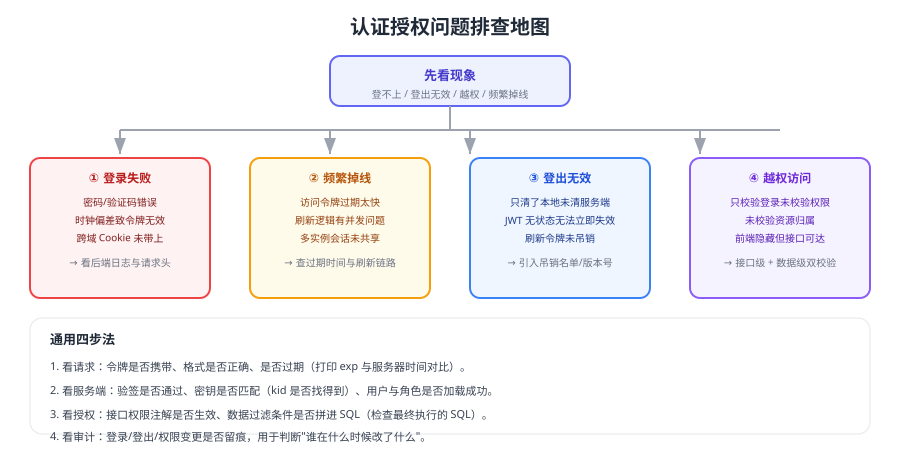

# 常见问题与最佳实践

认证授权的问题排查有一条捷径：**先分清是"进不去"（认证）还是"进去了不该看的也能看"（授权）**。本页按现象给出排查路径与长期实践清单。



## 通用排查四步

```shell
# 1. 看请求：令牌是否携带、格式是否正确、是否过期
curl -i -H "Authorization: Bearer $TOKEN" http://localhost:8080/api/me

# 2. 看令牌内容与过期时间（payload 只是 Base64，可直接解码查看）
echo "$TOKEN" | cut -d. -f2 | base64 -d 2>/dev/null; echo

# 3. 对比服务器时间与令牌 exp（时钟偏差是"刚签发的令牌就失效"的常见原因）
date -u
```

## 1. 登录失败

| 可能原因 | 验证方式 | 处理 |
| --- | --- | --- |
| 凭证错误 | 查看后端日志中的失败原因 | 区分"账号不存在/密码错/被锁定" |
| 跨域 Cookie 未携带 | 浏览器 Network 中查看请求头 | 配置 CORS 允许凭证 + `SameSite` |
| 令牌刚签发就失效 | 对比服务器时间与 `exp` | 统一 NTP 时间同步 |
| 网关与服务密钥不一致 | 对比 `kid` 与 JWKS | 统一密钥来源与轮换流程 |

## 2. 频繁掉线

1. **访问令牌过期太短**：结合刷新机制调整（5~30 分钟为常见区间）。
2. **刷新并发覆盖**：多个请求同时刷新，后到的旧令牌覆盖新令牌——应加锁或单飞（single-flight）。
3. **会话未共享**：多实例部署未使用集中会话存储。
4. **Cookie 属性不匹配**：`Secure`/`SameSite`/`Domain` 配置与访问方式不一致。

## 3. 登出无效

::: danger JWT 场景的固有问题
JWT 是无状态的，**签发后在过期前一直有效**。要做到"登出立即生效"，必须引入以下任一机制：

1. 服务端保存刷新令牌并在登出时删除（访问令牌靠短过期自然失效）；
2. 用户级令牌版本号（`token_version`），登出/改密时自增；
3. 令牌黑名单（按 `jti`），TTL 与令牌剩余有效期一致。
:::

## 4. 越权访问

| 类型 | 表现 | 修复 |
| --- | --- | --- |
| 水平越权 | 改 ID 能看到他人数据 | 接口内校验资源归属 + 数据范围过滤 |
| 垂直越权 | 普通用户调用管理接口 | 接口级权限注解 + 默认拒绝 |
| 批量越权 | 批量接口漏校验 | 逐条校验并记录审计 |
| 参数越权 | 通过传入 `tenantId` 跨租户 | 租户 ID 由会话推导，不接受入参覆盖 |

## 5. 第三方登录（OIDC）接不通

1. 检查 `redirect_uri` 是否与注册值完全一致（含协议、端口、路径、结尾斜杠）。
2. 检查 `state`/`nonce` 是否在回调中被校验。
3. 检查 `id_token` 的 `iss`/`aud` 是否与预期一致。
4. 检查时钟偏差与签名算法（`RS256` 常见）。
5. 检查前端与服务端谁的会话负责保存登录态（避免两边都存且互相覆盖）。

## 6. 多端如何共用一套认证

| 端 | 推荐方案 |
| --- | --- |
| Web（同域） | Session-Cookie（`HttpOnly` + `SameSite`） |
| Web（跨域/分离） | 短期 JWT + 安全存储刷新令牌 |
| 移动 App | 授权码 + PKCE（系统浏览器）或 JWT + 安全存储 |
| 第三方/开放平台 | OAuth 2.1 授权码 + PKCE，按 scope 限权 |
| 服务间 | 客户端凭据或服务签名 |

## 7. 面试高频问题速答

| 问题 | 回答要点 |
| --- | --- |
| Session 与 JWT 怎么选 | 有状态可即时注销 vs 无状态易扩展；按场景取舍，也可混用 |
| JWT 如何登出 | 短过期 + 刷新令牌吊销 / 版本号 / 黑名单 |
| OAuth2 与 OIDC 区别 | OAuth 解决授权访问，OIDC 在其上加身份层（id_token） |
| 为什么不能把令牌放 localStorage | XSS 一旦发生，长期凭证可被直接窃取 |
| 如何防止越权 | 接口级权限 + 资源归属校验 + 数据范围过滤，默认拒绝 |
| PKCE 解决什么问题 | 公共客户端授权码被拦截后无法兑换令牌 |

## 最佳实践清单

::: tip 设计阶段
1. 先分清认证与授权，各自设计验收用例（未认证/非法令牌/越权）。
2. 明确令牌有效期、刷新策略与注销语义（是否要求立即生效）。
3. 权限模型从 RBAC 起步，确有必要再引入 ABAC/ReBAC。
:::

::: tip 实现阶段
1. 密钥、算法、有效期全部配置化，禁止硬编码。
2. 网关做粗粒度校验，服务做细粒度与数据权限，两层都要有。
3. 身份头只能由网关写入，内部接口同样鉴权。
4. 登录限流、失败锁定、审计日志三件套齐全。
:::

::: tip 上线与运维
1. 全站 HTTPS，Cookie 带 `HttpOnly`/`Secure`/`SameSite`。
2. 密钥与令牌支持轮换，并演练过轮换流程。
3. 定期复核权限（尤其是高权限账号与离职账号）。
4. 监控异常登录、越权尝试与令牌校验失败率。
:::

## 验证方式

1. 用排查四步复现一次线上登录问题，输出"现象 → 根因 → 改动 → 验证结果"。
2. 用低权限账号分别尝试垂直越权与水平越权，确认都被拒绝。
3. 注销后重放旧令牌，确认被拒绝（或明确记录"仅在短过期窗口内有效"的设计取舍）。
4. 把本次问题补充进团队的安全检查清单。

## 相关专题

- [会话与 Cookie](../Session/index.md)、[JWT 深入](../Jwt/index.md)
- [OAuth 2.1 与 OIDC](../Oauth2/index.md)、[单点登录](../Sso/index.md)
- [权限模型](../Authorization/index.md)、[服务端落地](../Implementation/index.md)、[安全最佳实践](../Security/index.md)

## 参考资料

- OWASP · Authentication Cheat Sheet：https://cheatsheetseries.owasp.org/cheatsheets/Authentication_Cheat_Sheet.html
- RFC 9700（OAuth 2.0 安全最佳实践）：https://www.rfc-editor.org/rfc/rfc9700
- IETF OAuth 2.1 草案：https://datatracker.ietf.org/doc/draft-ietf-oauth-v2-1/
