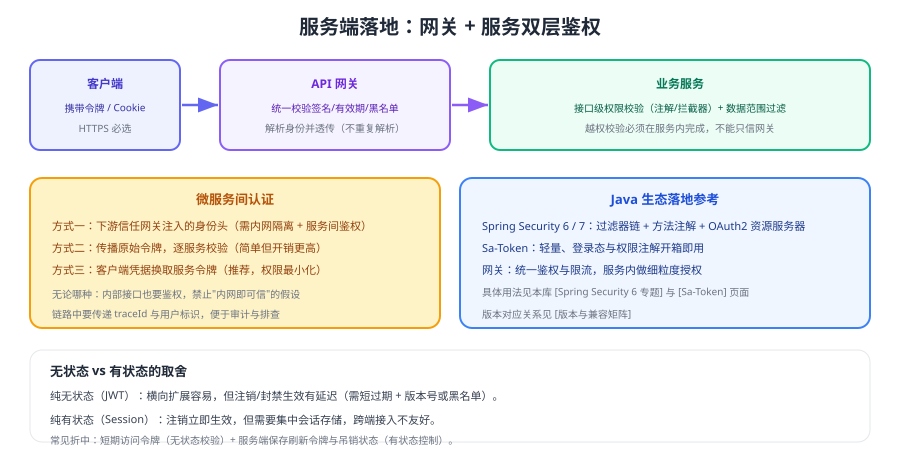

# 服务端落地

把方案落到代码时，最关键的两个决定是：**鉴权放在哪些层、身份如何在服务之间传递**。做错了就会出现"网关拦得住，内网随便进"或"每个服务各写一套校验逻辑"。



## 分层鉴权

| 层 | 职责 | 不做什么 |
| --- | --- | --- |
| 网关 | 校验令牌合法性（签名、过期、黑名单）、限流、路由 | 不做业务级数据权限判定 |
| 业务服务 | 接口权限校验 + 数据范围过滤 + 审计 | 不重复做签名校验（可用网关注入的身份） |
| 数据层 | 强制租户/数据范围条件 | 不依赖调用方传入的范围参数 |

::: tip 网关与服务不是"二选一"
网关解决"统一入口的粗粒度管控"，服务解决"业务语义的细粒度授权"。**只做其中一层，都会留下缺口**。
:::

## 身份传递的三种做法

| 做法 | 说明 | 适用 | 风险 |
| --- | --- | --- | --- |
| 网关注入身份头 | 网关校验后写入 `X-User-Id` 等头 | 内网服务、性能敏感 | 内网被直连即可伪造，必须禁止外部直达 |
| 传播原始令牌 | 服务间透传 access_token | 需要下游重新校验或调用第三方 | 令牌扩散，权限范围偏大 |
| 客户端凭据换服务令牌 | 服务用 client_credentials 换取自身令牌 | 服务间调用（**推荐**） | 需要授权服务器与令牌管理 |

```yaml [网关侧统一鉴权的配置思路]
# 伪配置：表达"哪些路径放行、哪些路径必须鉴权"
routes:
  - id: public
    predicates: ["Path=/api/public/**"]
    filters: []                      # 放行，不做鉴权
  - id: protected
    predicates: ["Path=/api/**"]
    filters:
      - TokenValidate               # 校验签名/过期/黑名单
      - RateLimit                   # 限流
      - InjectIdentity              # 注入用户标识（内网不可直达）
```

::: danger 服务间调用的四个安全底线
1. **内网不等于可信**：内部接口同样要鉴权，禁止"内网直连即放行"。
2. **身份头只能由网关写**：入口处剥离外部传入的 `X-User-*` 头，防止伪造。
3. **服务令牌权限最小化**：按调用方授予最小 scope，不使用超级权限令牌。
4. **链路可审计**：传递用户标识与 traceId，出问题能定位"谁在什么时候调了什么"。
:::

## Java 生态的两条路线

| 方案 | 特点 | 适用 | 详见 |
| --- | --- | --- | --- |
| Spring Security | 功能全面、生态成熟、与 Spring 深度集成 | 中大型项目、需要 OAuth2/方法级授权 | [Spring Security 专题](../../Java/Frame/SpringSecurity/index.md) |
| Sa-Token | 轻量、上手快、登录与权限注解开箱即用 | 中小项目、快速交付 | [Sa-Token](../../Java/Frame/Sa-token/index.md) |

```java [方法级授权的通用思路]
@RestController
public class OrderController {

    // ① 功能权限：注解声明所需权限点
    @PreAuthorize("hasAuthority('order:read')")
    @GetMapping("/api/orders/{id}")
    public OrderVO detail(@PathVariable Long id, Principal principal) {
        // ② 数据权限：按当前用户推导可见范围，而不是相信入参
        return orderService.findVisibleOrder(id, currentUserId(principal));
    }
}
```

## 无状态 vs 有状态的组合建议

| 组合 | 说明 | 适用 |
| --- | --- | --- |
| 纯 JWT | 服务端不存状态 | 高并发只读接口、内部服务 |
| 纯会话 | 服务端集中存储 | 后台系统、需要即时注销 |
| 短期 JWT + 服务端刷新令牌/吊销 | 兼顾性能与可控性 | **推荐默认组合** |

## 验证方式

1. 直接访问业务服务端口（绕过网关）发起请求，确认内部服务同样要求鉴权。
2. 伪造 `X-User-Id` 头从外部访问，确认网关会剥离该头（而不是信任它）。
3. 用只具备读取权限的服务令牌调用写接口，确认被拒绝（权限最小化生效）。
4. 检查日志：一次请求链路中用户标识与 traceId 是否可串联。

## 相关专题

- [权限模型](../Authorization/index.md)：功能权限与数据权限
- [会话与 Cookie](../Session/index.md)：会话方案
- [JWT 深入](../Jwt/index.md)：令牌校验细节
- [Spring Cloud Gateway](../../SpringCloud/Gateway/index.md)：网关统一鉴权与限流
- [微服务专题](../../Microservices/index.md)：服务间通信与安全边界

## 参考资料

- Spring Security 官方文档：https://docs.spring.io/spring-security/reference/
- Sa-Token 官方文档：https://sa-token.cc/
- OWASP · API Security Top 10：https://owasp.org/API-Security/
