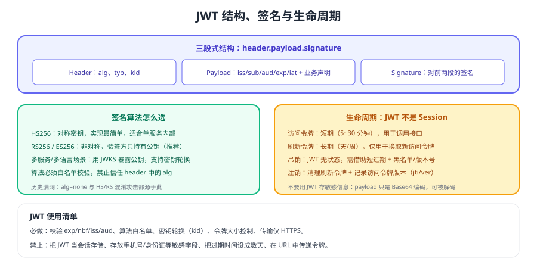

# JWT 深入

JWT（JSON Web Token，RFC 7519）把身份信息**用签名保护起来交给客户端携带**，服务端无需存储会话即可校验。它解决了"横向扩展"的问题，但也带来了三个新问题：**吊销、过期与信息泄露**。



## 结构：三段式

```text
Base64Url(header) . Base64Url(payload) . Base64Url(signature)
```

::: tip 一句话理解
**JWT 是"凭签名自证身份的介绍信"，不是"服务端的会话记录"**。介绍信一旦开出，在你设定的有效期内就有效——所以过期时间要短、吊销要有后备机制。
:::

| 段 | 内容 | 注意 |
| --- | --- | --- |
| Header | `alg`、`typ`、`kid` | `alg` 必须做白名单校验 |
| Payload | `iss`/`sub`/`aud`/`exp`/`iat`/`jti` + 业务声明 | **只是编码，不是加密**，不要放敏感信息 |
| Signature | 对前两段的签名 | 密钥与算法决定安全性 |

::: danger 关于"JWT 能防篡改但不能保密"
任何人拿到 JWT 都能 Base64 解码出 payload。**不要放手机号、身份证、密钥等敏感字段**；需要保密时应使用 JWE（加密）而不是普通 JWS。
:::

## 签名算法怎么选

| 算法 | 类型 | 适用 | 说明 |
| --- | --- | --- | --- |
| HS256 | 对称 | 单服务内部、无第三方验签 | 密钥分发是瓶颈，泄露即可伪造 |
| RS256 | 非对称 | 多服务/多语言（**推荐**） | 公钥可公开，支持 JWKS 与轮换 |
| ES256 | 非对称 | 对令牌体积敏感时 | 签名更短，兼容性略差于 RS256 |

```java [签发与校验的关键点（以 jjwt 为例）]
// 签发：指定算法与密钥，设置合理的过期时间，带上 kid 便于轮换
String token = Jwts.builder()
        .subject(String.valueOf(userId))
        .issuer("my-auth-service")
        .audience().add("my-api").and()
        .claim("roles", roles)                 // 只放必要声明，不放敏感信息
        .issuedAt(new Date())
        .expiration(Date.from(Instant.now().plus(15, ChronoUnit.MINUTES)))
        .signWith(privateKey, Jwts.SIG.RS256)
        .compact();

// 校验：算法白名单 + 发行方 + 受众 + 过期时间，缺一不可
Jwts.parser()
        .verifyWith(publicKey)
        .requireIssuer("my-auth-service")
        .requireAudience("my-api")
        .build()
        .parseSignedClaims(token)
        .getPayload();
```

## 生命周期：访问令牌 + 刷新令牌

| 令牌 | 有效期建议 | 存放位置 | 作用 |
| --- | --- | --- | --- |
| 访问令牌（access_token） | 5~30 分钟 | 内存（前端）或安全 Cookie | 调用接口 |
| 刷新令牌（refresh_token） | 数天~数周 | **仅服务端或安全存储** | 换取新的访问令牌 |

注销与封禁的实现方式：

1. **短过期**：把吊销延迟控制在分钟级（最基础也最重要）。
2. **刷新令牌吊销**：服务端保存刷新令牌状态，注销即删除。
3. **访问令牌版本号**：用户表维护 `token_version`，令牌中带上该值，版本不匹配即拒绝（改密、封禁时自增）。
4. **黑名单（jti）**：只对"必须立即失效"的令牌使用，并设置与令牌等长的 TTL。

::: danger JWT 使用的六个坑
1. 过期时间设成数天甚至不过期。
2. 在 payload 放敏感信息（可被解码）。
3. 信任 header 里的 `alg`（曾导致 `alg=none` 与 HS/RS 混淆漏洞）。
4. 把刷新令牌放在 `localStorage`（XSS 一旦发生即长期失守）。
5. 不校验 `iss`/`aud`：跨系统之间令牌可被"借用"。
6. 用令牌完全替代授权：令牌只证明身份，权限仍需服务端判定。
:::

## 验证方式

1. 把 JWT 粘贴到官方解码工具（或自行 Base64 解码），确认其中没有敏感字段。
2. 篡改 payload 中任一字段后重新请求，确认服务端返回 401（验签未通过）。
3. 把令牌的 `alg` 手工改为 `none` 后发起请求，确认被拒绝（算法白名单生效）。
4. 把访问令牌有效期改成 1 分钟，观察刷新令牌是否能自动续期，并确认并发刷新不会互相覆盖。

## 相关专题

- [会话与 Cookie](../Session/index.md)：有状态方案的对比
- [OAuth 2.1 与 OIDC](../Oauth2/index.md)：JWT 在授权协议中的角色
- [权限模型](../Authorization/index.md)：令牌里的角色不等于最终权限
- [版本与兼容矩阵](../Version/index.md)：RFC 规范与算法选择

## 参考资料

- RFC 7519（JWT）：https://www.rfc-editor.org/rfc/rfc7519
- RFC 9068（JWT Profile for OAuth 2.0 Access Tokens）：https://www.rfc-editor.org/rfc/rfc9068
- OWASP · JWT Cheat Sheet：https://cheatsheetseries.owasp.org/cheatsheets/JSON_Web_Token_for_Java_Cheat_Sheet.html
