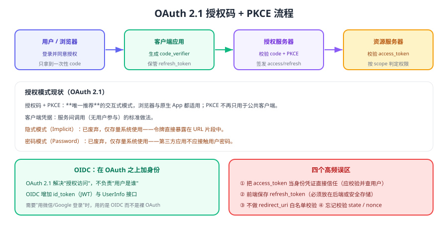

# OAuth 2.1 与 OIDC

OAuth 解决的是「**让第三方应用在用户授权下访问资源，而不接触用户密码**」；OIDC 则在其上叠加了「**用户是谁**」。两者常被混用，实际职责完全不同。



## 四个角色

| 角色 | 说明 |
| --- | --- |
| 资源所有者 | 用户本人 |
| 客户端 | 请求访问资源的应用 |
| 授权服务器 | 认证用户并签发令牌 |
| 资源服务器 | 存放资源、校验令牌并返回数据 |

## 授权模式现状（OAuth 2.1）

| 模式 | 状态 | 说明 |
| --- | --- | --- |
| 授权码 + PKCE | **唯一推荐的交互式模式** | 浏览器、原生 App、SPA 都适用；PKCE（RFC 7636）为必选 |
| 客户端凭据 | 推荐 | 服务间调用，无用户参与 |
| 隐式（Implicit） | **仅存量** | 令牌直接出现在 URL 片段，易泄露，OAuth 2.1 已移除 |
| 密码（Password） | **仅存量** | 第三方应用接触用户密码，OAuth 2.1 已移除 |

::: tip 一句话理解
**新项目只做"授权码 + PKCE"和"客户端凭据"两种模式**。看到隐式或密码模式，基本可以判断是历史遗留实现。
:::

## 授权码 + PKCE 流程要点

1. 客户端生成 `code_verifier`，计算 `code_challenge` 并随授权请求发送。
2. 用户在授权服务器登录并同意授权，重定向回客户端并携带一次性 `code`。
3. 客户端用 `code` + `code_verifier` 换取令牌（**必须校验 PKCE**）。
4. 校验失败或 code 被重放时应拒绝签发。

```text
客户端 → 授权服务器：/authorize?response_type=code&client_id=...&redirect_uri=...&scope=...&state=...&code_challenge=...&code_challenge_method=S256
授权服务器 → 客户端：/callback?code=...&state=...
客户端 → 授权服务器：/token  (grant_type=authorization_code, code, code_verifier, client_id, redirect_uri)
授权服务器 → 客户端：{ access_token, refresh_token, id_token, expires_in }
```

::: danger OAuth 实现中的五个高频错误
1. **不校验 `redirect_uri` 白名单**：导致授权码被重定向到攻击者域名。
2. **不校验 `state` 或 `nonce`**：无法防御 CSRF 与令牌重放。
3. **前端保存 `refresh_token`**：刷新令牌必须放在后端或安全存储。
4. **把 `access_token` 直接当用户身份**：应通过用户信息接口或 `id_token` 获取身份，并校验 `aud`/`iss`。
5. **scope 设置过宽**：一次授权拿到远超业务需要的权限。
:::

## OIDC：在 OAuth 之上加身份

| 项 | OAuth 2.1 | OIDC |
| --- | --- | --- |
| 关注点 | 授权访问资源 | 用户身份认证 |
| 关键产物 | access_token | id_token（JWT）+ UserInfo |
| 典型用途 | 第三方访问 API | 第三方登录、SSO |

校验 `id_token` 时至少要验证：签名、`iss`、`aud`、`exp`、`nonce`。缺少任一项都可能被伪造身份。

## 令牌校验：本地校验还是内省

| 方式 | 适用 | 说明 |
| --- | --- | --- |
| 本地校验（JWT） | 高并发、服务多 | 用 JWKS 公钥验签，无网络开销；吊销依赖短过期 |
| 令牌内省（introspection） | 需要即时吊销 | 每次请求询问授权服务器，开销高 |
| 混合 | 生产常见 | 本地验签 + 对敏感操作额外校验 |

## 验证方式

1. 走完一次授权码 + PKCE 流程，确认 `code` 只能用一次（重放应失败）。
2. 把 `redirect_uri` 改成未注册的地址，确认授权服务器拒绝。
3. 去掉 `code_verifier` 换取令牌，确认请求被拒绝。
4. 用 `id_token` 校验工具检查 `iss`/`aud`/`exp`/`nonce`，并尝试篡改 `aud` 确认校验生效。

## 相关专题

- [单点登录（SSO）](../Sso/index.md)：OIDC 在多系统统一登录中的应用
- [JWT 深入](../Jwt/index.md)：id_token 与 access_token 的校验细节
- [服务端落地](../Implementation/index.md)：资源服务器如何校验令牌
- [Spring Security 6 · OAuth2](../../Java/Frame/SpringSecurity/v6/OAuth2/index.md)：Java 侧实现

## 参考资料

- RFC 6749（OAuth 2.0）：https://www.rfc-editor.org/rfc/rfc6749
- RFC 9700（OAuth 2.0 安全最佳实践）：https://www.rfc-editor.org/rfc/rfc9700
- RFC 7636（PKCE）：https://www.rfc-editor.org/rfc/rfc7636
- OAuth 2.1 草案：https://datatracker.ietf.org/doc/draft-ietf-oauth-v2-1/
- OpenID Connect Core 1.0：https://openid.net/specs/openid-connect-core-1_0.html
