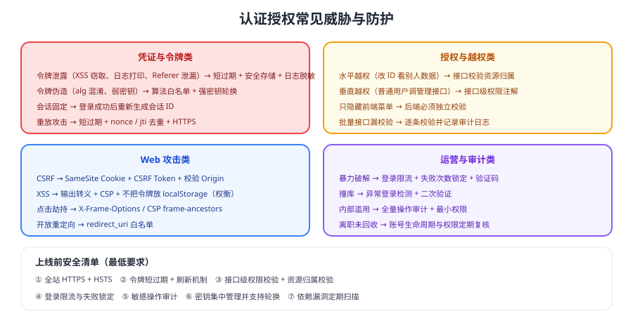

# 安全最佳实践

认证授权的安全风险集中在两类：**凭证被偷**与**权限没校验**。前者靠安全存储与短过期缓解，后者只能靠服务端的强制校验消除。



## 威胁与防护对照

| 威胁 | 典型表现 | 防护手段 |
| --- | --- | --- |
| 令牌泄露 | XSS 窃取、日志打印、Referer 泄漏 | 短过期、`HttpOnly` Cookie、日志脱敏、不在 URL 传令牌 |
| 令牌伪造 | 弱密钥、算法混淆、`alg=none` | 算法白名单、非对称签名、密钥轮换 |
| 会话固定 | 登录前后会话 ID 不变 | 登录成功后重新生成会话 ID |
| 重放攻击 | 抓包后重复发送请求 | HTTPS、短过期、`jti`/`nonce` 去重、签名带时间戳 |
| 水平越权 | 改资源 ID 访问他人数据 | 资源归属校验、数据范围过滤 |
| 垂直越权 | 普通用户调用管理接口 | 接口级权限校验 |
| CSRF | 诱导用户发起已登录请求 | `SameSite` Cookie、CSRF Token、校验 Origin |
| 点击劫持 | 页面被嵌套诱导点击 | `X-Frame-Options` / CSP `frame-ancestors` |
| 暴力破解 | 批量尝试密码/验证码 | 登录限流、失败锁定、验证码、异常检测 |

::: tip 安全投入的优先级
按收益排序：**接口级权限校验 > 全站 HTTPS > 令牌短过期与刷新 > 登录限流 > 审计日志**。前两项缺失时，其他加固的边际收益都不高。
:::

::: danger 三条不可妥协的底线
1. **全站 HTTPS**：任何明文传输的令牌都等于已泄露。
2. **接口必须校验权限**：登录不等于有权限。
3. **敏感操作必须留审计**：谁在什么时候改了什么，必须可追溯。
:::

## 令牌与密钥管理

1. **密钥不进代码仓库**：用环境变量或密钥管理服务，支持轮换。
2. **使用 `kid` 支持轮换**：新密钥上线后旧密钥保留一个过渡期。
3. **对称密钥仅限单服务内部**：跨服务一律使用非对称签名 + JWKS。
4. **定期轮换刷新令牌与客户端密钥**，并在轮换后验证旧凭证失效。

## 登录与账号安全

| 措施 | 说明 |
| --- | --- |
| 密码存储 | 使用 bcrypt / Argon2 等加盐哈希，禁止明文或 MD5 |
| 登录限流 | 按账号 + IP 双维度限制，防止撞库 |
| 失败锁定 | 连续失败后锁定一段时间或要求二次验证 |
| 二次验证 | 敏感操作（改密、转账、导出）要求二次确认 |
| 异常检测 | 异地登录、短时间内多地登录触发告警 |
| 账号生命周期 | 离职/停用即回收权限，定期复核授权 |

```text
密码校验的正确姿势（伪代码）：
1. 按账号查询用户（不存在时也执行一次假哈希，避免账号枚举时间差）
2. 校验哈希（bcrypt/Argon2 内置盐）
3. 失败计数 +1，成功后清零
4. 连续失败超过阈值 → 锁定或要求二次验证
5. 成功 → 生成新会话/令牌，并记录登录审计
```

## 审计要记什么

| 事件 | 必须记录 |
| --- | --- |
| 登录/登出 | 账号、时间、IP、客户端、结果 |
| 权限变更 | 操作人、目标账号、变更前后的权限 |
| 敏感操作 | 操作人、资源、参数摘要、结果 |
| 鉴权失败 | 账号、接口、失败原因（越权/过期/无效） |

::: warning 日志本身也是风险
审计日志中可能包含令牌、手机号等敏感信息。**记录前必须脱敏**，并限制日志访问权限。
:::

## 验证方式

1. 用浏览器开发者工具确认令牌不在 URL 中、Cookie 带 `HttpOnly`/`Secure`/`SameSite`。
2. 连续输错密码 10 次，确认触发限流或锁定（并验证锁定有明确恢复机制）。
3. 抓取一个请求并原样重放两次，确认重放被拒绝或业务幂等（取决于场景）。
4. 检查审计日志：一次登录、一次越权尝试、一次权限变更是否都有完整记录且已脱敏。

## 相关专题

- [权限模型](../Authorization/index.md)：越权的根源与治理
- [JWT 深入](../Jwt/index.md)：算法与吊销
- [会话与 Cookie](../Session/index.md)：Cookie 安全属性
- [前端安全 · CSRF](../../../Frontend/Others/Security/CSRF/index.md)：浏览器侧协同防护
- [常见问题与最佳实践](../FAQ/index.md)：问题排查路径

## 参考资料

- OWASP · Authentication Cheat Sheet：https://cheatsheetseries.owasp.org/cheatsheets/Authentication_Cheat_Sheet.html
- OWASP · Password Storage Cheat Sheet：https://cheatsheetseries.owasp.org/cheatsheets/Password_Storage_Cheat_Sheet.html
- RFC 9700（OAuth 2.0 安全最佳实践）：https://www.rfc-editor.org/rfc/rfc9700
