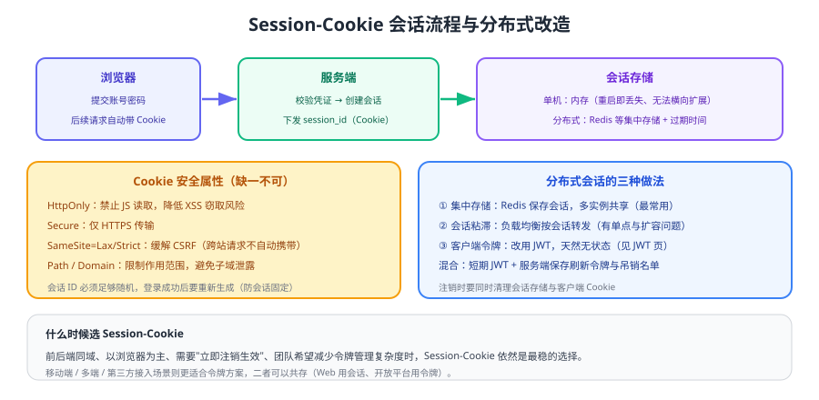

# 会话与 Cookie

Session-Cookie 是最经典也最容易被低估的方案：**服务端保存会话状态，客户端只拿一个不可猜测的会话 ID**。它天然支持"立即注销"，代价是服务端要有状态、集群要共享存储。



## 交互流程

1. 用户提交凭证（账号密码 / 验证码 / 扫码结果）。
2. 服务端校验通过后创建会话，把身份与权限信息写入会话存储。
3. 服务端通过 `Set-Cookie` 下发会话 ID（**登录成功后必须重新生成会话 ID**，防会话固定）。
4. 浏览器后续请求自动携带 Cookie，服务端据此恢复身份。
5. 注销或过期时销毁服务端会话，客户端 Cookie 随之失效。

## Cookie 安全属性

| 属性 | 作用 | 建议 |
| --- | --- | --- |
| `HttpOnly` | 禁止 JS 读取 | **必开**，降低 XSS 窃取风险 |
| `Secure` | 仅 HTTPS 传输 | **必开** |
| `SameSite` | 控制跨站携带 | `Lax`（默认推荐）或 `Strict`，跨站场景用 `None` + `Secure` |
| `Path` / `Domain` | 限制作用范围 | 尽量收窄，避免子域共享 |
| `Max-Age` / `Expires` | 过期时间 | 与业务登录有效期一致，避免"永久登录" |

::: tip 一条实用判据
如果你需要**"注销后立刻失效"**，Session 是最省事的方案；如果系统是**多端 + 前后端分离 + 需要横向扩展**，令牌方案更合适。两者并不互斥，可以按端分别选择。
:::

::: danger 会话相关的五个高频坑
1. **登录后不换会话 ID**：存在会话固定攻击风险。
2. **会话 ID 用可预测的规则生成**：必须使用安全随机数。
3. **只清客户端 Cookie 不清服务端会话**：表现为"退出后还能拿旧 Cookie 继续访问"。
4. **集群未共享会话**：负载均衡到另一台机器就掉线。
5. **会话不过期**：长期有效的会话等于长期有效的凭证。
:::

## 分布式会话三种做法

| 做法 | 说明 | 优点 | 代价 |
| --- | --- | --- | --- |
| 集中存储 | Redis 等保存会话 | 多实例共享、可集中销毁 | 引入一次网络访问 |
| 会话粘滞 | 负载均衡按会话转发 | 改动最小 | 扩容与故障转移体验差 |
| 客户端令牌 | 改用 JWT | 无状态、易扩展 | 注销不即时（见 [JWT](../Jwt/index.md)） |

```java [集中式会话的典型配置思路]
// 思路：把 HttpSession 的存储替换为 Redis，应用本身仍按标准 Session API 使用
// ① 引入会话持久化依赖（Spring Session + Redis 等）
// ② 配置连接与序列化方式（建议 JSON 序列化，便于排查）
// ③ 设置会话超时时间，与业务登录有效期一致
// ④ 验证：两个应用实例交替访问同一会话，登录态保持一致
```

## 什么时候仍然应该选 Session

1. **同域 Web 应用**：Cookie 天然可用，无需处理令牌存储位置问题。
2. **需要立即注销/封禁生效**：会话在服务端，删除即失效。
3. **后台管理系统**：用户量可控，会话存储压力小。
4. **安全合规要求"服务端可控"**：会话可集中审计与强制下线。

反过来，移动端、多端、开放平台、跨域前后端分离场景，令牌方案通常更合适——**两种方案可以在同一系统中共存**（Web 端用会话，开放平台用令牌）。

## 验证方式

1. 登录后查看响应头与浏览器存储，确认 Cookie 带有 `HttpOnly`、`Secure`、`SameSite` 属性。
2. 登录前后分别记录会话 ID，确认登录成功后 ID 发生变化。
3. 在两个应用实例间切换访问（或重启一个实例），确认登录态未丢失（验证共享会话）。
4. 点击注销后，用旧 Cookie 手动重放一次请求，确认被拒绝（而不是仍返回 200）。

## 相关专题

- [JWT 深入](../Jwt/index.md)：无状态令牌方案
- [服务端落地](../Implementation/index.md)：身份在网关与服务间的传递
- [安全最佳实践](../Security/index.md)：CSRF 与 XSS 防护
- [Spring Security 6 · 会话](../../Java/Frame/SpringSecurity/v6/SpringBoot/Session/index.md)：Java 侧会话配置

## 参考资料

- MDN · Set-Cookie 与 SameSite：https://developer.mozilla.org/zh-CN/docs/Web/HTTP/Headers/Set-Cookie
- OWASP · Session Management Cheat Sheet：https://cheatsheetseries.owasp.org/cheatsheets/Session_Management_Cheat_Sheet.html
