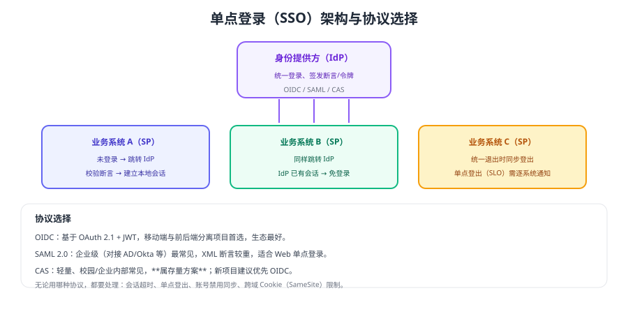

# 单点登录（SSO）

SSO 让用户**登录一次，就能访问多个互相信任的系统**。它的核心是把"认证"集中到一个身份提供方（IdP），各业务系统只负责校验断言并建立本地会话。



## 基本角色

| 角色 | 说明 |
| --- | --- |
| IdP（身份提供方） | 统一登录入口，签发断言或令牌 |
| SP（服务提供方） | 各业务系统，校验断言并建立本地会话 |
| 会话 | IdP 保存全局会话，SP 保存本地会话 |

## 协议选择

| 协议 | 特点 | 适用 | 状态 |
| --- | --- | --- | --- |
| OIDC | 基于 OAuth 2.1 + JWT，前后端分离友好 | 新项目、移动端、多端 | **推荐主线** |
| SAML 2.0 | XML 断言，企业身份系统支持最好 | 对接 AD/Okta 等企业 IdP | 仍广泛使用 |
| CAS | 轻量、协议简单 | 校园/企业内部存量系统 | **仅存量为主** |

::: tip 选型建议
新建系统优先 OIDC；对接企业已有身份系统时按其支持情况选择（SAML 常见）；存量 CAS 环境不必强行替换，但要逐步收敛到 OIDC。
:::

## 落地要点

### ① 登录流程

```text
用户访问系统 A → 未登录 → 重定向到 IdP → IdP 已有会话则直接签发断言
                → 回到系统 A 校验断言 → 建立本地会话
用户访问系统 B → 未登录 → 重定向到 IdP → IdP 会话仍有效 → 免登录进入
```

### ② 会话与超时

1. **全局会话与本地会话要同时设计超时**，避免"IdP 已登出、业务系统仍在线"。
2. 本地会话有效期通常短于全局会话，到期后重新走一次静默认证。
3. 支持"记住我"时要用独立的长期凭证，而不是延长全局会话到数月。

### ③ 单点登出（SLO）

单点登出是最容易被忽略的一环：

| 做法 | 说明 |
| --- | --- |
| 前端广播登出 | IdP 通知各 SP 清理本地会话（需要维护 SP 列表） |
| 缩短本地会话 | 简单可靠，代价是用户可能需要重新认证 |
| 令牌版本号 | 登出时递增版本，令牌校验时比对（适合 OIDC 场景） |

::: danger SSO 实施中的五个坑
1. **只做单点登录不做单点登出**：用户以为退出了，其他系统仍在登录状态。
2. **IdP 单点故障**：IdP 不可用时所有系统都无法登录，需要高可用与降级预案。
3. **断言不验签或过期时间不校验**：等于允许伪造身份。
4. **账号禁用未同步**：离职员工仍可凭旧会话访问。
5. **跨域 Cookie 受 SameSite 限制**：IdP 与 SP 不同站时需按规范配置（`SameSite=None; Secure`，并评估浏览器限制）。
:::

## 验证方式

1. 登录系统 A 后直接访问系统 B，确认无需重新登录（验证单点登录生效）。
2. 在 A 中退出，确认 B 也随之失效（验证单点登出）。
3. 篡改断言/令牌内容后重放，确认被拒绝（验证验签与过期校验）。
4. 停掉 IdP 后访问业务系统，确认已有会话仍可用，且登录入口给出明确提示（验证降级表现）。

## 相关专题

- [OAuth 2.1 与 OIDC](../Oauth2/index.md)：协议基础
- [会话与 Cookie](../Session/index.md)：本地会话的实现
- [权限模型](../Authorization/index.md)：SSO 解决身份，权限仍需各系统自管
- [安全最佳实践](../Security/index.md)：断言校验与审计

## 参考资料

- OpenID Connect Core 1.0：https://openid.net/specs/openid-connect-core-1_0.html
- OASIS SAML 2.0：https://docs.oasis-open.org/security/saml/v2.0/
- RFC 9700（OAuth 2.0 安全最佳实践）：https://www.rfc-editor.org/rfc/rfc9700
