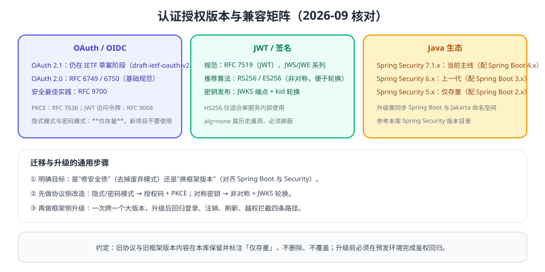

# 版本与兼容矩阵

认证授权领域的"版本"有三层含义：**协议版本（OAuth 2.0 → 2.1）**、**规范版本（RFC 与 OIDC）**、**框架版本（Spring Security 5/6/7 与 Spring Boot 2/3/4）**。三者交织，升级时必须成组考虑。



## 协议与规范状态

| 项目 | 状态 | 说明 |
| --- | --- | --- |
| OAuth 2.0 | 正式规范 | RFC 6749（授权框架）、RFC 6750（Bearer 令牌） |
| OAuth 2.0 安全最佳实践 | 正式 BCP | **RFC 9700**，落地必读的安全基线 |
| OAuth 2.1 | IETF 草案（Rev 16） | 移除隐式与密码模式、PKCE 必选；按 2.1 思路实现即可 |
| PKCE | 正式规范 | RFC 7636，OAuth 2.1 中为必选 |
| JWT | 正式规范 | RFC 7519；访问令牌形态另见 RFC 9068 |
| OIDC | 正式规范 | OpenID Connect Core 1.0（含勘误集） |
| SAML | 正式规范 | OASIS SAML 2.0，企业 IdP 广泛支持 |

::: info 状态标注约定
「主线」指新项目应采用的做法；「仍在使用」指在企业存量环境中常见、本库保留说明；「仅存量」指已不推荐、只用于维护既有系统，**内容保留不删除、不覆盖**。
:::

::: tip 升级前先做一次版本体检
把协议、框架、JDK、令牌算法与有效期记录下来，与本页矩阵逐项比对。**先治理协议（去掉隐式/密码模式），再升框架版本**，顺序反了会重复返工。
:::

## 模式状态对照

| 模式 | 状态 | 建议 |
| --- | --- | --- |
| 授权码 + PKCE | 主线 | 所有交互式客户端使用 |
| 客户端凭据 | 主线 | 服务间调用 |
| 隐式（Implicit） | **仅存量** | 改用授权码 + PKCE |
| 密码（Password） | **仅存量** | 改用授权码 + PKCE 或迁移到 IdP |
| CAS | **仅存量为主** | 新项目优先 OIDC |

## 框架版本对照（Java 生态）

| Spring Security | 对应 Spring Boot | 状态 | 升级注意 |
| --- | --- | --- | --- |
| 7.1.x（当前 7.1.1，2026-08-20） | 4.x（当前 4.1.1） | **主线** | 与 Spring Framework 7 同步，注意废弃 API 与配置写法 |
| 6.x | 3.x | 上一代，仍在大量使用 | 从 5.x 升级需处理配置迁移与 `jakarta` 命名空间 |
| 5.x | 2.x | **仅存量** | `WebSecurityConfigurerAdapter` 等写法已废弃；仅用于维护旧项目 |

::: danger 升级期的四个高危动作
1. 在业务发布窗口同时升级框架与协议实现。
2. 只升级依赖版本，不回归登录、注销、刷新、越权拦截四条路径。
3. 升级后未验证第三方登录（OIDC/SAML）与网关鉴权链路。
4. 删除旧版本目录与旧配置，失去回滚能力。
:::

## 升级检查清单

1. **记录快照**：框架版本、Spring Boot 版本、JDK 版本、授权服务器版本、令牌算法与有效期。
2. **先做协议治理**：清理隐式/密码模式，统一到授权码 + PKCE；对称密钥改非对称 + JWKS。
3. **再升框架**：一次只跨一个大版本，升级后跑鉴权回归用例（未认证 / 非法令牌 / 越权 / 注销）。
4. **验证兼容**：客户端 SDK、网关、资源服务器三方版本是否匹配。
5. **保留回滚**：保留旧分支与旧配置，确认可一键切回。

## 验证方式

```shell
# 环境体检：把结果贴进项目文档，作为升级与回滚的依据
java -version
mvn -q dependency:tree -Dincludes=org.springframework.security 2>/dev/null || true
# 检查是否仍存在对称签名密钥或隐式/密码模式调用（代码检索）
rg -n "client_secret|grant_type=password|response_type=token" src/ || echo "未发现存量模式调用"
```

1. 列出当前系统的协议与框架版本，与本页矩阵逐项比对，标注"需升级项"。
2. 在预发环境用同一批鉴权用例（未认证、过期令牌、越权、正常）对比升级前后行为。
3. 检查是否仍存在隐式/密码模式调用或对称签名密钥，确认治理完成。
4. 演练一次回滚，确认旧版本仍可运行。

## 相关专题

- [OAuth 2.1 与 OIDC](../Oauth2/index.md)：协议细节与安全要点
- [JWT 深入](../Jwt/index.md)：算法与密钥轮换
- [Spring Security 专题](../../Java/Frame/SpringSecurity/index.md)：框架版本目录（v5 / v6 / v7）
- [FAQ](../FAQ/index.md)：升级后常见问题排查

## 参考资料

- RFC 9700（OAuth 2.0 安全最佳实践）：https://www.rfc-editor.org/rfc/rfc9700
- OAuth 2.1 草案：https://datatracker.ietf.org/doc/draft-ietf-oauth-v2-1/
- Spring Security 官方文档：https://docs.spring.io/spring-security/reference/
- Spring Security 版本支持说明：https://spring.io/projects/spring-security#support
