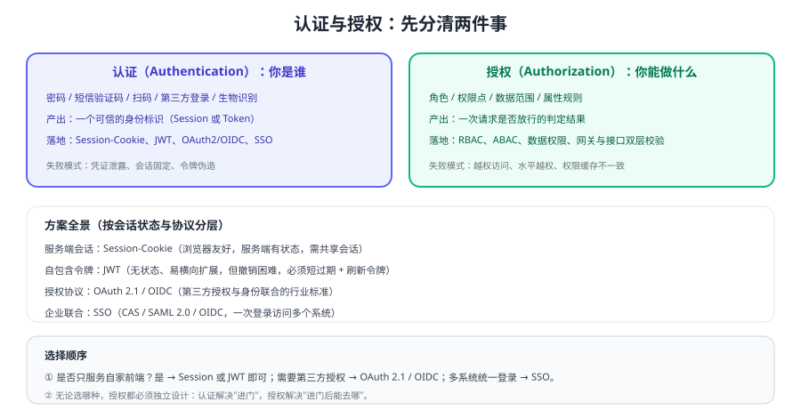

# 认证与授权

<p style="text-align:center;"></p>

认证与授权是每个后端系统的第一道门：**认证（Authentication）回答「你是谁」，授权（Authorization）回答「你能做什么」**。两者经常被混为一谈，结果就是「登录做得很严，接口却处处越权」。本专题从协议与架构角度讲透方案选型与落地，语言无关；Java 生态的具体实现见 [Spring Security 专题](../Java/Frame/SpringSecurity/index.md) 与 [Sa-Token](../Java/Frame/Sa-token/index.md)。



## 专题导航

- [会话与 Cookie](Session/index.md)：Session-Cookie 流程、分布式会话与安全属性
- [JWT 深入](Jwt/index.md)：结构、签名算法、刷新与吊销、常见坑
- [OAuth 2.1 与 OIDC](Oauth2/index.md)：授权码 + PKCE、客户端凭据、身份联合
- [单点登录（SSO）](Sso/index.md)：OIDC / SAML / CAS 对比与落地要点
- [权限模型](Authorization/index.md)：RBAC / ABAC / ReBAC 与数据权限
- [服务端落地](Implementation/index.md)：网关与服务双层鉴权、微服务间认证
- [安全最佳实践](Security/index.md)：令牌泄露、越权、CSRF/XSS、限流与审计
- [版本与兼容矩阵](Version/index.md)：OAuth 2.1 草案、RFC 现状与 Spring Security 5/6/7
- [常见问题与最佳实践](FAQ/index.md)：登不上、掉线、登出无效、越权的排查

::: tip 一句话理解
**认证只管「进门」，授权才管「进门后能去哪」**。绝大多数线上安全问题不是「登录被攻破」，而是「登录之后没校验权限或数据归属」。
:::

## 方案全景

| 方案 | 状态存储 | 典型场景 | 关键取舍 |
| --- | --- | --- | --- |
| Session-Cookie | 服务端（内存/Redis） | 同域 Web、后台系统 | 注销立即生效；需共享会话存储 |
| JWT | 客户端持有，服务端无状态校验 | 前后端分离、多端、微服务 | 易扩展；吊销与注销需额外机制 |
| OAuth 2.1 / OIDC | 授权服务器 | 第三方授权、身份联合 | 标准成熟；实现细节多、易踩坑 |
| SSO（OIDC/SAML/CAS） | 身份提供方统一维护 | 多系统统一登录 | 体验好；单点故障与登出同步需设计 |
| API Key / 签名 | 服务端校验 | 服务间调用、开放平台 | 简单；不适合代表用户身份 |

## 选型决策树

1. **只服务自家前端？** 是 → Session-Cookie（同域）或 JWT（多端/分离架构）。
2. **需要第三方应用代表用户访问你的资源？** 是 → OAuth 2.1 授权码 + PKCE。
3. **需要「用微信/Google/企业账号登录」？** 是 → OIDC（OAuth 2.1 之上叠加身份层）。
4. **多个内部系统要统一登录？** 是 → SSO（新项目优先 OIDC，存量常见 SAML / CAS）。
5. **是服务与服务之间的调用？** 是 → 客户端凭据（Client Credentials）或服务签名，不使用用户令牌。

::: danger 认证授权设计的四个常见错误
1. **只有认证没有授权**：接口只校验「已登录」，任何用户都能改别人的数据（水平越权）。
2. **只在网关鉴权**：网关放行后服务内部无校验，一旦被绕过或被内网调用就直接越权。
3. **把 JWT 当会话用**：长过期、无法吊销、塞满敏感信息，出问题只能等它自然过期。
4. **前端隐藏当权限**：菜单隐藏不等于接口安全，后端必须独立校验。
:::

## 版本速览

| 项目 | 当前状态（2026-09 核对） | 说明 |
| --- | --- | --- |
| OAuth 2.1 | IETF 草案（`draft-ietf-oauth-v2-1`，Rev 16） | 取消隐式与密码模式、PKCE 必选；实践上按 2.1 的思路做即可 |
| OAuth 2.0 安全最佳实践 | RFC 9700（Best Current Practice） | 官方安全基线，落地必读 |
| JWT | RFC 7519；JWT 访问令牌规范 RFC 9068；PKCE 为 RFC 7636 | 签名算法建议 RS256 / ES256 + JWKS 轮换 |
| Spring Security | 7.1.x（配 Spring Boot 4.x） | 6.x 为上一代（配 Boot 3.x），5.x 仅存量（配 Boot 2.x） |

::: info 大版本处理约定
本库对存在大版本差异的主题采用「版本目录 + 状态标注」的方式组织。认证授权领域的主线为 **OAuth 2.1 思路（授权码 + PKCE）+ Spring Security 7.x**；OAuth 2.0 的隐式模式与密码模式、Spring Security 5.x 的内容**保留说明并标注「仅存量项目使用」**，不删除、不覆盖，详见 [版本与兼容矩阵](Version/index.md)。
:::

## 最小可运行验证

```shell
# 1. 未携带令牌访问受保护接口，期望 401 而不是 200
curl -i http://localhost:8080/api/me

# 2. 携带非法/过期令牌，期望 401 而不是 500
curl -i -H "Authorization: Bearer invalid.token.value" http://localhost:8080/api/me

# 3. 水平越权自测：用 A 的令牌访问 B 的资源，期望 403/404 而不是 200
curl -i -H "Authorization: Bearer $TOKEN_A" http://localhost:8080/api/orders/1002
```

预期结果：三条命令分别得到「未认证被拒」「非法令牌被拒」「越权被拒」。**这三条是任何认证授权实现的底线验收用例**。

## 学习路径

| 顺序 | 内容 | 页面 |
| --- | --- | --- |
| 1 | 分清认证与授权、选型 | 本页 |
| 2 | 选定会话方式 | [会话与 Cookie](Session/index.md) / [JWT](Jwt/index.md) |
| 3 | 需要第三方或统一登录 | [OAuth 2.1 与 OIDC](Oauth2/index.md) / [单点登录](Sso/index.md) |
| 4 | 设计权限模型 | [权限模型](Authorization/index.md) |
| 5 | 落地到服务与网关 | [服务端落地](Implementation/index.md) |
| 6 | 做安全加固与验收 | [安全最佳实践](Security/index.md) / [FAQ](FAQ/index.md) |

## 验证方式

1. 按上面的三条 `curl` 用例验证现有系统，确认未认证、非法令牌、越权三种情况都被正确拒绝。
2. 打开浏览器开发者工具，确认令牌/会话 Cookie 的实际存储位置与过期时间符合设计。
3. 执行一次「注销」，确认服务端会话或刷新令牌同时失效（而不是只清了前端存储）。
4. 记录一次完整登录链路的耗时与令牌有效期，作为后续安全与体验调优的基线。

## 相关专题

- [Spring Security 专题](../Java/Frame/SpringSecurity/index.md)：Java 生态的认证、授权与 OAuth2 实现
- [Sa-Token](../Java/Frame/Sa-token/index.md)：轻量级登录与权限框架
- [Spring Cloud Gateway](../SpringCloud/Gateway/index.md)：网关层统一鉴权与限流
- [微服务专题](../Microservices/index.md)：服务拆分后的身份传递与安全边界
- [前端安全 · CSRF](../../Frontend/Others/Security/CSRF/index.md)：前后端协同的浏览器侧防护

## 参考资料

- RFC 6749（OAuth 2.0 授权框架）：https://www.rfc-editor.org/rfc/rfc6749
- RFC 9700（OAuth 2.0 安全最佳实践）：https://www.rfc-editor.org/rfc/rfc9700
- RFC 7519（JWT）：https://www.rfc-editor.org/rfc/rfc7519
- RFC 7636（PKCE）：https://www.rfc-editor.org/rfc/rfc7636
- OAuth 2.1 草案（IETF）：https://datatracker.ietf.org/doc/draft-ietf-oauth-v2-1/
- OpenID Connect Core：https://openid.net/specs/openid-connect-core-1_0.html
