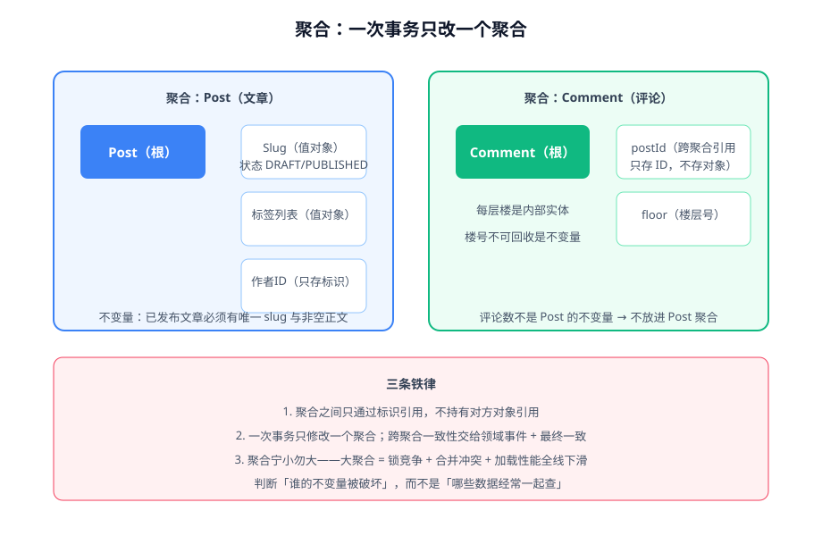

# 聚合设计

聚合（Aggregate）是战术设计里**最难、也最有价值**的部分：它定义了一致性边界——边界内的数据必须时刻满足业务不变量，边界外的对象只能通过聚合根访问。**聚合切对了，事务、并发、性能问题一起消失；切错了，怎么调都别扭。**



## 聚合与聚合根

- **聚合**：一组必须保持一致的对象集合（一个聚合根 + 若干内部实体/值对象）。
- **聚合根（Aggregate Root）**：聚合对外的唯一入口。外部只能持有根的引用，只能调用根的方法修改聚合内部。

```java [src/main/java/com/example/blog/domain/reader/Comment.java]
public class Comment {

    private final CommentId id;          // 聚合根标识
    private final PostId postId;         // 跨聚合引用：只存 ID
    private final List<Floor> floors;    // 内部实体：楼层

    public void reply(CommentId parentFloorId, ReaderId authorId, String content) {
        Floor parent = requireFloor(parentFloorId);
        if (parent.isDeleted()) {
            throw new CommentNotFoundException(parentFloorId);   // 不变量：已删楼层不可回复
        }
        if (!postQuerier.isPublished(postId)) {
            throw new NotPublishedException(postId);            // 不变量：仅已发布文章可评论
        }
        floors.add(new Floor(nextFloorNo(), parentFloorId, authorId, content));
        registerEvent(new CommentReplied(id.value(), parentFloorId.value()));
    }
}
```

不变量（Invariant）是聚合存在的理由：**「任何时候查询这个聚合，这些条件都必须为真」**。上例的不变量是「楼层号分配后永不回收」「已删楼层不可回复」「仅已发布文章可评论」。

## 边界判据：谁的不变量被破坏

判断一段数据属于哪个聚合，**唯一可靠的依据是不变量**，而不是「经常一起查询」或「外键关联」：

| 提问 | 如果答案是 | 举例（博客平台） |
| --- | --- | --- |
| 修改 A 时，必须同时检查/修改 B，否则业务规则被破坏？ | 是 → 放同一聚合 | 发布文章时必须生成 slug（slug 属于 Post 聚合） |
| B 变了，A 只是「知道」这件事，各自规则不受影响？ | 是 → 分开，用事件 | 发评论不需要改 Post 本体（评论数是查询产物） |
| B 有自己独立的生命周期（单独创建、删除）？ | 是 → 强烈信号分开 | 楼层不能脱离评论独立存在（内部实体），评论可以脱离文章独立删除（独立聚合） |

::: tip 与项目实战的一致性
项目侧 [CoreFlow · 领域建模](/project/Complete/BlogPlatform/CoreFlow/DomainModel/index.md) 用同一判据把博客平台划成了 Post / Comment / User 三个聚合——「事务边界按谁的不变量被破坏划」两侧口径完全一致。
:::

## 三条铁律

1. **聚合之间只通过标识引用**。`Comment` 持有 `postId`（ID），不持有 `Post` 对象。持有对象引用会导致：加载评论连带加载文章（性能塌方）、修改级联越过边界（不变量失守）。
2. **一次事务只修改一个聚合**。需要另一个聚合跟着变时，发领域事件，由对方在自己的事务里处理（最终一致）。
3. **聚合宁小勿大**。大聚合 = 并发修改同一行的锁竞争 + 团队合并冲突 + 每次加载全量数据的性能税。

::: danger 两个方向的反面案例
1. **大聚合**：把「文章 + 全部评论 + 全部点赞」塞进一个 Post 聚合——每发一条评论都要以 Post 为事务根，热门文章的评论区互相阻塞。评论有独立不变量（楼层规则），是独立聚合。
2. **过度拆分**：把「订单 + 订单行」拆成两个聚合、两个事务——「订单金额 = 行金额之和」这个不变量就再也无法在一个事务里保证了。**同一事务必须一起改的，不许拆。**
:::

## 跨聚合一致性：强一致还是最终一致

| 情形 | 选择 | 做法 |
| --- | --- | --- |
| 不变量要求同一事务内成立 | 强一致 | 收进同一个聚合（先检查聚合是否该合并） |
| 只是业务上的先后依赖，可短暂不一致 | 最终一致 | 领域事件 + 事件处理（见[领域事件](../DomainEvent/index.md)） |
| 涉及外部系统（支付、邮件） | 只能最终一致 | Outbox + 对账兜底 |

最终一致不是「降低要求」，而是**把一致性窗口显式化**：窗口多长、窗口内的读怎么处理（显示「处理中」还是隐藏）、失败怎么补偿——这三问在建模时就要回答。

## 常见错误与纠正

::: danger 聚合设计五坑
1. **按数据库表建模聚合**——表是持久化产物，不是模型的依据。正确顺序：不变量 → 聚合 → 再设计表。
2. **聚合根上到处是 getter/setter**——外部绕过根直接改内部状态，不变量形同虚设。正确做法：状态字段无 setter，转移走业务方法。
3. **在聚合里做查询**——聚合负责一致性，不负责列表查询。列表、搜索走独立的查询服务（CQRS 的读侧），不要为了「只在聚合里访问」硬造出奇慢的接口。
4. **跨聚合的对象引用**——`Comment.post` 持有 Post 对象，序列化、加载、级联更新全面失控。改成只存 ID。
5. **事件补偿逻辑塞进聚合**——聚合里出现「调用邮件服务」的代码说明分层失守，补偿是应用服务/事件处理器的事。
:::

## 验证方式

1. 对每个聚合写出**不变量清单**（不超过五条，超过说明聚合太大），每条不变量对应至少一个领域层测试断言。
2. `grep` 检查聚合之间是否互相 import 了对方类型（除 ID 外）——出现即违规。
3. 事务注解审查：任何 `@Transactional` 方法里出现两个聚合根的写操作，要么聚合切错，要么该改事件。

## 参考资料

- Vaughn Vernon,《Implementing Domain-Driven Design》第 10 章（聚合）——"聚合设计规则"即出自本章
- Vaughn Vernon, Effective Aggregate Design（三篇系列）：https://vaughnvernon.co/?p=838
- Martin Fowler, DDD Aggregate：https://martinfowler.com/bliki/DDD_Aggregate.html
